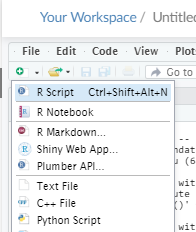
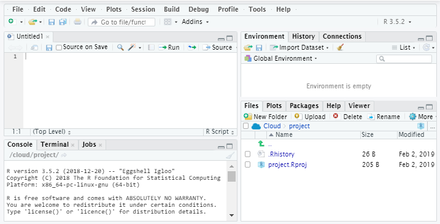
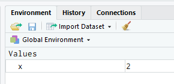
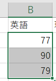
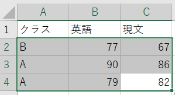

```{r include = FALSE}
knitr::opts_chunk$set(fig.align = 'center')
knitr::opts_chunk$set(message = F)
knitr::opts_chunk$set(warning = F)
```

# 本講義の目的
- RやR Studioの起動について学ぶ。
- Rを使った計算について学ぶ。
- オブジェクト、ベクトル、関数、データフレームなどについて学ぶ。
- データの読み込み方について学ぶ。
- 因子（factor)について学ぶ。

# Rの起動

## RStudio Cloudの用意

RStudio Cloudというサービスを利用して，次の手順によりRを実行する

1. RStudio Cloud（ https://rstudio.cloud/ ）に行き，「Get Started」をクリックする
2. 「Sign up with Google」などでログインする（立教のアカウントで入れる）
3. 「New Project」をクリックして新しいプロジェクトを立ち上げる

## RStudioの基本操作

### 新規Rファイルの作成

Rスクリプト（R言語のコードを記述するテキストファイル）の新規作成を行うには，RStudio左上の「白い紙に(+)のマークがついているようなアイコン」をクリックし，「R Script」をクリックする



### 各部分の説明



RStudioの基本画面はこの４つの領域からなる。

- 左上がRスクリプトの入力欄（コードを書く部分）
- 左下[Console]がRスクリプトの実行結果が出てくる画面
- 右上[Environment]が読み込んだデータなどのオブジェクトが一覧で表示される画面
- 右下[Files]が現在のワークスペースのファイルを表示している部分
    - 図を描けば[Plots]タブに表示され，Helpを呼び出せば[Help]タブに表示される


# 計算と代入


Rでは電卓やExcelで計算するのと同様に計算を行うことができる。

```{r}
123 + 456
```

## 代入

分析対象のデータや計算結果の値などのデータを格納するもののことを**オブジェクト**（object）と呼ぶ。

あるオブジェクトに何らかの値を代入するときは，`=`や`<-`という記号（演算子）を使う。  
（なお，Rは`<-`による代入のほうが正統な記法である）

RStudio上では，`<-`は`Alt`と`-`のキーを同時に押すことで簡単に入力できる（Macの場合は`Option + -`）。

```{r}
x <- 1 + 1  # オブジェクト x に 1+1の演算結果を代入
```

## オブジェクトの確認

オブジェクト単体でコードを実行すれば，オブジェクトの中身を表示することができる。

```{r}
x # オブジェクト x の中身を表示
```


また，RStudioの[Environment]部を見ることでも確認することができる。




## Rのデータ型

プログラミング言語では，データの型というものを意識する必要がある。

例えば，クォーテーション（`"`や`'`）で囲っているものは**文字列**（character）型となるため，`"1" + 1`のような演算はできない点に気をつける。

Rの基本的なデータ型は次の通り。

| データ型            | 例                |
|:-------------------:|:-----------------:|
| 整数（integer）     | 1，10，100        |
| 実数（double）      | 0.1，3.14         |
| 文字列（character） | "A"，"あいうえお" |
| 論理値（bool）      | TRUE，FALSE       |


# ベクトル

**ベクトル**（vector）という，複数の値が一列にならぶようにして入れられた形式のオブジェクトがある。

Excelでいうとデータを1行あるいは1列取り出したようなものにあたる。



ベクトルを作りたいときは，`c()`にカンマで区切りながら値を入れていく。
`c`はconcatenation(連結)のcである。

```{r}
# ベクトル
y <- c(1, 20, 100)
y
```

1~10の整数が入ったベクトルが欲しい時などは，`1:10`のように
始めの数と終わりの数で`:`を挟むように記述する。

```{r}
# 1~10の整数
x <- 1:10
x
```


## 文字列を扱う際の注意点

文字列のデータを扱うときはクォーテーション（`"`や`'`）で囲う。

```{r}
z <- c("あ", "いう", "えおか") # これならエラーにならない
z
```

クォーテーションで囲まない場合はオブジェクト扱いになる

```{r, eval=F}
z <- c(あ, いう, えおか) #これだとエラー（「あ」「いう」「えおか」というオブジェクトを定義していないため）
```

日本語のオブジェクトに値を代入することもできるが，日本語はエラーの元なのでできるだけ避けたほうがよい

```{r}
# 「あ」「いう」「えおか」をそれぞれ定義
あ <- "A"
いう <- "IU"
えおか <- "EOKA"

# これならエラーにならない
z <- c(あ, いう, えおか)
z

```

## ベクトルとデータ型

1つのベクトルには1つのデータ型のデータしか入れることができない。

```{r}
onetwothree <- c(1, "1", 2, "二", 3) #全部文字列(chr)になる
onetwothree
```


## ベクトルの要素の取り出し

`LETTERS`は大文字のアルファベットが入ったベクトルで，あらかじめ定義されている。

```{r}
LETTERS
```


ベクトルの要素を取り出すには，`ベクトル[要素の番号]` のように指定する。

```{r}
LETTERS[1] # LETTERSの最初の要素
LETTERS[1:3] # LETTERSの1~3番目の要素
LETTERS[c(1, 12, 23)] # LETTERSの1,12,23番号の要素
```

# 関数

何らかの処理を行う機能を持ったオブジェクトを**関数**（function）という。

```{r}
sum(1:100) # sum: 数値ベクトルの合計値を返す
length(LETTERS) # length: ベクトルの長さ（要素数）を返す
```


## ヘルプ

関数の使い方など，わからないことがある場合はヘルプを参照すると便利である。

ヘルプは

1. 調べたい関数名を`help()`に入れて実行する
2. 関数名の前に`?`をつけて実行する
3. （RStudioの場合）関数名にカーソルを置いた状態で`F1`キーを押す

といった方法で呼び出すことができる。

```{r, eval=F}
?sum
```


# データフレーム

**データフレーム**（data frame）とは，Excelのワークシートのようにデータを表形式で保持するためのオブジェクトのこと。

Rでは基本的にデータフレームを使ってデータ分析を行うことになる。

<!--  -->

## データフレームの作成

```{r}
df1 <- data.frame(クラス = c("B","A","A"),
                  英語 = c(79, 91, 89),
                  数学 = c(75, 81, 92))
df1
```


## データフレームの操作

`df[行番号,列番号]`のように座標を指定して要素を取り出すことができる。下記のコードの前に `x <- ...`  などとして新しいオブジェクト（数値、ベクトル、データフレーム）にすることもできる。

```{r}
df1[1, ] # 1行目を表示
df1[ ,2] # 2列目を表示
df1[2] # 2列目をデータフレームとして表示
df1[1:3, 1:3] # 1~3行の1~3列を表示
df1[c(1,3), c(1,3)] # 1,3行の1,3列を表示
```


`df["列名"]`や`df$クラス`のように列を指定することもできる

```{r}
df1["クラス"]
```


<!-- 列を取り出す場合，いろんな取り出し方がある -->

<!-- (1)`df[,列番号]`, (2)`df[列番号]`, (3)`df[[列番号]]`, (4)`df["列名"]`, (5)`df[["列名"]]`, (6)`df$列名`といった取り出し方がある。 -->

<!-- ```{r} -->
<!-- df1[1] # 1列目 -->
<!-- df1["クラス"] # クラス列 -->
<!-- ``` -->

<!-- ## （参考）列の取り出し方とオブジェクトのクラス -->

<!-- (1)`df[,列番号]`, (3)`df[[列番号]]`, (5)`df[["列名"]]`, (6)`df$列名`の取り出し方をすると，ベクトルとして取り出される。 -->

<!-- ```{r} -->
<!-- df1[,1] # 1列目をベクトルとして取り出し -->
<!-- ``` -->

<!-- (2)`df[列番号]`, (3)`df[列名]`の取り出し方をすると，データフレームとして取り出される。 -->

<!-- ```{r} -->
<!-- df1[1] # 1列目をデータフレームとして取り出し -->
<!-- class(df1[1]) -->
<!-- ``` -->


# 外部データの読み込み

## ワークスペースの設定

ワークスペースとは「作業を行うディレクトリ」のこと。

csvやxlsxのデータを読み込む場合はファイルが存在する場所を指定する必要があるため，ワークスペースを意識する必要がある。

（RStudio Cloudではあまり意識しなくてもよいが，クラウドでなく手元のパソコンの中でRStudioを使う際には重要になる）

```{r}
# ワークスペース
getwd()  # ワークスペースを調べる（get working directory）
setwd("./") # ワークスペースの場所を設定する
# "./"は現在のフォルダを指すのでsetwd("./") は実質なにも指定していない
```

## csvデータの書き出し

データの書き出しには`write.csv()`関数を使う。

```{r}
#データをcsvファイルに書き出す
write.csv(df1, "df1.csv", row.names = FALSE)
```

なお，`row.names = FALSE`というオプションの**引数**（argument）は，行番号をcsvに含めずに保存することを指定するものである。（こうしないと行番号の列を含んだ状態でcsvが保存される）


## csvデータの読み込み

データの読み込みには`read.csv()`関数を使う。

```{r}
#データをcsvファイルから読み込んでdf2という名前にする
df2 <- read.csv("df1.csv")
```


## colMeans()

`colMeans()`はデータフレームの各列に対して平均値の計算（ベクトルの場合は`mean()`関数が使える）を行った結果を返す関数である。以下は、すべて同じ結果を返す。

```{r}
colMeans(df2[2:3, 2:3]) # 2~3行の2~3列の平均を表示
colMeans(df2[c(2,3), c(2,3)]) # 2,3行の2,3列の平均を表示
colMeans(df2[2:3,-1]) # 2~3行の1列目以外の平均を表示
colMeans(df2[c(2:3),-c(1)]) # 2,3行の1列目以外の平均を表示
```

# 因子（factor）型

文字列と似たデータ型で**因子**（factor）型というものがある。

```{r}
# 因子(ファクター)
classes <- as.factor(df2$クラス)
classes

str(classes) # str() = structure
```

`str()`というデータの内部構造を表示する関数を使うと，`classes`は因子型であり，値の水準（levels）が`"A","B"`の2つあり，内部的には2,1,1と数値で保持されていることがわかる。


## データ型の変換

`as.factor()`と同様に`as.character()`を使えば文字列型に戻すことができる。

```{r}
str(as.character(classes))
```


## （参考） 文字列型の因子型への自動変換

バージョン4.0.0より前のRではデータフレーム作成時（`data.frame()`）やcsvの読み込み時（`read.csv()`）には，文字列型のデータは因子型に自動的に変換する処理が`data.frame()`や`read.csv()`の関数ではデフォルト設定となっていたため、不意に因子型に遭遇することがあった。もし古いRを使っていて自動変換を防ぎたい場合は，`stringsAsFactors = FALSE`という引数を追加して関数を実行すればよい。

```{r}
df3 <- data.frame(クラス = c("B","A","A"),
                  英語 = c(79, 91, 89),
                  数学 = c(75, 81, 92),
                  stringsAsFactors = FALSE)
str(df3)
```


# （参考）その他のタイプのオブジェクト

Rでデータ分析を行うときは，基本的にベクトルとデータフレームを理解していればいい。

しかし，Rの世界も奥深いので，それらとも異なる形のデータと出会うこともある。本節ではそれらを紹介する。

## リスト

**リスト**（list）はベクトルやデータフレームなど様々なオブジェクトをまとめることができる，非常に自由度が高いオブジェクトである。

リストの中にリストを内包するようなこともできる。

### リストの作成

```{r}
# リストの作成
list_ex <- list(vector = c("A", "B", "C"), 
                df = df1,
                list = list(LETTERS, letters))
list_ex
```

### リストの要素へのアクセス

要素に名前がついていれば`list$要素名`で参照できる

```{r}
# リストの中のdfという要素（データフレーム）の取り出し
list_ex$df
```

要素に名前がついていない場合，要素の番号（`list[[i]]`）を指定して参照する

```{r}
# リストの中のlistという要素（リスト）の第一要素([[1]])の取り出し
list_ex$list[[1]]
```


## 行列

**行列**（matrix）は，データフレームと非常に似ているものの，

1. すべての要素のデータ型が統一されている
2. 通常，要素は数値（整数型integerや実数型double）で構成される

という特徴を持つ。

### 行列の作成

行列は基本的にひとつのベクトルを用意して行数（nrow）や列数（ncol）を指定して作成する

```{r}
# ベクトルから行列を作る場合
matrix(data = c(1:6), nrow = 2, ncol = 3)
```

`as.matrix()`関数でデータフレームを行列にすることもできる。

```{r}
# データフレームの行列への変換
as.matrix(df1[,2:3])
```


# （参考）Rの入門向けサイト

## 日本語

- 卒業論文のためのR入門： https://tomoecon.github.io/R_for_graduate_thesis/
    - 森知晴氏（立命館大学総合心理学部）のサイト
    
- 私たちのR: ベストプラクティスの探究　http://www.jaysong.net/RBook/
    - 宋財泫氏 (Jaehyun Song)と矢内勇生 (Yuki Yanai)氏のサイト

- KUT 計量経済学応用 統計的因果推論入門 https://yukiyanai.github.io/econometrics2/
    - 矢内勇生氏のサイト
    
- 統計解析フリーソフト R の備忘録頁: http://cse.naro.affrc.go.jp/takezawa/r-tips/r.html
    - ベクトル、行列、データフレームなどの基本的操作についても詳しく解説されている。
    
- JIN'S PAGE: https://mjin.doshisha.ac.jp/R/
    - 同志社大学 文化情報学部教授である金明哲のWebサイト
    - このWebサイトには彼の著書[『Rによるデータサイエンス』](https://www.amazon.co.jp/R%E3%81%AB%E3%82%88%E3%82%8B%E3%83%87%E3%83%BC%E3%82%BF%E3%82%B5%E3%82%A4%E3%82%A8%E3%83%B3%E3%82%B9-%E3%83%87%E3%83%BC%E3%82%BF%E8%A7%A3%E6%9E%90%E3%81%AE%E5%9F%BA%E7%A4%8E%E3%81%8B%E3%82%89%E6%9C%80%E6%96%B0%E6%89%8B%E6%B3%95%E3%81%BE%E3%81%A7-%E9%87%91-%E6%98%8E%E5%93%B2/dp/462709602X/ref=asap_bc?ie=UTF8)のほぼ全ての内容が公開されている。
    
## 英語
- **R for Data Science**: https://r4ds.had.co.nz/
    - 和訳されて[『Rではじめるデータサイエンス』](https://www.amazon.co.jp/R%E3%81%A7%E3%81%AF%E3%81%98%E3%82%81%E3%82%8B%E3%83%87%E3%83%BC%E3%82%BF%E3%82%B5%E3%82%A4%E3%82%A8%E3%83%B3%E3%82%B9-Hadley-Wickham/dp/487311814X/ref=sr_1_cc_6?s=aps&ie=UTF8&qid=1549191795&sr=1-6-catcorr&keywords=R%E3%81%AB%E3%82%88%E3%82%8B%E3%83%87%E3%83%BC%E3%82%BF%E3%82%B5%E3%82%A4%E3%82%A8%E3%83%B3%E3%82%B9)ともなっている本"R for Data Science"の原文


