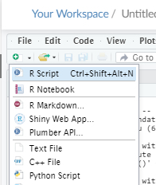
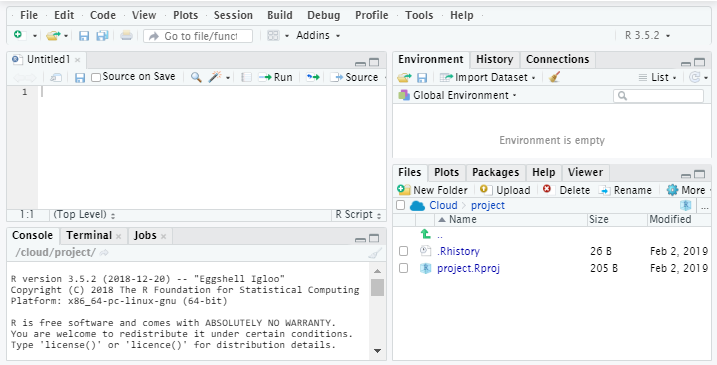
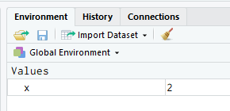
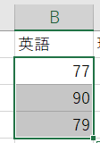
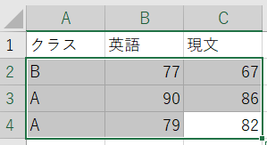

```{r include = FALSE}
knitr::opts_chunk$set(fig.align = 'center')
knitr::opts_chunk$set(message = F)
knitr::opts_chunk$set(warning = F)
```

# 本講義の目的
- RやR Studioの起動について学ぶ。
- Rを使った計算について学ぶ。
- オブジェクト、ベクトル、関数、データフレームなどについて学ぶ。
- データの読み込み方について学ぶ。
- 因子（factor)について学ぶ。

# Rの起動

## RStudioのセットアップ

Posit Cloud（旧名：RStudio Cloud）というサービスを利用して、次の手順によりRの開発環境を準備する

1. Posit Cloud（ [https://posit.cloud/](https://posit.cloud/) ）に行き、右上の「Log In」をクリックする
2. 「Log In with Google」から立教のアカウントを選び、ログインする
3. 「New Project」から「New RStudio Project」をクリックして新しいプロジェクトを立ち上げる


※卒論など本格的にRを使う場合はPosit Cloudではなく大学のPCを利用するか、自身のPCに[R](https://cran.ism.ac.jp/)と[R Studio](https://posit.co/products/open-source/rstudio/)をインストールして使用することをおすすめする。


## RStudioの基本操作

### 新規Rファイルの作成

Rスクリプト（R言語のコードを記述するテキストファイル）の新規作成を行うには、RStudio左上の「白い紙に(+)のマークがついているようなアイコン」をクリックし、「R Script」をクリックする



### 各部分の説明



RStudioの基本画面はこの４つの領域からなる。

- 左上がRスクリプトの入力欄（コードを書く部分）
  - コードを書き、[Run]ボタンを押せば実行できる
- 左下[Console]がRスクリプトの実行結果が出てくる画面
- 右上[Environment]が読み込んだデータなどのオブジェクトが一覧で表示される画面
- 右下[Files]が現在のワークスペースのファイルを表示している部分
    - 図を描けば[Plots]タブに表示され、Helpを呼び出せば[Help]タブに表示される


# 計算と代入


Rでは電卓やExcelで計算するのと同様に計算を行うことができる。

```{r}
123 + 456
```

## 代入

分析対象のデータや計算結果の値などのデータを格納するもののことを**オブジェクト**（object）や**変数**（variable）と呼ぶ。

あるオブジェクトに何らかの値を代入するときは、`=`や`<-`という記号（演算子）を使う。
（なお、Rは`<-`による代入のほうが正統な記法である）

RStudio上では、`<-`は`Alt`と`-`のキーを同時に押すことで簡単に入力できる（Macの場合は`Option + -`）。

```{r}
x <- 1 + 1  # オブジェクト x に 1+1の演算結果を代入
```

## オブジェクトの確認

オブジェクト単体でコードを実行すれば、オブジェクトの中身を表示することができる。

```{r}
x # オブジェクト x の中身を表示
```


また、RStudioの[Environment]部を見ることでも確認することができる。




## Rのデータ型

プログラミング言語では、データの型というものを意識する必要がある。

例えば、クォーテーション（`"`や`'`）で囲っているものは**文字列**（character）型となるため、`"1" + 1`のような演算はできない点に気をつける。

Rの基本的なデータ型は次の通り。

| データ型            | 例                |
|:-------------------:|:-----------------:|
| 数値（numeric）     | 1、0.1            |
| 文字列（character） | "A"、"あいうえお" |
| 論理値（logical）   | TRUE、FALSE、T、F |


# ベクトル

**ベクトル**（vector）という、複数の値が一列にならぶようにして入れられた形式のオブジェクトがある。

Excelでいうとデータを1行あるいは1列取り出したようなものにあたる。



ベクトルを作りたいときは、`c()`にカンマで区切りながら値を入れていく。
`c`はcombine(結合)のcである。

```{r}
# ベクトル
y <- c(1, 20, 100)
y
```

1~10の整数が入ったベクトルが欲しい時などは、`1:10`のように
始めの数と終わりの数で`:`を挟むように記述する。

```{r}
# 1~10の整数
x <- 1:10
x
```


## 文字列を扱う際の注意点

文字列のデータを扱うときはクォーテーション（`"`や`'`）で囲う。

```{r}
z <- c("あ", "いう", "えおか") # これならエラーにならない
z
```

クォーテーションで囲まない場合はオブジェクト扱いになる

```{r, eval=F}
z <- c(あ, いう, えおか) #これだとエラー（「あ」「いう」「えおか」というオブジェクトを定義していないため）
```

日本語のオブジェクトに値を代入することもできるが、日本語はエラーの元なのでできるだけ避けたほうがよい

```{r}
# 「あ」「いう」「えおか」をそれぞれ定義
あ <- "A"
いう <- "IU"
えおか <- "EOKA"

# これならエラーにならない
z <- c(あ, いう, えおか)
z

```

## ベクトルとデータ型

1つのベクトルには1つのデータ型のデータしか入れることができない。

```{r}
onetwothree <- c(1, "1", 2, "二", 3) #全部文字列(chr)になる
onetwothree
```


## ベクトルの要素の取得

`LETTERS`は大文字のアルファベットが入ったベクトルで、あらかじめ定義されている。

```{r}
LETTERS
```


ベクトルの要素を取り出すには、`ベクトル[要素の番号]` のように指定する。

```{r}
LETTERS[1] # LETTERSの最初の要素
LETTERS[1:3] # LETTERSの1~3番目の要素
LETTERS[c(1, 12, 23)] # LETTERSの1,12,23番号の要素
```

# 関数

何らかの処理を行う機能を持ったオブジェクトを**関数**（function）あるいは**メソッド**（method）という。

```{r}
sum(1:100) # sum: 数値ベクトルの合計値を返す
length(LETTERS) # length: ベクトルの長さ（要素数）を返す
```


## ヘルプ

関数の使い方など、わからないことがある場合はヘルプを参照すると便利である。

ヘルプは

1. 調べたい関数名を`help()`に入れて実行する
2. 関数名の前に`?`をつけて実行する
3. （RStudioの場合）関数名にカーソルを置いた状態で`F1`キーを押す

といった方法で呼び出すことができる。

```{r, eval=F}
?sum
```


# データフレーム

**データフレーム**（data frame）とは、Excelのワークシートのようにデータを表形式で保持するためのオブジェクトのこと。

Rでは基本的にデータフレームを使ってデータ分析を行うことになる。

<!--  -->

## データフレームの作成

```{r}
df1 <- data.frame(class = c("B","A","A"),
                  english = c(79, 91, 89),
                  math = c(75, 81, 92))
df1
```


## データフレームの要素の取得

`df[行番号,列番号]`のように座標を指定して要素を取り出すことができる。

```{r}
df1[1, ] # 1行目を表示
df1[ ,2] # 2列目を表示
df1[2] # 2列目をデータフレームとして表示
df1[1:3, 1:3] # 1~3行の1~3列を表示
df1[c(1,3), c(1,3)] # 1,3行の1,3列を表示
```


`df["列名"]`や`df$class`のように列を指定することもできる

```{r}
df1["class"]
```

取り出したデータフレームの一部を別途代入し、新しいオブジェクト（数値、ベクトル、データフレーム）にすることもできる。

```{r}
df <- df1[c("english","math")]
df
```


## 簡単な集計処理の例

### mean()

ベクトルの場合は`mean()`で平均値を計算できる

```{r}
mean(1:6)
```


### colMeans()

`colMeans()`はデータフレームの各列に対して平均値の計算を行った結果を返す関数である。
（`colSums()`、`rowSums()`、`rowMeans()`なども存在する）

```{r}
colMeans(df1[, -1]) # 1列目以外の各列（columns）に対する平均を表示
```


# 外部データの読み込み

## （参考）ワーキングディレクトリの設定

ワーキングディレクトリとは、「作業を行うディレクトリ」のこと。
「現在開いているディレクトリ」ということで"current directory"とも呼ばれる。

csvやxlsxのデータを読み込む場合はファイルが存在する場所を指定する必要があるため、意識する必要がある。

（RStudio Cloudではあまり意識しなくてもよいが、クラウドでなく手元のパソコンの中でRStudioを使う際には重要になる）

```{r, results='hide'}
# 現在開いているディレクトリを調べる（get working directory）
getwd()
```

ワーキングディレクトリを設定するには`setwd("作業したいディレクトリのパス")`のように書く。

```{r, results='hide'}
# set working directory
setwd(".")
```

（なお、`"."`はUNIX系OSでワーキングディレクトリを指すので`setwd(".")`は何も変化を起こさない）


## csvデータの書き出し

データの書き出しには`write.csv()`関数を使う。

```{r}
#データをcsvファイルに書き出す
write.csv(df1, "df1.csv", row.names = FALSE)
```

なお、`row.names = FALSE`というオプションの**引数**（argument）は、行番号をcsvに含めずに保存することを指定するものである。（こうしないと行番号の列を含んだ状態でcsvが保存される）


## csvデータの読み込み

データの読み込みには`read.csv()`関数を使う。

```{r}
#データをcsvファイルから読み込んでdf2という名前にする
df2 <- read.csv("df1.csv")
```


# 因子（factor）型とデータ型の変換

## 因子（factor）型

文字列と似たデータ型で**因子**（factor）型というものがある。

```{r}
# 因子(ファクター)
classes <- as.factor(df2$class)
classes

str(classes) # str() = structure
```

`str()`というデータの内部構造を表示する関数を使うと、`classes`は因子型であり、値の水準（levels）が`"A","B"`の2つあり、内部的には2,1,1と数値で保持されていることがわかる。


## データ型の変換

`as.factor()`と同様に`as.character()`を使えば文字列型に戻すことができる。

```{r}
str(as.character(classes))
```


## （参考） 文字列型の因子型への自動変換

バージョン4.0.0より前のRではデータフレーム作成時（`data.frame()`）やcsvの読み込み時（`read.csv()`）には、文字列型のデータは因子型に自動的に変換する処理が`data.frame()`や`read.csv()`の関数ではデフォルト設定となっていたため、不意に因子型に遭遇することがあった。もし古いRを使っていて自動変換を防ぎたい場合は、`stringsAsFactors = FALSE`という引数を追加して関数を実行すればよい。

```{r}
df3 <- data.frame(class = c("B","A","A"),
                  english = c(79, 91, 89),
                  math = c(75, 81, 92),
                  stringsAsFactors = FALSE)
str(df3)
```


# （参考）その他のタイプのオブジェクト

Rでデータ分析を行うときは、基本的にベクトルとデータフレームを理解していればいい。

しかし、Rの世界も奥深いので、それらとも異なる形のデータと出会うこともある。本節ではそれらを紹介する。

## リスト

**リスト**（list）はベクトルやデータフレームなど様々なオブジェクトをまとめることができる、非常に自由度が高いオブジェクトである。

リストの中にリストを内包するようなこともできる。

### リストの作成

```{r}
# リストの作成
list_ex <- list(vector = c("A", "B", "C"),
                df = df1,
                list = list(LETTERS, letters))
list_ex
```

### リストの要素へのアクセス

要素に名前がついていれば`list$要素名`で参照できる

```{r}
# リストの中のdfという要素（データフレーム）の取り出し
list_ex$df
```

要素に名前がついていない場合、要素の番号（`list[[i]]`）を指定して参照する

```{r}
# リストの中のlistという要素（リスト）の第一要素([[1]])の取り出し
list_ex$list[[1]]
```


## 行列

**行列**（matrix）は、データフレームと非常に似ているものの、

1. すべての要素のデータ型が統一されている
2. 通常、要素は数値で構成される

という特徴を持つ。

### 行列の作成

行列は基本的にひとつのベクトルを用意して行数（nrow）や列数（ncol）を指定して作成する

```{r}
# ベクトルから行列を作る場合
M <- matrix(data = c(1:6), nrow = 2, ncol = 3)
M
```

`as.matrix()`関数でデータフレームを行列にすることもできる。

```{r}
# データフレームの行列への変換
D <- as.matrix(df1[,2:3])
D
```

### 行列の演算

行列同士であれば`%*%`という演算子を用いて行列同士の積を計算したりなど、様々な演算が可能になる。

```{r}
M %*% D
```


# （参考）Rの入門向けサイト

## 日本語

- 卒業論文のためのR入門： [https://tomoecon.github.io/R_for_graduate_thesis/](https://tomoecon.github.io/R_for_graduate_thesis/)
    - 森知晴氏（立命館大学総合心理学部）のサイト

- 私たちのR: ベストプラクティスの探究　[http://www.jaysong.net/RBook/](http://www.jaysong.net/RBook/)
    - 宋財泫氏 (Jaehyun Song)と矢内勇生 (Yuki Yanai)氏のサイト

- KUT 計量経済学応用 統計的因果推論入門 [https://yukiyanai.github.io/econometrics2/](https://yukiyanai.github.io/econometrics2/)
    - 矢内勇生氏のサイト

## 英語
- **R for Data Science**: [https://r4ds.had.co.nz/](https://r4ds.had.co.nz/)
    - 和訳されて[『Rではじめるデータサイエンス』](https://www.amazon.co.jp/R%E3%81%A7%E3%81%AF%E3%81%98%E3%82%81%E3%82%8B%E3%83%87%E3%83%BC%E3%82%BF%E3%82%B5%E3%82%A4%E3%82%A8%E3%83%B3%E3%82%B9-Hadley-Wickham/dp/487311814X/)ともなっている本"R for Data Science"の原文


# （おまけ）Pythonで同様の作業を行う場合

本講義の演習はRで行うが、参考として、ここまで学んだ内容に対応するPythonのコードを簡単に紹介する。

Pythonにはベクトルやデータフレームが標準では備わっていないため、通常は**NumPy**（数値計算・配列）と**pandas**（データフレーム）という2つの外部ライブラリを使う。

```python
import numpy as np
import pandas as pd
```

## 計算と代入

計算や代入の書き方はRとほとんど同じ。ただし代入の記号は`<-`ではなく`=`を使う。

```python
123 + 456
```

```python
x = 1 + 1  # オブジェクト x に 1+1の演算結果を代入
x          # 中身を表示（スクリプト実行時はprint(x)が必要）
```

## ベクトル（リスト・NumPy配列）

Rの**ベクトル**に相当するのは、Pythonの標準の**リスト**（list）や、NumPyの**配列**（array）である。要素ごとの計算（ベクトル演算）をしたい場合はNumPyの配列を使うのが一般的。

```python
# NumPy配列（Rのc(1, 20, 100)に相当）
y = np.array([1, 20, 100])
y
```

```python
# 1~10の整数（Rの1:10に相当）
x = np.arange(1, 11)
x
```

Rと同様、1つの配列には基本的に1つのデータ型しか入らない（数値と文字列が混ざると全体が文字列型になる）。

要素の取り出しは`[ ]`を使うが、**Pythonのインデックスは0始まり**である点がRとの大きな違い（Rは1始まり）。

```python
LETTERS = list("ABCDEFGHIJKLMNOPQRSTUVWXYZ")
LETTERS[0]        # 最初の要素（Rの LETTERS[1] に相当）
LETTERS[0:3]      # 1~3番目の要素（Rの LETTERS[1:3] に相当）
[LETTERS[i] for i in [0, 11, 22]]  # 1,12,23番目の要素
```

## 関数

関数の呼び出し方自体はRとほぼ同じ。

```python
sum(range(1, 101))  # 1~100の合計（Rのsum(1:100)に相当）
len(LETTERS)         # 要素数（Rのlength()に相当）
```

## データフレーム（pandas）

Rのデータフレームに相当するのはpandasの**DataFrame**である。列を辞書（dict）形式で指定して作成する。

```python
df1 = pd.DataFrame({
    "class": ["B", "A", "A"],
    "english": [79, 91, 89],
    "math": [75, 81, 92],
})
df1
```

要素の取得には`.iloc[]`（位置による指定）や`.loc[]`（ラベルによる指定）、列名の指定を使う。

```python
df1.iloc[0]                  # 1行目を表示（Rの df1[1, ] に相当）
df1.iloc[:, 1]                # 2列目を表示（Rの df1[ ,2] に相当）
df1[["english", "math"]]      # 複数列をデータフレームとして表示
```

平均値の計算には`.mean()`メソッドを使う（Rの`colMeans()`に相当）。

```python
df1[["english", "math"]].mean()
```

## csvデータの読み書き

pandasでは`to_csv()`・`read_csv()`を使う（Rの`write.csv()`・`read.csv()`に相当）。

```python
df1.to_csv("df1.csv", index=False)   # 書き出し（index=FalseはRのrow.names=FALSEに相当）
df2 = pd.read_csv("df1.csv")          # 読み込み
```

## 因子（factor）型 → カテゴリ型

Rの因子（factor）型に相当するのは、pandasの**category型**である。

```python
classes = df2["class"].astype("category")
classes
classes.cat.codes  # 内部的な数値コード（Rのas.integer()に相当）
```

## （参考）辞書・NumPy配列（行列）

Rのリストに近いものとしてPythonには**辞書**（dict）がある。また、Rの行列に相当するのは2次元のNumPy配列である。

```python
list_ex = {
    "vector": ["A", "B", "C"],
    "df": df1,
    "list": [LETTERS, [c.lower() for c in LETTERS]],
}
list_ex["df"]        # 辞書のdfという要素の取り出し（Rの list_ex$df に相当）
list_ex["list"][0]   # listという要素の第一要素（Rの list_ex$list[[1]] に相当）
```

```python
M = np.array([[1, 3, 5], [2, 4, 6]])  # Rのmatrix(1:6, nrow=2, ncol=3)に相当
D = df1[["english", "math"]].to_numpy()    # データフレームをNumPy配列に変換
M @ D                                  # 行列の積（Rの %*% に相当）
```
