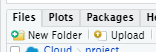
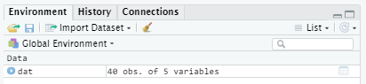
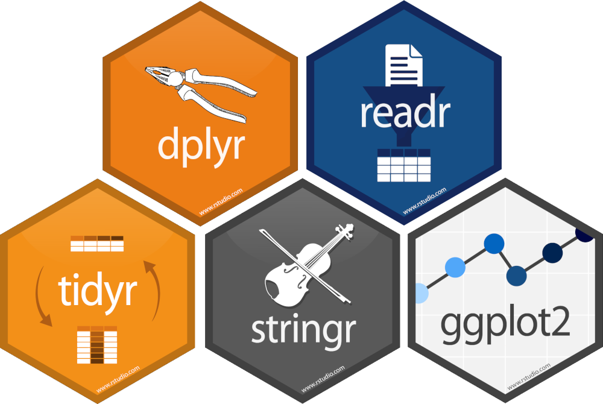
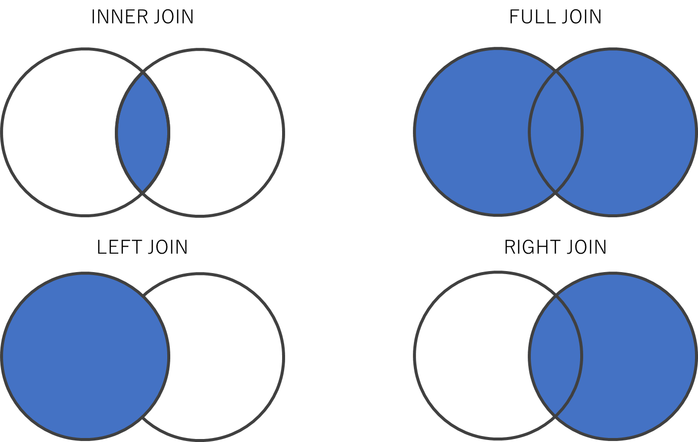
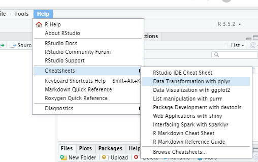

```{r include = FALSE}
knitr::opts_chunk$set(fig.align = 'center', message = F, warning = F)
library("readxl")
```


# パッケージ

パッケージ（package）とは，Rの機能を拡張するプログラムである。  
（他のプログラミング言語ではライブラリと呼ぶものにあたる）

## パッケージのセットアップ

公開されているパッケージをダウンロードしてインストールするには`install.packages("パッケージ名")`と書き，インストールしたパッケージを読み込むには`library(パッケージ名)`と書く。

なお，インストールは一度すれば次回からは`install.packages()`を実行する必要はないが，`library()`はRを起動するたびに必要になる。

さて，以下ではExcelファイルを読み込むためのパッケージ`{readxl}`を使用していく。

```{r, eval=F}
# パッケージ読み込み
install.packages("readxl") #インストール
library("readxl") # 読み込み
```

### ファイルのアップロード

分析したいデータが入ったファイルをRStudio Cloudのワークスペースにアップロードするには，右下の[Files]タブの[Upload]をクリックしてファイルをアップロードする。



`test_scores.xlsx`ファイルをアップロードすれば，[Files]タブにも反映される。


## エクセル（.xlsx）ファイルの読み込み

`{readxl}`パッケージの`read_excel()`関数で読み込みを行う。

```{r}
# エクセル読み込み
df <- read_excel("test_scores.xlsx")
```


# データフレームを概観する

## データフレームオブジェクトの確認

オブジェクト`dat`に代入されたデータフレームは[Environment]タブにも表示される。



「40 obs. of 5 variables」とは，「観測値（行）が40，変数（列）が5」のデータフレームであることを示している。


## 行数・列数を確認

データフレームオブジェクトの行数と列数を関数で確認したいときは`dim()`を使う

```{r}
dim(df)
```


## View()

「40 obs. of 5 variables」の右にある表のようなアイコンをクリックする（あるいは`View(dat)`を実行する）と，エクセルのようなセルにデータが入った形式でデータフレームを表示することができる。


## head()

`head()`関数は，データフレームの先頭6行を表示する関数である。

どういった変数が入ったデータなのかを簡単に把握することができる。

```{r}
head(df)
```

（なお，後尾6行を見たいときは`tail()`関数を使う）


# パイプ処理

Rは基本的に関数を使ってコードを書くため，複数の処理をまとめて書くときは関数の中に関数を内包する形になる。

複雑な処理を行うときは，関数を内包するたびにコードがどんどん読みづらくなっていく。

```{r}
head(read_excel("test_scores.xlsx"))
```

そこで登場するのが`{dplyr}`パッケージの**パイプ演算子**（`%>%`）である。

```{r, eval=F}
# パッケージのインストール
install.packages("dplyr")
```

パイプ演算子は左にあるオブジェクトを右の関数に受け渡して処理をさせることができる。

```{r}
library(dplyr)
read_excel("test_scores.xlsx") %>% head()
```

バイプの始点は関数でなくオブジェクトでもよい。

```{r}
# subset()は条件（クラスがCである）に合う行を取り出す関数
df %>% subset(クラス == "C") %>% head()
```

なお，パイプ処理で関数に渡されるオブジェクトは関数の第一引数に入れられる。  
（本来`subset(データフレーム, 条件)`となっていて，この「データフレーム」が第一引数）

ただし，`subset(, 条件)`のようにカンマを残す必要はない。`subset(条件)`のように書けばよい。


# データフレームの操作

## {tidyverse}パッケージ



データの本格的な分析に入る前にデータの整理や加工を行うことを**前処理**（preprocess）という。

Rでは前処理を効率よく行うために{dplyr}や{tidyr}や{stringr}などのパッケージが整備されている。

いくつものパッケージを個別にインストールと読み込みを行うのは面倒なので，{dplyr}や{tidyr}や{stringr}などの便利なパッケージをまとめた[{tidyverse}](https://www.tidyverse.org/packages/)というパッケージをインストールする。


```{r, eval=F}
install.packages("tidyverse") #インストール
library("tidyverse") # 読み込み
```

```{r, include=F}
library("tidyverse") # 読み込み
```


{tidyverse}パッケージで読み込まれるパッケージは，例えば次のようなものである

- 前処理を便利にするもの
    - [dplyr](http://dplyr.tidyverse.org/)や[tidyr](http://tidyr.tidyverse.org/)：データフレームの操作のためのパッケージ
    - [stringr](https://github.com/tidyverse/stringr)：文字列の操作のためのパッケージ
- 既存の関数の改善
    - [readr](http://readr.tidyverse.org/)：`read.csv()`関数をもっと便利なものに置き換える
    - [tibble](http://tibble.tidyverse.org/)：`data.frame()`関数をもっと便利なものに置き換える
    - [ggplot2](http://ggplot2.tidyverse.org/) ：綺麗なグラフやGIS（統計地図）などを描くことができる


## 条件指定による行の取り出し

### 条件と論理演算

ここでいう条件とは，「変数Xが2である（$X = 2$）」「変数Zが0以上である（$Z \geq 0$）」などといったもののこと。

Rでは等号や不等号は次のように表す。

| 数学上の記号 | Rでの記法  | 意味                   |
| :----------: | :--------: | :--------------------: |
| =，≠         | `==`，`!=` | である，でない         |
| ＞，＜       | `>`，`<`   | より大きい，より小さい |
| ≧，≦         | `>=`，`<=` | 以上，以下             |

これらの条件を複数つなげるとき（例えば「$X=2$かつ$Z=10$」のようにするとき）の論理演算子は次のように書く。

| 数学上の記号 | Rでの記法 | 意味         |
| :----------: | :------: | :----------: |
| ∧，∩         | `&`  | かつ（and）  |
| ∨，∪         | `|`  | または（or） |


```{r}
# 条件式の計算の例
 x <- 7            # x = 7と定義
 x != 2            # 「xは2ではない」（か否か）  
 (x > 2) & (x < 4) # 「2より大きい」かつ「4より小さい」（であるか否か）
```

条件式の計算結果はTRUE（真）とFALSE（偽）の値（論理値 bool）で返される。

### 関数を使わないで行指定

条件を満たす行を抜き出したいとき，関数を使わずにシンプルに記述する場合は次の方法で行う。

```{r}
df[df["クラス"] == "C",] # クラスがCの行を取り出す
```

これは，`df`というデータフレームの`"クラス"`という列（`df["クラス"]`）が`"C"`であるか否かを`df["クラス"] == "C"`として計算させて論理値（TRUEやFALSE）のベクトルを得て，それを`df[行番号,列番号]`の行番号の部分に入れることで条件に合致する行を取り出す方法。


### 関数を使って行指定

{dplyr}パッケージの`filter()`関数を使っても同様に条件指定して行を取り出すことができる。

`filter(データフレーム, 条件式)`の形で書く。

```{r}
filter(df, 50 < 英語 & 英語 < 60) # 英語が50~60点の人を抽出
```

（`filter()`はパイプ処理の節で登場した`subset()`と機能も文法もほぼ一緒）


#### （参考）`filter_all()`

`filter_()`派生の関数で`filter_all()`というものがある。

`filter_all()`の中に`any_vars()`や`all_vars()`という関数を入れて使う。

```{r}
# データフレームのいずれかの変数で100という値をとる行
filter_all(df, any_vars(. == 100))
```


## 列の取り出し

`select()`関数はデータフレームから条件に合う列を取り出す関数である


基本的には`select(データフレーム, 列名1, 列名2, ...)`のように書く。

```{r}
select(df, クラス, 名前)
```

パイプ演算子を使用してもよい。

```{r}
df %>% select(クラス, 名前)
```

### 除外条件の指定

列名を指定するときに，マイナス（`-`）をつけると，「その列以外を取り出す」という指定になる

```{r}
df %>% select(-名前)
```

### 列名を検索して指定

`select()`の中で`contains()`という関数を使うと，「列名に〇〇という言葉を含むものを取り出す」という指定を行うことができる。

```{r}
df %>% select(contains("国"))
```


## 列名の変更

データフレームの列名を変更したいときは，主に次の2つの方法がある


### `colnames()`を使う

`colnames()`関数を使うとデータフレームの列名を取得できる（なお，行名は`rownames()`で取得できる）

```{r}
df2 <- df %>% select(クラス, 名前) # 説明の簡略のために2列を取り出す
colnames(df2) # 列名の表示
```

逆に，`colnames()`に（列数と同じ長さの）文字列ベクトルを指定することでデータフレームの列名を変更できる。

```{r}
colnames(df2) <- c("class","name") # 列名の変更
head(df2)
```


### `rename()`を使う

`rename()`関数を使い，`rename(df, 新しい列名 = 古い列名)`のように指定すると任意の列の列名のみを変えることができる。

```{r}
df2 %>% rename(NAME = name)
```


## 行を並べ替える

「点数が低い順に並べ替える」といった操作を行いたい場合，`arrange()`を使う

```{r}
df %>% arrange(数学) # 数学の点が低い順（昇順）に並べ替える
```

「高い順に並べ替える」という操作をしたい場合は`arrange()`の中で`desc()`を使う

```{r}
df %>% arrange(desc(英語)) # 英語の点が高い順（降順）に並べ替える
```


## 新たな列を追加する

前処理においては，「変数を加工し，新たな列に追加する」という処理を行う機会が多い。

変数の加工の仕方は目的に応じて様々だが，ここでは例として学生ごとの3科目の合計得点を算出する，

### 1列ずつ追加する

各科目の列を取り出して足し合わせれば合計得点の算出はできるので，それを`df["新たな列の名前"]`のように記述したものに代入すれば列の追加は簡単に終わる

```{r}
# 総得点
df["合計点"] = df$数学 + df$英語 + df$国語

# 列が追加された
head(df)
```


ただし，この方法では追加したい列の数だけこの記述を繰り返す必要がある。


### 複数列まとめて追加する

`mutate()`関数を使うと列の追加をもう少しスマートに記述できて，`mutate(df, 新しい列の名前 = 代入したい内容)`のように書く。

例えば「数学＋国語」，「数学＋英語」の2つの変数を作り，それぞれ「数国計」「数英計」と名付けることにする。

その場合，次のようにカンマで区切りながら変数を追加していく。

```{r}
df %>% mutate(数国計 = 数学 + 国語, 
              数英計 = 数学 + 英語)
```


## データフレームの連結

### 横方向の連結

同じ行数の２つのデータフレームを連結したいときは`bind_cols()`を使う

```{r}
# データフレームを分割
A <- df %>% select(クラス, 名前)
B <- df %>% select(数学, 英語, 国語)

# データフレームの連結
bind_cols(A,B)
```

（ちなみに，同様の機能をもつ関数で`cbind()`というものもある。）


### 縦方向の連結

同じ列数の２つのデータフレームを連結したいときは`bind_rows()`を使う

```{r}
# データフレームを分割
A <- df[1:20, ]   # 第1~20行
B <- df[21:40, ]  # 第21~40行

# データフレームの連結
bind_rows(A,B)
```

（同様の機能をもつ関数で`rbind()`というものもある。）


## （参考）データフレームの結合

「異なる行数・列数のデータフレームが２つあり，"id"列だけが対応関係にある」というような状況は公的統計でも民間企業のデータでも非常に多くある。  
（例えば公的統計なら「"地方自治体コード"列が対応関係にあるデータ群」であったり，民間企業なら「"顧客id"列が対応関係にあるデータ群」であったりする。）

そうした場合は"id"列を基準にデータフレームを結合するjoin関数を使う。

### full_join()

`full_join()`関数を例に実行してみる。

まず，例示用に簡単なデータフレームを作る


```{r}
# データフレームの用意
customers <- data.frame(顧客id = 1:2,
                        性別 = c("男性", "女性"),
                        年齢 = c("20代", "10代"))
sales <- data.frame(顧客id = c(1,2,3,2),
                    商品 = c("みかん", "りんご", "りんご", "みかん"),
                    個数 = c(1:4))
```

それぞれ次のようなデータフレームである。

```{r}
# 2名の顧客情報
customers
```

```{r}
# 3名の顧客による4回の取引記録
sales
```

これを`full_join()`で結合する。`full_join(df1, df2, by = "id")`のように書く。

```{r}
# "顧客id"をキーにcustomersとsalesを結合
full_join(customers, sales, by = "顧客id")
```

このように`顧客id`で紐づけしてひとつのデータフレームへと結合する。


### 結合の種類

ところで，結合する２つのデータフレーム間でidのデータが等しいとは限らない。一方では他方に比べて収録されているidのデータが少ないかもしれない（先の例での`顧客id == 3`が存在しなかったように）。

そこで結合の方法は一般的に4種類存在する。

Rでは結合方法に応じて別々の関数になっており，

1. `inner_join()`: 両方のデータフレームに存在するidを使う
2. `full_join()`: いずれかのデータフレームに存在するidは使う
3. `left_join()`: 左側に指定されたデータフレームに存在するidを使う
4. `right_join()`: 右側に指定されたデータフレームに存在するidを使う

となっている。


<center></center>

### inner_join()

`inner_join()`を使えば，先程の例での`顧客id == 3`は一方のデータフレームにしか存在しないidであるため，結合後は消える

```{r}
inner_join(customers, sales, by = "顧客id")
```

逆に`full_join()`では，先に示したように，`顧客id == 3`のデータが無い列は`NA`（欠損値）になる


## （参考）データフレームの展開

データの形式には**「ロング形式（縦持ち）」**と呼ばれるものと，**「ワイド形式（横持ち）」**と言われるものがある。


ロング形式は，例えば上記の`sales`データのように"商品"列には商品の種類を書き，"個数"列にはその商品の（売上）個数を書くものである。

一般的なデータが基本的に採用している形式で，これまで例に使用してきたデータフレームもロング形式である。

```{r}
# ロング形式
sales
```


ワイド形式は，例えば`sales`データで"商品"列の商品の種類ごとに列を分け，"顧客id"に対応する個数をセルに入れたもの（クロス集計表の形式になっているもの）である。

{tidyr}パッケージの`spread()`でワイド形式に変換することができる

```{r}
# ワイド形式
wide_shape = sales %>% spread(key = 商品, value = 個数)
wide_shape
```

{tidyr}パッケージの`gather()`でロング形式に戻すことができる

```{r}
# ロング形式に戻す
wide_shape %>% gather(key = 商品, value = 個数, みかん:りんご, na.rm = TRUE)
```


# （参考）文字列の操作

{stringr}パッケージによる文字列操作の基本を紹介する

## 文字列の結合

複数の文字列の結合は`str_c()`で行う

```{r}
str_c("あいう", "えお")
```

## 文字列ベクトルの全結合

文字列ベクトルの全要素を結合してひとつの文字列にまとめるには`str_flatten()`を使う

```{r}
str_flatten(LETTERS)
```

## 文字列のマッチング

文字列ベクトルの要素のうち，ある文字列（パターン）が入っている要素を取り出したいときは`str_subset()`を使う

```{r}
df[["名前"]] %>% str_subset("安") # "安"が入っている要素を検索
```

文字列ベクトルのなかで，ある文字列（パターン）が入っている要素の位置は`str_which()`で取得できる

```{r}
df[["名前"]] %>% str_which("川") # "川"が入っている要素の位置
```


<!-- 文字列ベクトルの各要素に，ある文字列（パターン）が入っているかどうかどうかの論理値がほしいときは`str_detect()`を使う -->

<!-- ```{r} -->
<!-- A <- c("あいうえお", "かきくけこ", "さしすせそ") -->

<!-- A %>% str_detect("あ") # "あ"が入っているか否か（論理値） -->
<!-- ``` -->


# （参考）Rのチートシート
プログラミング言語などにおいて，基本的な知識をまとめた文書を**チートシート**（Cheat Sheet）という。

[RStudioの公式サイトにもチートシートの一覧がまとめられているが](https://www.rstudio.com/resources/cheatsheets/)，主要なものはRStudioの[Help]→[Cheatsheets]からも簡単にアクセスできる。




有志による日本語のチートシートは[公式サイト](https://www.rstudio.com/resources/cheatsheets/)の下の方の「Japanese Translations – 日本語翻訳」で見ることができる。（例：[dplyrとtidyrを使ったデータラングリングチートシート](https://github.com/rstudio/cheatsheets/raw/master/translations/japanese/data-wrangling-japanese.pdf)）

# 参考文献

石田基広(2017)『[Rによるテキストマイニング入門](https://www.morikita.co.jp/books/book/3169)』　森北出版　第２版

Rによるテキストマイニングの教科書だが、「第3章 R/RStudio速習」には、本稿と重なる内容が説明されている。

