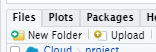
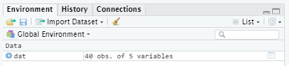
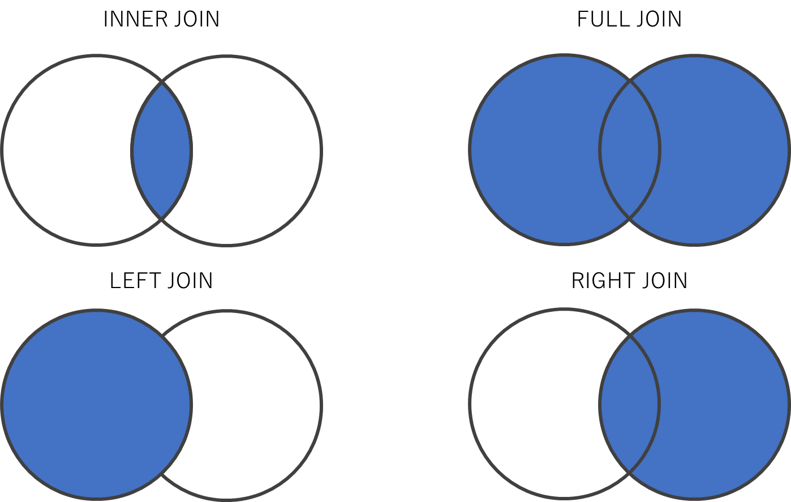

```{r include = FALSE}
knitr::opts_chunk$set(fig.align = 'center', message = F, warning = F)
library("readxl")
```

# 本講義の目的

-   パッケージについて学ぶ
-   パイプ演算子について学ぶ
-   dplyrやtidyverseを使ったデータの前処理について学ぶ

# パッケージ

パッケージ（package）とは、Rの機能を拡張するプログラムである。
（他のプログラミング言語ではライブラリと呼ぶものにあたる）

## パッケージのセットアップ

公開されているパッケージをダウンロードしてインストールするには`install.packages("パッケージ名")`と書き、インストールしたパッケージを読み込むには`library(パッケージ名)`と書く。

なお、インストールは一度すれば次回からは`install.packages()`を実行する必要はないが、`library()`はRを起動するたびに必要になる。なお、`install.packages()`や`library()`を使わないでパッケージを読み込む方法も、後日学びます。

さて、以下ではExcelファイルを読み込むためのパッケージ`{readxl}`を使用していく。

```{r, eval=F}
# パッケージ読み込み
install.packages("readxl") #インストール
library("readxl") # 読み込み
```

### ファイルのアップロード

まず、分析したいデータファイルを作業用フォルダに入れる。今回は、講義ページにある[{test_scores.xlsx}](https://michihito-ando.github.io/econome_ml_with_R/test_scores.xlsx)のファイルを使う。

なお、Posit Cloudのワークスペースにアップロードする場合は、右下の[Files]タブの[Upload]をクリックしてファイルをアップロードする。



`test_scores.xlsx`をアップロードすれば、[Files]タブにも反映される。


## エクセル（.xlsx）ファイルの読み込み

`{readxl}`パッケージの`read_excel()`関数で読み込みを行う。

```{r}
# エクセル読み込み
df <- read_excel("test_scores.xlsx")
```

# データフレームを概観する

## データフレームオブジェクトの確認

オブジェクト`df`に代入されたデータフレームは[Environment]タブにも表示される。



「40 obs. of 5 variables」とは、「観測値（行）が40、変数（列）が5」のデータフレームであることを示している。

## 行数・列数を確認

データフレームオブジェクトの行数と列数を関数で確認したいときは`dim()`を使う

```{r}
dim(df)
```

（行数だけを取得する`nrow()`や列数だけを取得する`ncol()`といった関数もある）

## View()

「40 obs. of 5 variables」の右にある表のようなアイコンをクリックする（あるいは`View(df)`を実行する）と、エクセルのようなセルにデータが入った形式でデータフレームを表示することができる。

## head()

`head()`関数は、データフレームの先頭6行を表示する関数である。

どういった変数が入ったデータなのかを簡単に把握することができる。

```{r}
head(df)
```

（なお、後尾6行を見たいときは`tail()`関数を使う）


# パイプ演算子

Rは基本的に関数を使ってコードを書くため、複数の処理をまとめて書くときは関数の中に関数を内包する形になる。

複雑な処理を行うときは、関数を内包するたびにコードがどんどん読みづらくなっていく。

```{r}
head(read_excel("test_scores.xlsx"))
```

そこで**パイプ演算子**（`|>`）を利用する。
`|>`はR 4.1以降であれば追加のパッケージなしで使える、base R（Rの標準機能）の演算子である。

以降の章では{dplyr}パッケージの`filter()`や`select()`といった便利な関数もあわせて使っていくので、ここでインストール・読み込みをしておく。

```{r, eval = FALSE}
# パッケージのインストール
install.packages("dplyr")
```

```{r}
# パッケージの読み込み
library(dplyr)
```

パイプ演算子は左にあるオブジェクトを右の関数に受け渡して処理をさせることができる。

```{r}
read_excel("test_scores.xlsx") |> head()
```

なおRStudioでは`Shift + Ctrl + M`（Macは`Shift + Command + M`）でパイプ演算子を挿入することができる（最近のRStudioではデフォルトで`|>`が挿入されるが、[Tools] → [Global Options] → [Code]の設定で`%>%`に変更することもできる）。

パイプの始点は関数でなくオブジェクトでもよい。

```{r}
# subset()は条件（classがCである）に合う行を取り出す関数
df |> subset(class == "C") |> head()
```

なお、パイプ処理で関数に渡されるオブジェクトは関数の第一引数に入れられる。
（本来`subset(データフレーム, 条件)`となっていて、この「データフレーム」が第一引数）

ただし、`subset(, 条件)`のようにカンマを残す必要はなく、`subset(条件)`のように書けばよい。

## （参考）`{magrittr}`のパイプ演算子`%>%`

{dplyr}などのtidyverse系パッケージでは、もともと`{magrittr}`パッケージ由来の`%>%`というパイプ演算子が使われてきた。`|>`が導入される前の解説記事やパッケージの公式ドキュメントには今も`%>%`が数多く使われているため、読めるようにしておくとよい。

```{r}
# %>% も |> とほぼ同じ働きをする
read_excel("test_scores.xlsx") %>% head()
```

基本的な使い方であれば`|>`と`%>%`はほぼ同じ結果になるので、本講義では以降`|>`に統一して表記する。


# データフレームの操作

## {tidyverse}パッケージ


データの本格的な分析に入る前にデータの整理や加工を行うことを**前処理**（preprocess）という。

Rでは前処理を効率よく行うために{dplyr}や{tidyr}や{stringr}などのパッケージが整備されている。

いくつものパッケージを個別にインストールと読み込みを行うのは面倒なので、{readxl}や{dplyr}や{stringr}などの便利なパッケージをまとめた[{tidyverse}](https://www.tidyverse.org/packages/)というパッケージをインストールする。

```{r, eval=F}
install.packages("tidyverse") #インストール
```

```{r}
library("tidyverse") # 読み込み
```

{tidyverse}パッケージで読み込まれるパッケージは、例えば次のようなものである

- 前処理を便利にするもの
  - [dplyr](http://dplyr.tidyverse.org/)や[tidyr](http://tidyr.tidyverse.org/)：データフレームの操作のためのパッケージ
  - [stringr](https://github.com/tidyverse/stringr)：文字列の操作のためのパッケージ
- 既存の関数の機能拡張
  - [readr](http://readr.tidyverse.org/)：`read.csv()`関数をもっと便利なものに置き換える
  - [readxl](https://readxl.tidyverse.org/)：Excelのファイル（.xlsx）を読み込む関数を提供する
  - [tibble](http://tibble.tidyverse.org/)：`data.frame()`関数をもっと便利なものに置き換える
  - [ggplot2](http://ggplot2.tidyverse.org/) ：綺麗なグラフやGIS（統計地図）などを描くことができる

## 条件指定による行の取り出し

### 条件と論理演算

ここでいう条件とは、「変数Xが2である（$X = 2$）」「変数Zが0以上である（$Z \geq 0$）」などといったもののこと。

Rでは等号や不等号は次のように表す。

| 数学上の記号 | Rでの記法  |          意味          |
|:------------:|:----------:|:----------------------:|
|     =、≠     | `==`、`!=` |     である、でない     |
|    ＞、＜    |  `>`、`<`  | より大きい、より小さい |
|     ≧、≦     | `>=`、`<=` |       以上、以下       |

これらの条件を複数つなげるとき（例えば「$X=2$かつ$Z=10$」のようにするとき）の論理演算子は次のように書く。

| 数学上の記号 | Rでの記法 |     意味     |
|:------------:|:---------:|:------------:|
|     ∧、∩     |    `&`    | かつ（and）  |
|     ∨、∪     |    `|`    | または（or） |

```{r}
# 条件式の計算の例
x <- 7            # x = 7と定義
x != 2            # 「xは2ではない」（か否か）
(x > 2) & (x < 4) # 「2より大きい」かつ「4より小さい」（であるか否か）
```

条件式の計算結果はTRUE（真）とFALSE（偽）の値（論理値）で返される。

### 関数を使わないで行指定

条件を満たす行を抜き出したいとき、関数を使わずにシンプルに記述する場合は次の方法で行う。

```{r}
df[df["class"] == "C",] # classがCの行を取り出す
```

これは、`df`というデータフレームの`"class"`という列（`df["class"]`）が`"C"`であるか否かを`df["class"] == "C"`として計算させて論理値（TRUEやFALSE）のベクトルを得て、それを`df[行番号,列番号]`の行番号の部分に入れることで条件に合致する行を取り出す方法。

### 関数を使って行指定

{dplyr}パッケージの`filter()`関数を使っても同様に条件指定して行を取り出すことができる。

`filter(データフレーム, 条件式)`の形で書く。

```{r}
dplyr::filter(df, 50 < english & english < 60) # englishが50~60点の人を抽出
```

（`filter()`はパイプ処理の節で登場した`subset()`と機能も文法もほぼ一緒）

なお、`dplyr::`は省略することもできる。ただし、読み込んでいる他のパッケージに同じ名前の関数があった場合、エラーが生じるので、できるだけ省略しないことをすすめる。ただ、本講義では簡便化のためにわりと省略している。

```{r}
filter(df, 50 < english & english < 60) # englishが50~60点の人を抽出
```

#### （参考）filterの派生関数群

`if_any()`、`if_all()`といった関数を組み合わせることでより複雑なフィルタリング条件を簡潔に指定することもできる。

```{r}
# データフレームのいずれかの変数で100という値をとる行
# （参考）やや古い書き方になるが filter_all(df, any_vars(. == 100)) と書くこともできる
filter(df, if_any(everything(), ~ . == 100))
```

`if_any(対象の列を指定する関数, 条件や処理を指定する関数)` というやや難しい記法になる。

（`~ . == 100`は{purrr}パッケージで導入される無名関数の記法で、`.`を引数に取る関数`function(.){. == 100}`を定義していることと等しい）

対象の列は、`ends_with()`や`contains()`のような部分一致だけでなく、`all_of()`で列名を直接指定することもできる。

```{r}
# englishとjapaneseの2列がどちらも90以上の値をとる行を取り出す
# if_all()をif_any()に変えると「いずれかで90以上の値」という条件になる
df |> filter(if_all(all_of(c("english", "japanese")), ~ . > 90))
```

## 列の取り出し

`select()`関数はデータフレームから条件に合う列を取り出す関数である

基本的には`select(データフレーム, 列名1, 列名2, ...)`のように書く。

```{r}
dplyr::select(df, class, name)
```

パイプ演算子を使用してもよい。

```{r}
df |> select(class, name)
```

### 除外条件の指定

列名を指定するときに、マイナス（`-`）をつけると、「その列以外を取り出す」という指定になる

```{r}
df |> dplyr::select(-name)
```

### 列名を検索して指定

`select()`の中で`contains()`という関数を使うと、「列名に〇〇という言葉を含むものを取り出す」という指定を行うことができる。

```{r}
df |> select(contains("an")) # "an"を含む列名（japanese）を取り出す
```

## 列名の変更

データフレームの列名を変更したいときは、主に次の2つの方法がある。

Excelファイルなどの元データでは、列名が日本語になっていることもよくある。変数名に日本語（特に全角記号や漢字）を使うと、異なる環境で文字化けやエラーの原因になったり、日本語が読めない人にとって読みにくくなったりするため、読み込んだ後になるべく早い段階で英語名に変換しておくことをすすめる。ここでは、そうした日本語の列名を英語名に変換する場面を例に、列名の変更方法を紹介する。

### `colnames()`を使う

`colnames()`関数を使うとデータフレームの列名を取得できる（なお、行名は`rownames()`で取得できる）

```{r}
# 列名が日本語になっている例（説明のために作成したデータ）
df_ja <- data.frame(クラス = c("B","A","A"),
                    英語 = c(79, 91, 89),
                    数学 = c(75, 81, 92))
colnames(df_ja) # 列名の表示
```

逆に、`colnames()`に（列数と同じ長さの）文字列ベクトルを指定することでデータフレームの列名を変更できる。

```{r}
colnames(df_ja) <- c("class", "english", "math") # 列名を英語名に変更
df_ja
```

### `rename()`を使う

`rename()`関数を使い、`rename(df, 新しい列名 = 古い列名)`のように指定すると任意の列の列名のみを変えることができる。

```{r}
df2 <- df |> select(class, name) # 説明の簡略のために2列を取り出す
df2 |> dplyr::rename(NAME = name)
```

## 行を並べ替える

「点数が低い順に並べ替える」といった操作を行いたい場合、`arrange()`を使う

```{r}
df |> dplyr::arrange(math) # mathの点が低い順（昇順）に並べ替える
```

「高い順に並べ替える」という操作をしたい場合は`arrange()`の中で`desc()`を使う

```{r}
df |> arrange(desc(english)) # englishの点が高い順（降順）に並べ替える
```

## 新たな列を追加する

前処理においては、「変数を加工し、新たな列に追加する」という処理を行う機会が多い。

変数の加工の仕方は目的に応じて様々だが、ここでは例として学生ごとの3科目の合計得点を算出する、

### 1列ずつ追加する

各科目の列を取り出して足し合わせれば合計得点の算出はできるので、それを`df["新たな列の名前"]`のように記述したものに代入すれば列の追加は簡単に終わる

```{r}
# 総得点
df["total_score"] <- df$math + df$english + df$japanese

# 列が追加された
head(df)
```

ただし、この方法では追加したい列の数だけこの記述を繰り返す必要がある。

### 複数列まとめて追加する

`mutate()`関数を使うと列の追加をもう少しスマートに記述できて、`mutate(df, 新しい列の名前 = 代入したい内容)`のように書く。

例えば`math`＋`japanese`、`math`＋`english`の2つの変数を作り、それぞれ`math_japanese`、`math_english`と名付けることにする。

その場合、次のようにカンマで区切りながら変数を追加していく。

```{r}
df |> dplyr::mutate(math_japanese = math + japanese,
                     math_english = math + english)
```

## データフレームの連結

### 横方向の連結

同じ行数の２つのデータフレームを連結したいときは`bind_cols()`を使う

```{r}
# データフレームを分割
A <- df |> select(class, name)
B <- df |> select(math, english, japanese)

# データフレームの連結
bind_cols(A,B)
```

（ちなみに、同様の機能をもつ関数で`cbind()`というものもある。）

### 縦方向の連結

同じ列数の２つのデータフレームを連結したいときは`bind_rows()`を使う

```{r}
# データフレームを分割
A <- df[1:20, ]   # 第1~20行
B <- df[21:40, ]  # 第21~40行

# データフレームの連結
bind_rows(A, B)
```

（同様の機能をもつ関数で`rbind()`というものもある。）

## （参考）データフレームの結合

「異なる行数・列数のデータフレームが２つあり、"id"列だけが対応関係にある」というような状況は公的統計でも民間企業のデータでも非常に多くある。
（例えば公的統計なら「"地方自治体コード"列が対応関係にあるデータ群」であったり、民間企業なら「"顧客id"列が対応関係にあるデータ群」であったりする。）

そうした場合は"id"列を基準にデータフレームを結合するjoin関数を使う。

### dplyr::full_join()

`full_join()`関数を例に実行してみる。

まず、例示用に簡単なデータフレームを作る

```{r}
# 顧客データ
customers <- data.frame(顧客id = 1:3,
                        性別 = c("男性", "女性", "女性"),
                        年齢 = c(20, 24, 35))
customers
```

```{r}
# 取引データ
sales <- data.frame(取引id = 1:3,
                    顧客id = c(1,2,2),
                    商品 = c("みかん", "みかん", "りんご"),
                    金額 = c(200, 200, 300))
sales
```

これを`full_join()`で結合する。`full_join(df1, df2, by = "id")`のように書く。

```{r}
# "顧客id"をキーにcustomersとsalesを結合
dplyr::full_join(customers, sales, by = "顧客id")
```

このように`顧客id`で紐づけしてひとつのデータフレームへと結合する。

### 結合の種類

ところで、結合する２つのデータフレーム間でidのデータが等しいとは限らない。 一方では他方に比べて収録されているidのデータが少ないかもしれない （先の例で`顧客id == 3`の取引履歴が存在しなかったように）。

結合の方法は一般的に4種類存在する。 Rでは結合方法に応じて別々の関数になっており、

1.  `inner_join()`: 両方のデータフレームに存在するidを使う
2.  `full_join()`: いずれかのデータフレームに存在するidを使う
3.  `left_join()`: 左側に指定されたデータフレームに存在するidを使う
4.  `right_join()`: 右側に指定されたデータフレームに存在するidを使う

となっている。

<center></center>

### inner_join()

`inner_join()`を使えば、先程の例での`顧客id == 3`は一方のデータフレームにしか存在しないidであるため、結合後は消える

```{r}
dplyr::inner_join(customers, sales, by = "顧客id")
```

逆に`full_join()`では、先に示したように、`顧客id == 3`の行が残り、紐づくデータが無い列は`NA`（欠損値）になる

## （参考）データフレームの展開

データの形式には**「ロング形式（縦持ち）」**と呼ばれるものと、**「ワイド形式（横持ち）」**と言われるものがある。

ロング形式は、例えば上記の`sales`データのように"商品"列には商品の種類を書き、"金額"列にはその商品の売上金額を書くものである。

一般的なデータが基本的に採用している形式で、これまで例に使用してきたデータフレームもロング形式である。

```{r}
# ロング形式
sales
```

ワイド形式は、例えば`sales`データで"商品"列の商品の種類ごとに列を分け、"顧客id"に対応する金額をセルに入れたもの（クロス集計表のような形式になっているもの）である。

{tidyr}パッケージの`pivot_wider()`でワイド形式に変換することができる

```{r}
# ワイド形式
sales_wide <- sales |> tidyr::pivot_wider(names_from = "商品", values_from = "金額")
sales_wide
```

{tidyr}パッケージの`pivot_longer()`でロング形式に戻すことができる

```{r}
# ロング形式に戻す
sales_long <- sales_wide |>
  tidyr::pivot_longer(cols = c(-顧客id, -取引id), names_to = "商品", values_to = "金額")

sales_long |> dplyr::filter(!is.na(金額))
```

# （参考）文字列の操作

{stringr}パッケージによる文字列操作の基本を紹介する

## 文字列の結合

複数の文字列の結合は`str_c()`で行う

```{r}
str_c("あいう", "えお")
```

## 文字列ベクトルの全結合

文字列ベクトルの全要素を結合してひとつの文字列にまとめるには`str_flatten()`を使う

```{r}
str_flatten(LETTERS)
```

## 文字列のマッチング

文字列ベクトルの要素のうち、ある文字列（パターン）が入っている要素を取り出したいときは`str_subset()`を使う

```{r}
df[["name"]] |> str_subset("安") # "安"が入っている要素を検索
```

文字列ベクトルのなかで、ある文字列（パターン）が入っている要素の位置は`str_which()`で取得できる

```{r}
df[["name"]] |> str_which("川") # "川"が入っている要素の位置
```

<!-- 文字列ベクトルの各要素に、ある文字列（パターン）が入っているかどうかどうかの論理値がほしいときは`str_detect()`を使う -->

<!-- ```{r} -->

<!-- A <- c("あいうえお", "かきくけこ", "さしすせそ") -->

<!-- A |> str_detect("あ") # "あ"が入っているか否か（論理値） -->

<!-- ``` -->

# （参考）Rのチートシート

プログラミング言語などにおいて、基本的な知識をまとめた文書を**チートシート**（Cheat Sheet）という。

[RStudioの公式サイトにもチートシートの一覧がまとめられているが](https://www.rstudio.com/resources/cheatsheets/)、主要なものはRStudioの[Help]→[Cheatsheets]からも簡単にアクセスできる。

# 参考文献

- **[R for Data Science (2nd edition)](https://r4ds.hadley.nz/)**
    - Hadley Wickhamらによる定番教科書の最新版。旧版と異なり`|>`を使った現行の書き方に統一されている。特に[Data transformation](https://r4ds.hadley.nz/data-transform)（`filter()`/`select()`/`mutate()`/`arrange()`など）と[Joins](https://r4ds.hadley.nz/joins)（`inner_join()`/`full_join()`などの結合）の章が本講義の内容と対応している。

- **[私たちのR](http://www.jaysong.net/RBook/)**
    - 宋財泫氏・矢内勇生氏のサイト（第1回でも紹介）。[第13章 データハンドリング[抽出]](http://www.jaysong.net/RBook/datahandling1.html)（`select()`/`filter()`/`rename()`/`arrange()`、`|>`と`%>%`の解説）、[第17章 整然データ構造](http://www.jaysong.net/RBook/tidydata.html)（`pivot_wider()`/`pivot_longer()`）、[第18章 文字列の処理](http://www.jaysong.net/RBook/string.html)（`{stringr}`）が本講義の内容と対応している。

- **[tidyr公式: Pivoting](https://tidyr.tidyverse.org/articles/pivot.html)**
    - `pivot_longer()`/`pivot_wider()`についての、パッケージ開発元による公式解説（英語）。


# （おまけ）Pythonで同様の作業を行う場合

本講義の演習はRで行うが、参考として、ここまで学んだ内容に対応するPythonのコードを簡単に紹介する。

Pythonでのデータの前処理には、主に**pandas**というライブラリを使う。Rの`{dplyr}`や`{tidyr}`に相当する機能がまとまっている。

```python
import pandas as pd
import numpy as np
```

## パッケージ

Pythonでのパッケージのインストールは`pip install パッケージ名`（ターミナル上で実行）、読み込みは`import パッケージ名`で行う（Rの`install.packages()`・`library()`に相当）。

```python
# ターミナル上で実行（Rのinstall.packages()に相当）
# pip install pandas openpyxl
```

## エクセル（.xlsx）ファイルの読み込み

`pd.read_excel()`で読み込む（Rの`read_excel()`に相当）。

```python
df = pd.read_excel("test_scores.xlsx")
```

## データフレームを概観する

`.shape`で行数・列数、`.head()`で先頭6行、`.dtypes`で各列のデータ型を確認できる（Rの`dim()`・`head()`・`str()`に相当）。

```python
df.shape       # (40, 5)
df.head()      # 先頭6行
df.dtypes      # 各列のデータ型
```

## パイプ演算子

pandasには`|>`のような専用の演算子はないが、メソッドをドット（`.`）で繋げていく**メソッドチェーン**が同様の役割を果たす。

```python
df.query("class == 'C'").head()  # Rの df |> subset(class == "C") |> head() に相当
```

## 条件指定による行の取り出し

角括弧に論理値の条件を入れる方法と、`.query()`メソッドを使う方法がある。

```python
df[df["class"] == "C"]              # Rの df[df["class"] == "C",] に相当
df.query("50 < english < 60")        # Rの filter(df, 50 < english & english < 60) に相当
df[(df["english"] > 90) & (df["japanese"] > 90)]  # 複数条件（Rの if_all(...) に相当）
```

## 列の取り出し

列名を二重の角括弧（`[[ ]]`）で指定する。除外は`.drop(columns=...)`、部分一致検索は`.filter(like=...)`を使う。

```python
df[["class", "name"]]        # Rの select(df, class, name) に相当
df.drop(columns=["name"])     # Rの select(df, -name) に相当
df.filter(like="an")          # "an"を含む列名（japanese）を取り出す。Rの select(contains("an")) に相当
```

## 列名の変更

`.columns`に直接代入する方法と、`.rename(columns={...})`を使う方法がある（Rの`colnames()`・`rename()`に相当）。

```python
df2 = df[["class", "name"]].copy()
df2.columns = ["class", "NAME"]        # colnames()での変更に相当
df2.rename(columns={"name": "NAME"})   # rename()での変更に相当
```

## 行を並べ替える

`.sort_values()`を使う（Rの`arrange()`に相当）。降順にしたい場合は`ascending=False`を指定する。

```python
df.sort_values("math")                        # 昇順（Rの arrange(math) に相当）
df.sort_values("english", ascending=False)     # 降順（Rの arrange(desc(english)) に相当）
```

## 新たな列を追加する

角括弧で直接代入する方法と、`.assign()`メソッドを使う方法がある（Rの`df["新しい列"] <- ...`・`mutate()`に相当）。

```python
df["total_score"] = df["math"] + df["english"] + df["japanese"]

df = df.assign(math_japanese = df["math"] + df["japanese"],
               math_english = df["math"] + df["english"])
```

## データフレームの連結

`pd.concat()`を使う。横方向は`axis=1`、縦方向は`axis=0`を指定する（Rの`bind_cols()`・`bind_rows()`に相当）。

```python
A = df[["class", "name"]]
B = df[["math", "english", "japanese"]]
pd.concat([A, B], axis=1)   # 横方向の連結（Rの bind_cols(A, B) に相当）

A2 = df.iloc[0:20]   # 第1~20行
B2 = df.iloc[20:40]  # 第21~40行
pd.concat([A2, B2], axis=0)  # 縦方向の連結（Rの bind_rows(A, B) に相当）
```

## （参考）データフレームの結合

`pd.merge()`を使う。`how`引数で結合方法（`"inner"`・`"outer"`・`"left"`・`"right"`）を指定する（Rの`inner_join()`・`full_join()`等に相当）。

```python
customers = pd.DataFrame({
    "顧客id": [1, 2, 3],
    "性別": ["男性", "女性", "女性"],
    "年齢": [20, 24, 35],
})
sales = pd.DataFrame({
    "取引id": [1, 2, 3],
    "顧客id": [1, 2, 2],
    "商品": ["みかん", "みかん", "りんご"],
    "金額": [200, 200, 300],
})

pd.merge(customers, sales, on="顧客id", how="outer")  # Rの full_join() に相当
pd.merge(customers, sales, on="顧客id", how="inner")   # Rの inner_join() に相当
```

## （参考）データフレームの展開

ワイド形式への変換は`.pivot()`、ロング形式への変換は`.melt()`を使う（Rの`pivot_wider()`・`pivot_longer()`に相当）。

```python
# ワイド形式（Rの pivot_wider() に相当）
sales_wide = sales.pivot(index="顧客id", columns="商品", values="金額")

# ロング形式に戻す（Rの pivot_longer() に相当）
sales_long = (
    sales_wide.reset_index()
    .melt(id_vars="顧客id", var_name="商品", value_name="金額")
    .dropna()
)
```

## （参考）文字列の操作

文字列の結合は`+`や`"".join()`、文字列ベクトル（`Series`）に対するパターンマッチには`.str`アクセサを使う（Rの`str_c()`・`str_flatten()`・`str_subset()`・`str_which()`に相当）。

```python
"あいう" + "えお"          # 文字列の結合（Rの str_c() に相当）
"".join(["A", "B", "C"])   # 全結合（Rの str_flatten() に相当）

names = df["name"]
names[names.str.contains("安")]        # "安"が入っている要素を検索（Rの str_subset() に相当）
np.where(names.str.contains("川"))[0]  # "川"が入っている要素の位置（Rの str_which() に相当）
```
