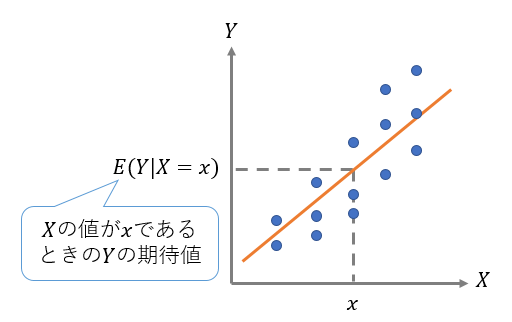

```{r include = FALSE}
knitr::opts_chunk$set(fig.align = 'center', message = F, warning = F)
```

# 本講義の目的

- 差の検定と回帰分析とマッチング法の基礎を学ぶ。
- データを自分で生成する方法を学ぶ。

# パッケージの読み込み

```{r}
pacman::p_load(tidyverse, DiagrammeR, stargazer, Matching)
```

# データの用意

今回から、データの背後に潜む因果関係を推定する手法について学んでいく。

データから因果関係を推定するということは，データ生成過程（Data generating process: DGP）を理解しようという試みでもある。そこで今回は、データ生成過程があらかじめ分かっている架空のデータを自分で生成し、それを分析していく。

個人の所得$Y$と学歴$X$（大卒か否か）と能力$A$との関係について、以下のようなDGPを持つ架空データを次のように生成する（ただし$\varepsilon$は撹乱項）。このDGPは現実的なものではないが、理解しやすいようにできるだけ単純に設定したものを用いる。

$$
Y = 200 + 10A + 500X+ \varepsilon
$$

- サンプルサイズは10,000人
- 能力は0から100まで均等に分布する
- 能力が1上がると所得は10万円上昇する
- 能力が80 以上の約 2,000人中から約 1,000人がランダムに選ばれて大卒となる。
- 大卒だと所得が500万円上昇する
- 切片は200万円（能力=0、非大卒の平均給与）
  

```{r, echo=F}
grViz("digraph dot{
graph[rankdir = LR]

node[shape = circle, fontname = 'Yu Gothic']

edge[fontname = 'Yu Gothic', fontsize = 10]
能力A -> 所得Y [label='10']
能力A -> 学歴X [label='A≧80からランダム抽出']
学歴X -> 所得Y [label='500']

{rank = same; 能力A; 学歴X}
}")


# grViz("digraph dot{
# graph[rankdir = LR]
# 
# node[shape = circle, fontname = 'Yu Gothic']
# 
# edge[]
# 能力A -> {所得Y; 学歴X; テストの点}
# テストの点 -> 学歴X -> 所得Y
#       }")
```

ここで、学歴$X$が所得$Y$に与える効果に興味があるとき、$X$を**処置変数**、$Y$を**アウトカム変数**と呼ぶ。また、$X$と$Y$に影響を及ぼすことが想定される能力$A$のような変数を**共変量/交絡要因/コントロール変数**と呼ぶ（分野によって呼び方やニュアンスが若干異なるが、ほぼ同じ意味で用いて問題ない）。

まず、上記のDGPに従うデータを生成する。なお、データ生成は、これまでの学習した内容と比較してやや高度なので、とりあえずは、ただコピペしてデータ生成するだけでも構わない。

```{r}
# 事前準備 --------------------


# 乱数の種を固定　=>　毎回同じように乱数を発生させるようにする。0を他の数値に変えると異なる乱数となる。
set.seed(0)


# データの生成 ----------------

# n:サンプルサイズ
n <- 10000

# 能力は0から100まで均等に分布。#runifは一様分布を発生させる関数。標本規模n、最小値0、最大値100
ability <- runif(n, min = 0, max = 100) 

# IDとabilityをデータフレームに格納する。
# 以下の"tibble()"はtidyverseにおけるデータフレームを作成する関数。
# 代わりに"data.frame()"を用いても構わない。

df <- tibble(ID = 1:n, ability)

# 大卒ダミーの作成
# 能力が 80 以上の約 2000人の中から約 1000人をランダムに選ばれて大卒にする。
# dfからdplyr::filter()で抽出し、sample_fram()でさらに半分をランダムに抽出する。

university_df <- df %>% filter(ability >= 80) %>% 
                        sample_frac(0.5) # 大卒の人

# university_df のデータフレームに、universityという変数を作成し、すべて1とする。
university_df <- university_df %>% 
                      dplyr::mutate(university = 1)

## なお、university_df["university"] = 1でも作成可能

# dfからdplyr::anti_join()を用いて"university_df"とマッチしなかった人を抽出する。
no_university_df <- anti_join(df, university_df, 
                              by = c("ID","ability")) # 大卒ではない人

# no_university_dfのデータフレームに、universityという変数を作成し、すべて0とする。
no_university_df <- no_university_df %>% 
                      dplyr::mutate(university = 0)

## なお、no_university_df["university"] = 0でも作成可能

# university_dfとno_university_dfを、dplyr::bind_rowsを用いて結合してあたらしいdfとし、ID順で並べる
df <- bind_rows(university_df, no_university_df) %>%  # 両者を結合
      arrange(ID) # ID順に並べる

# 所得変数（income)の作成：上記のDGP(母集団回帰モデル）に基づいて生成

df <- df %>% mutate(income = 200 + 10*ability + 500*university + rnorm(n, mean = 0, sd = 50)) # 誤差項は平均=0、SD=50

# 最初の6行
head(df)
```

生成したデータを用いて、能力(`ability`)と所得(`income`)との関係をプロットすると次のようになる。

```{r}
# 塗り分けプロット

# plot

## 大卒か否かのラベルをデータフレームに加える
df <- df %>% mutate(edu_label =
                      case_when(university == 1 ~ "Grad.", 
                                university == 0 ~ "Not grad."))

## 散布図を描く with 大卒ラベル
ggplot(df, aes(x = ability, y = income, color = edu_label)) + 
         geom_point(alpha = 0.5)+ 
         labs(title = "Ability and Income")
```


# 差の検定


以下では、上記のように生成したデータを、（データ生成過程を知らない）観察データとみなして分析する。分析目標は、「大学を卒業することが、所得をどれだけ上昇させるのか」という「因果効果」の推定である。

まず、学歴と所得分布の関係を箱ひげ図で表示すると、以下のようになる。

```{r}

# plot（箱ひげ図）
ggplot(df, aes(x = edu_label, y = income)) +
  geom_boxplot(alpha = 0.7) +
  labs(title = "Income distribution by university education")
```

大卒と非大卒の所得の平均には統計学的に有意な差があるかどうかを$t$検定によって調べる。

```{r}
# 大卒
grad_df <- df %>% filter(university == 1)
# 非大卒
not_grad_df <- df %>% filter(university == 0)

# それぞれのincomeを比較
t.test(x = grad_df$income, y = not_grad_df$income)
```

大卒の平均所得が約`r round(mean(grad_df$income),0)`万円，非大卒の平均所得が約`r round(mean(not_grad_df$income),0)`万円であり，1%有意水準でも有意な差があることがわかった。

ただし，ここで「大卒になることで、所得が`r round(mean(grad_df$income),0)` - `r round(mean(not_grad_df$income),0)` = `r round(mean(grad_df$income) - mean(not_grad_df$income), 0)`万円上昇する」と結論付けることはできない。例えば、学歴と所得の両方に影響を与える交絡要因がある場合、大卒と非大卒の所得差には、このような交絡要因の影響が反映されてしまう。

ここで、自分がこのデータの「真のデータ生成過程」を知っていることを思い起こそう。本データにおいては、所得$Y$が上がる要因には学歴$X$以外にも能力$A$という要因があった。そして、能力$A$は所得$Y$だけでなく、学歴$X$にも影響を与えていた。したがって，`r round(mean(grad_df$income) - mean(not_grad_df$income), 0)`万円という所得差は、学歴（大卒）による所得上昇効果だけでなく、能力による所得上昇効果も混在している。

それでは、能力による所得上昇効果を含まない、学歴だけによる所得上昇効果を推定することはできるだろうか？

# 回帰分析

## 回帰分析と条件付き平均値

前節の平均値の差の検定では，条件付き期待値$E(変数|条件)$の記法を使って表現すると，大卒者の所得の期待値$E(Y|X=1)$と非大卒者の所得の期待値$E(Y|X=0)$の差

$$
E(Y|X=1) - E(Y|X=0)
$$

を推定していた。

しかしこの「差」においては、能力がどんな人であれ，大卒であるかどうかという点のみを条件に比較することになり、それが交絡要因である能力$A$による推定バイアスを生じさせていた。

そこで、イメージとしては、

- 能力$A=80$の人の中で、大卒($X=1$)の所得の条件付き期待値$E(Y|X = 1,A = 80)$と非大卒($X=0$)の所得の条件付き期待値$E(Y|X = 0,A = 80)$を比べる
- 能力$A=81$の人の中で、大卒($X=1$)の所得の条件付き期待値$E(Y|X = 1,A = 81)$と非大卒($X=0$)の所得の条件付き期待値$E(Y|X = 0,A = 81)$を比べる
- 能力$A=82$の人の中で...
- 能力$A=83$の人の中で...


といったように，新たに条件を追加して能力$A$の値を一定にした下で大卒と非大卒の所得を比較していけばよいと考えられる。

回帰分析の予測値$\hat{Y}$は、説明変数を$X,A$とすると、これらの説明変数の条件付き期待値$E(Y|X,A)$の推定値である。そのため、$E(Y|X = x,A = a)$のように、複数の説明変数で条件付けた下での期待値を推定することができる。これを利用して学歴$X$が所得$Y$に与える効果を推定することができる。

<center></center>


```{r,eval=F,echo=F}
# 没コード
# # data
# ss = 50
# set.seed(0)
# temp = data_frame(x = rpois(n = ss, lambda = 5),
#                   y = 2 * x + rnorm(ss))
# # plot
# ggplot(temp, aes(x,y))+
#   geom_point()+
#   geom_smooth(method="lm",se=F)
# 
# # E(y|x = 5)
# temp %>% filter(x == 5) %>% summarise_all(funs(mean))
# # yhat|x = 5
# lm_temp = lm(y ~ x, data = temp)
# predict(lm_temp, data_frame(x = 5))
```


## すべての変数が入手可能な場合

もし，手元に所得$Y$，能力$A$，学歴$X$のデータがあるならば、

$$
Y = \beta_0 + \beta_1 A + \beta_2 X + u
$$

という回帰モデルによって係数$\beta_0,\beta_1,\beta_2$を推定できる。


```{r}
OLS_true_model <- lm(formula = income ~ ability + university, 
                     data = df)

stargazer(OLS_true_model, type = "text")
```

能力(`ability`)、学歴（`university`)、ｙ切片（`constant`)の係数推定値は、冒頭のDGPで設定したパラメータとほとんど一致する。すなわち、バイアスのない推定値となっている。

ここで、上述したような、「能力$A=a$の人の中で、大卒($X=1$)の所得の条件付き期待値$E(Y|X = 1,A = a)$と非大卒($X=0$)の所得の条件付き期待値$E(Y|X = 0,A = a)$を比べる」というのは、下図の二つの回帰直線の「縦の差を測る」ことに相当する。一定の条件の下で、ここでの「縦の差」は、学歴が所得に与えた「**平均処置効果**」の推定値とみなすことができる。

```{r}
# 塗り分けプロット

# plot

## 散布図と回帰直線を描く with 大卒ラベル
ggplot(df, aes(x = ability, y = income, 
               color = edu_label, 
               group = edu_label)) + # groupごと
         geom_point(alpha = 0.5)+ 
         geom_smooth(method = "lm", color = "black") +  # 回帰直線
         labs(title = "Ability and Income")
```

## 入手不可能な変数がある場合

実際には、学歴$X$と所得$Y$に影響を及ぼす能力$A$を正確に観察・測定することは難しい。そこで、能力$A$の変数が入手できない場合を想定し、上記の回帰式から$A$の項を除いた単回帰モデル

$$
Y = \beta_0 + \beta_1 X + u
$$

を推定するとどうなるだろうか。

結果は以下のようになる。

```{r}
OLS_missing_A <- lm(formula = income ~ university, 
                    data = df)
stargazer(OLS_missing_A, type = "text")
```

```{r, echo=F}
lm_score = lm(formula = income ~ university, 
              data = df)
```

この推定結果を因果的に解釈すると、「大卒になることによる所得上昇の効果」は、約`r round(lm_score$coefficients[2], 0)`（万円）と推定されたことになる（なおこの値は、上記の「差の検定」における大卒と非大卒の平均所得差と等しい）。すなわち，データ生成時に設定した真の値500よりも過大に推定されている。

このように，正しく推定するために必要な変数（能力$A$）が考慮されないことによる推定量・推定値の偏りを**欠落変数バイアス**（omitted variable bias）という。

# マッチング法

前節において、交絡要因である能力$A$の影響を除去したいときには、

- 能力$A=a$の人の中で、大卒($X=1$)の所得の条件付き期待値$E(Y|X = 1,A = a)$と非大卒($X=0$)の所得の条件付き期待値$E(Y|X = 0,A = a)$を比べる

という作業を行えばよいと述べた。そして、能力$A$を説明変数に加えた回帰分析は、このような作業を行っていると解釈できることも説明した。

マッチング法は、このような「条件($A$)を揃えた上での処置群($X=1$)と対照群($X=0$)の間でのアウトカム($Y$)の比較」を、いわば、そのまま行う分析手法である。言い換えると、マッチング法とは、共変量ベクトルが同一あるいは近しい個体を、処置群と対照群から「マッチング」させた上で両者のアウトカムの差を計算し、その全体での平均値を**平均処置効果**の推定値とみなす方法である。

なお、共変量ベクトルと処置変数のデータを用いて「処置を受ける確率」（傾向スコア）を推定した上で、この推定された傾向スコアを用いてマッチングする方法を「傾向スコアマッチング」という。この手法はマッチング法以上に広く使用されてきたが、ここでは扱わない。

マッチング法は、Rでは`{Matching}`パッケージで実行できる。

マッチングも回帰分析と同じで，必要な共変量が入手できるかどうかによって、推定バイアスの有無や程度に違いがでる。

今回の場合、能力$A$が入手できる場合は、これを唯一の共変量として、次のようにマッチング推定を行うことができる。

```{r}
# 最近傍マッチング（マッチングの方法の１つ）
match_nn <- Matching::Match(Y = df$income,      # 被説明変数・結果変数
                  Tr = df$university, # 処置変数
                  X = df$ability,     # 共変量
                  version = "fast",   # 一部の処理を省略して計算量を減らす設定
                  Weight = 1)         # ユークリッド距離に基づくマッチング

# 結果の表示
summary(match_nn)
```


```{r, echo=F, eval=F}
# 厳密なマッチング
# match_exact <- Match(Y = df$income,      # 被説明変数・結果変数
#                      Tr = df$is_college, # 処置変数
#                      X = df$ability,     # 共変量
#                      version = "fast",   # 一部の処理を省略して計算量を減らす設定
#                      exact = T)          # 厳密なマッチングを行う
# summary(match_exact)
```

推定値は、設定した500（万円）に非常に近い値となっている。

# 参考文献

-  [計量経済学応用 回帰分析](https://yukiyanai.github.io/jp/classes/econometrics2/contents/R/regression.html) (矢内勇生氏の講義ノート)

- [計量経済学応用 傾向スコア](https://yukiyanai.github.io/jp/classes/econometrics2/contents/R/propensity-score.html) (矢内勇生氏の講義ノート)

- [Chapter 13 - Regression](https://theeffectbook.net/ch-StatisticalAdjustment.html) (Nick Huntington-Klein (2021)"The Effect: An Introuction to Research Design and Causality")

- [Chapter 14 - Matching](https://theeffectbook.net/ch-Matching.html) (Nick Huntington-Klein (2021)"The Effect: An Introuction to Research Design and Causality")

なお、今回用いたデータ生成過程（DGP)は、下記のエッセイのものと同一である。

- 安藤道人（2015) 「[多重回帰分析と回帰不連続デザイン](https://www.jil.go.jp/institute/zassi/backnumber/2015/04/pdf/012-013.pdf)」 『日本労働研究雑誌』 No.657 pp.12-13 
