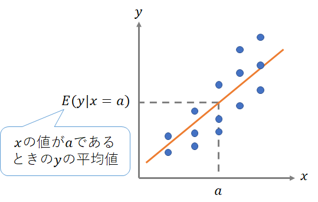

```{r include = FALSE}
knitr::opts_chunk$set(fig.align = 'center', message = F, warning = F)
```

# データの用意

今回から、データの背後に潜む因果関係を推定する手法について学んでいく。データから因果関係を推定するということは，データ生成過程（Data generating process: DGP）を理解しようという試みでもある。そこで今回は、データ生成過程があらかじめ分かっている架空のデータを自分で生成し、それを分析していく。

個人の所得$Y$と学歴$X$（大卒か否か）・能力$A$との関係について、以下のようなDGPを持つ架空データを次のように生成する（ただし$\varepsilon$は測定誤差などを反映した撹乱項）。DGPは現実的なものではないが、理解しやすいように設定した。

$$
Y = 200 + 10A + 500X+ \varepsilon
$$

- サンプルは10万人
- 切片は200万円
- 能力が1上がると所得は10上昇する
- 能力は0から100まで均等に分布する
- 大卒だと所得が500万円上昇する
- 大卒になる条件は2つあり，どちらかの条件を満たせば大卒になるとする
    - 条件1：能力が 80 以上の約 2 万人の中から約 1 万人がランダムに選ばれて大卒となる。
    - 条件2：能力を部分的に反映した学力テストの点数が 180 点以上であれば大卒となる（約1万人が合格する）


```{r, echo=F}
#install.packages("Diagrammes")
library(DiagrammeR)
grViz("digraph dot{
graph[rankdir = LR]

node[shape = circle, fontname = 'Yu Gothic']

edge[fontname = 'Yu Gothic']
能力A -> 所得Y [label='10']
能力A -> 学歴X [label='80以上の中からランダム']
学歴X -> 所得Y [label='500']

{rank = same; 能力A; テストの点; 学歴X}
}")


# grViz("digraph dot{
# graph[rankdir = LR]
# 
# node[shape = circle, fontname = 'Yu Gothic']
# 
# edge[]
# 能力A -> {所得Y; 学歴X; テストの点}
# テストの点 -> 学歴X -> 所得Y
#       }")
```


```{r}
# 事前準備 --------------------
# ここでの内容は、これまでよりもやや高度なので、ただコピペしてデータ生成するだけでも取り合わずは構わない。

# パッケージの読み込み
library(tidyverse)
# 乱数の種を固定　=>　毎回同じように乱数を発生させるようにする。0を他の数値に変えると異なる乱数となる。
set.seed(0)


# データの生成 ----------------
n <- 100000
# 能力は0から100まで均等に分布。#runifは一様分布を発生させる関数。標本規模n、最小値0、最大値100
ability <- runif(n, min = 0, max = 100) 

# IDとabilityをデータフレームに格納する。以下の"tibble()"はtidyverseにおけるデータフレームを作成する関数。ここでは代わりに"data.frame()"を用いても構わない。

df <- tibble(ID = 1:n, ability)

# 大卒ダミーの作成

## 条件１：能力が 80 以上の約 2 万人の中から約 1 万人がランダムに選ばれて大卒となる。

### dfからdplyr::filter()で抽出し、sample_fram()でさらに半分をランダムに抽出する。
college <- df %>% filter(ability >= 80) %>% sample_frac(0.5) # 大卒の人

### collegeのデータフレームに、is_college1という変数を作成し、すべて1とする。
college["is_college1"] = 1

### dfから、dplyr::anti_join()を用いてcollegeとマッチしなかった人を抽出する。
no_college <- anti_join(df, college, by = c("ID","ability")) # 大卒じゃない人

### collogeのデータフレームに、is_college1という変数を作成し、すべて0とする。
no_college["is_college1"] = 0

### collegeとno_collegeを、dplyr::bind_rowsを用いて結合して、ID順で並べる
df <- bind_rows(college, no_college) %>% arrange(ID) # 両者を結合

## 条件２：能力を部分的に反映した学力テストの点数が 180 点以上であれば大卒となる

### １万人くらいが該当するように、適当にテスト点数（score)の変数をdfの中に作成
df["score"] <- 30 * log10(ability) + rnorm(n, mean = 115, sd = 10) # rnorm()は正規分布を生成する関数

### score>=180の場合に1、そうでない場合に0となる変数(is_college2)をdfの中に作成。
df["is_college2"] <- 1*(df["score"] >= 180) # 1*(df["score"] >= 180)で、0と1を生成するようになっている

### ２つの条件のいずれかに該当していれば大卒(is_colloge = 1)とする。dplyr::case_whenを使う。
df <- df %>% mutate(is_college = case_when(is_college1 == 1 | is_college2 == 1 ~ 1, # "|"はorの記号
                                          TRUE ~ 0)) # それ以外は0

# 所得変数（income)の作成：上記のDGP(母集団回帰モデル）に基づいて生成
df["income"] <- 200 + 10*df["ability"] + 500*df["is_college"] + rnorm(n, sd = 50)

# 最初の6行
head(df)
```

こうして生成したデータの所得と能力・学歴・テストの点数の関係をプロットすると次のようになる。

```{r, echo=F}
# 塗り分けプロット

# plot

ggplot(df %>% mutate(education = case_when(is_college1 == 1 ~ "大卒(条件1)",
                                           is_college2 == 1 ~ "大卒(条件2)",
                                           is_college == 0 ~ "非大卒")),
       aes(x = ability, y = income, color = education))+
  geom_point(alpha = 0.5)+
  labs(title = "能力と所得")

ggplot(df %>% mutate(education = case_when(is_college1 == 1 ~ "大卒(条件1)",
                                           is_college2 == 1 ~ "大卒(条件2)",
                                           is_college == 0 ~ "非大卒")),
       aes(x = score, y = income, color = education))+
  geom_point(alpha = 0.5)+
  labs(title = "テストの点数と所得")
```


以下では「学歴（大卒になること）が所得をどれだけ上昇させるのか」を知ることを目的として分析していくことにする。


# 差の検定

```{r, echo=F}
# plot
ggplot(df %>% mutate(education = case_when(is_college == 1 ~ "大卒",
                                           is_college == 0 ~ "非大卒")),
       aes(x = education, y = income))+
  geom_boxplot(alpha = 0.7)+
  labs(title = "学歴別の所得分布")
```


まず，大卒と非大卒の所得の平均には統計学的に有意な差があるかどうかを$t$検定によって調べる。

```{r}
# 大卒
is_col <- df %>% filter(is_college == 1)
# 非大卒
no_col <- df %>% filter(is_college == 0)

# それぞれのincomeを比較
t.test(x = is_col$income, y = no_col$income)
```

大卒の平均所得が約`r round(mean(is_col$income),0)`万円，非大卒の平均所得が約`r round(mean(no_col$income),0)`万円であり，有意な差があることがわかった。

ただし，ここで「大卒になることで所得が`r round(mean(is_col$income),0)` - `r round(mean(no_col$income),0)` = `r round(mean(is_col$income) - mean(no_col$income), 0)`万円上昇する」とは言い切れない。データ生成過程を考えると所得が上がる要因には「学歴」以外にも「能力」という要因があり，学歴が高い人は能力も高い人が多い構造もあるため，`r round(mean(is_col$income) - mean(no_col$income), 0)`という値は能力による所得上昇の効果も含まれた推定値であり，学歴による純粋な所得上昇効果を知りたいときは別の方法を使う必要がある。


# 回帰分析

## 回帰分析と条件付き平均値

前節の平均値の差の検定では，条件付き平均値$E(変数|条件)$の記法を使って表現すると，大卒者の平均所得$E(Y|X=1)$と非大卒者の平均所得$E(Y|X=0)$の差

$$
E(Y|X=1) - E(Y|X=0)
$$

を調べていた。

しかしこれでは能力がどんな人であれ，大卒であるかどうかという点のみを条件に比較することになるのが問題だった。
そこで，「能力が80の人で大卒の人達の平均所得$E(Y|X = 1,A = 80)$と能力が80の人で非大卒の人達の平均所得$E(Y|X = 0,A = 80)$を比べる」「能力81がの人同士で比べる」「能力が82の人同士で比べる」…といったように，新たに条件を追加して能力の値を一定にした下で比較していけばよいと考えられる。

一般に回帰分析の予測値$\hat{y}$はサンプルサイズが増大するにつれて説明変数の条件付き平均値$E(y|x)$に近づいていく。そのため$E(Y|X = a,A = b)$のように複数の説明変数で条件付けた下での（他の要因の値を一定のものに固定した下での）平均値を推定することができ，これを利用して学歴$X$が所得$Y$に与える効果を推定することができる。

<center></center>

```{r,eval=F,echo=F}
# 没コード
# # data
# ss = 50
# set.seed(0)
# temp = data_frame(x = rpois(n = ss, lambda = 5),
#                   y = 2 * x + rnorm(ss))
# # plot
# ggplot(temp, aes(x,y))+
#   geom_point()+
#   geom_smooth(method="lm",se=F)
# 
# # E(y|x = 5)
# temp %>% filter(x == 5) %>% summarise_all(funs(mean))
# # yhat|x = 5
# lm_temp = lm(y ~ x, data = temp)
# predict(lm_temp, data_frame(x = 5))
```


## すべてのデータが入手可能な場合

もし，手元に所得$Y$，能力$A$，学歴$X$のデータがあるのであれば，

$$
Y = \beta_0 + \beta_1 A + \beta_2 X + u
$$

という回帰モデルによって係数$\beta_0,\beta_1,\beta_2$を推定できる。


```{r}
ols_A <- lm(formula = income ~ ability + is_college, data = df)

library(stargazer)
stargazer(ols_A, type = "text")
```

ほとんどぴったり推定することができた。


## 入手不可能なデータがある場合

実際には個人の能力は測定できず，データとして入手することは不可能である。能力を部分的に反映した「学力テストの点数$S$」を能力の代理変数として使用する場合の回帰モデル

$$
Y = \beta_0 + \beta_1 S + \beta_2 X + u
$$

を考えてみる。

```{r}
ols_S <- lm(formula = income ~ score + is_college, data = df)
stargazer(ols_S, type = "text")
```

```{r, echo=F}
lm_score = lm(formula = income ~ score + is_college, data = df)
```

学歴が大卒になることによる所得上昇の効果は約`r round(lm_score$coefficients[3], 0)`（万円）と推定された。データ生成時に設定した本来の値500よりも過大に推定されている。

このように，正しく推定するために必要な変数（能力$A$）が説明変数に入っていないことによって推定値が真の値よりも偏ることを**欠落変数バイアス**（omitted variable bias）という。


# マッチング分析

マッチング分析は，因果効果を推定したい変数（**処置変数**treatment variableと呼ばれる。今回の例では学歴$X$）以外の説明変数（**共変量**covariatesと呼ばれる。今回の例では能力$A$）が同じ値あるいは近い値の個体同士を比較する手法である。

Rでは`{Matching}`パッケージで実行できる。

```{r, eval=F}
# パッケージのインストール
install.packages("Matching")
```


## すべてのデータが入手可能な場合

マッチング分析も回帰分析と同じで，必要な共変量を入手できるかどうかの影響を受ける。

能力$A$が入手できる場合は次のように推定される。

```{r}
library(Matching)
# 最近傍マッチング
match_nn <- Match(Y = df$income,      # 被説明変数・結果変数
                  Tr = df$is_college, # 処置変数
                  X = df$ability,     # 共変量
                  version = "fast",   # 一部の処理を省略して計算量を減らす設定
                  Weight = 1)         # ユークリッド距離に基づくマッチング
summary(match_nn)
```


```{r, echo=F, eval=F}
# 厳密なマッチング
# match_exact <- Match(Y = df$income,      # 被説明変数・結果変数
#                      Tr = df$is_college, # 処置変数
#                      X = df$ability,     # 共変量
#                      version = "fast",   # 一部の処理を省略して計算量を減らす設定
#                      exact = T)          # 厳密なマッチングを行う
# summary(match_exact)
```

大卒の効果をきちんと推定できている。


## 入手不可能なデータがある場合

入手できない能力$A$の変数の代わりにテストの点数$S$を使用した場合

```{r}
# 最近傍マッチング
match_nn <- Match(Y = df$income,      # 被説明変数・結果変数
                  Tr = df$is_college, # 処置変数
                  X = df$score,       # 共変量
                  version = "fast",   # 一部の処理を省略して計算量を減らす設定
                  Weight = 1)         # ユークリッド距離に基づくマッチング
summary(match_nn)
```

欠落変数バイアスを抱えた推定値となった。


