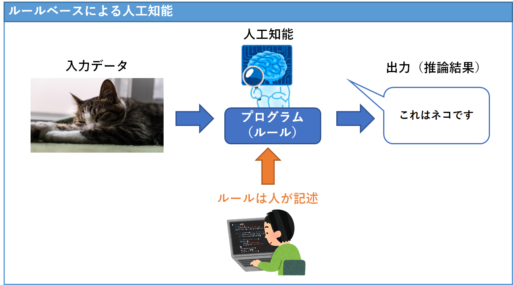
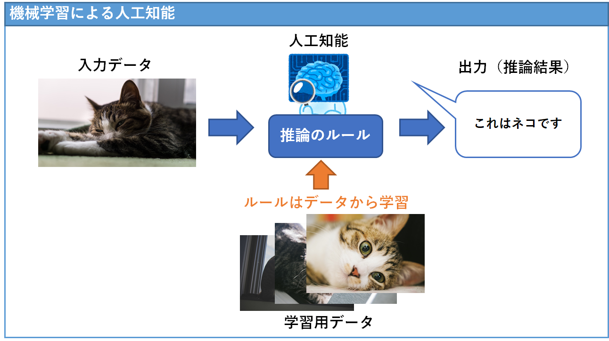
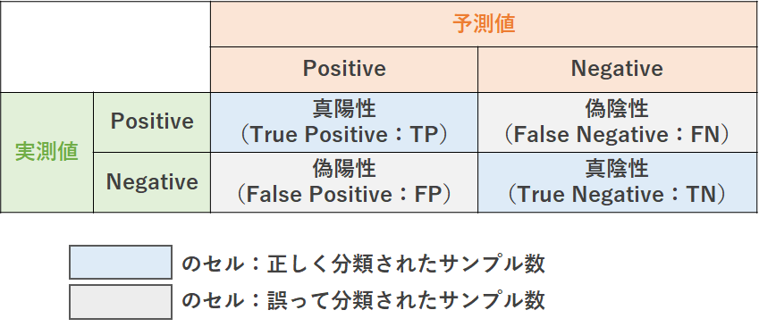
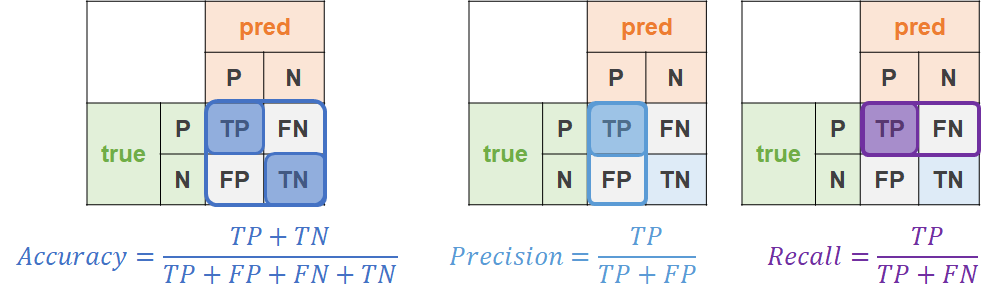

```{r include = FALSE}
knitr::opts_chunk$set(fig.align = 'center', message = F, warning = F,
                      fig.height=2.5, fig.width=3)
set.seed(0)
```

# 人工知能と機械学習

## 人工知能とは

**人工知能**（artificial intelligence）とは，人間の知的なふるまいをプログラムで再現したもののことである。

例えば「画像に何が写っているのかを識別する」というふるまいをコンピュータで実行するプログラムは人工知能といえる。

人工知能を作るための方法はいくつかあり，機械学習が登場する前の**ルールベース**と呼ばれるアプローチでは，画像に何が写っているのかを推論する部分のプログラム（推論のルール）を人間が考えて作るものであった。

ルールベースの人工知能は，医者など専門家の知的なふるまいをシステム化することを目的とした**エキスパートシステム**という試みとして1970~80年代に発展したものの，推論のルール（人工知能の中身）を人間が作るため，システムの開発・保守運用に多数のプログラマーを必要として莫大な人件費がかかるものであった。


<center></center>


## 機械学習とは

他方で**機械学習**（machine learning）は人工知能のプログラムを人間が考えるのではなくデータから統計学的に推定させる（機械に学習させる）タイプのアプローチである。

このアプローチは大量のデータと高い処理能力のコンピュータが必要になるが，人間の労働力は少なく済む。現在「人工知能」と呼ばれるものはほとんどが機械学習に基づくもので，これまでに触れてきた「線形回帰（回帰分析）」や近年ブームになっている「ディープラーニング」も機械学習の手法のひとつである。

<center></center>


## 学習の種類

学習の種類は大別して次の３種類がある。

1. **教師あり学習**（supervised learning）：予測（推論結果）の正解データ（教師データ）があるもの
     - 回帰分析のように，入力データ（説明変数）$x$と出力データ（被説明変数）$y$の相関関係を学習する
2. **教師なし学習**（unsupervised learning）：予測の正解データが与えられないもの
     - 入力データの規則性から「同じ系統のもの」「異なる系統のもの」を分けるような推論を行う
3. **強化学習**（reinforcement learning）：予測の正解データは無いが，利得関数という間接的な正解データがあるもの
     - 囲碁や将棋のAIなどで使われる

本講義では**教師あり学習**に関して述べていく。


## 機械学習のタスク

教師あり学習が行う主なタスクは次の２種類の予測問題になる。

1. **回帰**（regression）：入力データから連続変数の出力を予測する
     - 例：過去の気象データから明日の気温を予測する
2. **分類**（classification）：入力データから離散変数の出力を予測する
     - 例：顧客情報から，その顧客が商品を「買う」か「買わない」かを予測する

今回は回帰を行う機械学習の例として**線形回帰**に再度触れ，分類を行う機械学習の例として**ロジスティック回帰**を紹介する。

# 線形回帰

```{r, echo=F}
n = 1000
x = 3 * rnorm(n) + 2
y = 2 * x + rnorm(n, sd = 4)

# plot
library(tidyverse)
ggplot(data_frame(y, x),
       aes(x = x, y = y))+
  geom_point(color = "Orange")+
  geom_smooth(method = "lm", se = F, color = "SteelBlue")+
  # labs(title = "2乗誤差関数")+
  theme_classic()+
  theme(axis.text.x = element_blank(),
        axis.text.y = element_blank(),
        axis.ticks = element_blank())
```

**線形回帰**（linear regression）は，予測の目的変数$y_i$と説明変数$x_{i1}, x_{i2}, ..., x_{ip}$の間に次のような線形関係を仮定したモデルを置いて予測する。
$$
y_i = \beta_0 + \beta_1 x_{i1} + \beta_2 x_{i2} + \cdots + \beta_p x_{ip} + \varepsilon_i
$$

ここで$\varepsilon_i$は誤差項である。

## 最小二乗法

<!-- 線形回帰では一般的に最小二乗法という手法でパラメータ$\beta_j \hspace{1em} (j = 1,...,p)$を推定する -->

### 残差平方和の最小化

線形回帰でパラメータ$\boldsymbol{\beta}$（$=\begin{pmatrix}\beta_1 & \beta_2 & \cdots & \beta_p\end{pmatrix}$）を推定するために多く使われる方法は**最小二乗法**（OLS: ordinary least squares method）というもので，これは実測値$y_i$と予測値$\hat{y}_i$の**残差平方和（残差二乗和）**（SSR: sum of squared residuals）

$$
SSR = \sum_{i=1}^n (y_i - \hat{y}_i)^2
$$

を最小にするパラメータ


$$
% 定義
\newcommand{\argmin}{\mathop{\rm arg~min}\limits}
\hat{\boldsymbol{\beta}}^{OLS} = \argmin_{\boldsymbol{b}} \sum_{i=1}^n(y_i - \hat{y}_i)^2
$$

を採用するというものである。

なお，$\argmin$という記号は「関数の最小値を与える引数」という意味である。

SSRは（パラメータが1つの場合）U字型のカーブを描く関数になる。

最小値が１つであり微分可能なので，推定量$\hat{\boldsymbol{\beta}}^{OLS}$を得るための計算が容易であるという便利な特性をもっている。

```{r, echo=F}
# data 
x = 3 * rnorm(1000) + 2
y = 0 * x + rnorm(1000, sd = 3)

# ウェイトを変えながら残差を計算
w = -100:100 * 0.1
for(i in 1:length(w)){
  y_hat = w[i] * x
  e = (y - y_hat)
  cost = sum(e^2) 
  
  if(i == 1){
    cost_vec = cost
  } else {
    cost_vec = c(cost_vec, cost)
  }
}

# plot
ggplot(data_frame(weight = w, loss = cost_vec),
       aes(x = weight, y = loss))+
  geom_line(color = "SteelBlue")+
  labs(y = "SSR", x = "Parameter b")+
  theme_classic()+
  theme(axis.text.x = element_blank(),
        axis.text.y = element_blank(),
        axis.ticks = element_blank())
```

### 推定量

以下では説明の簡単のために，説明変数が１つの**単回帰モデル**（simple regression model）

$$
y_i = \beta_0 + \beta_1 x_{i} + \varepsilon_i
$$

の場合で説明していく。

最小二乗法では，残差平方和(RSS)を最小化するようなパラメータ$\beta_j^*$の値を推定するのが目的であり，それはU字型の関数であるRSSの最小値であるので，次の条件（接線の傾きが0であること）を満たすパラメータとなる。

$$
\begin{cases}\frac{\partial SSR}{\partial b_0} = -2 \sum_{i=1}^n (y_i - b_0 - b_1 x_i) = 0\\\frac{\partial SSR}{\partial b_1} = -2 \sum_{i=1}^n (y_i - b_0 - b_1 x_i)x_i = 0\end{cases}
$$


```{r, echo=F}
sse <- data_frame(weight = w, loss = cost_vec)

# plot
ggplot(sse,
       aes(x = weight, y = loss))+
  geom_line(color = "SteelBlue")+
  # 接線
  geom_segment(aes(x = sse[sse$loss == min(sse$loss),"weight"][[1]] - 3,
                   xend = sse[sse$loss == min(sse$loss),"weight"][[1]] + 3,
                   y = min(sse$loss),
                   yend = min(sse$loss)),
               color = "orange")+
  # 最小二乗推定値
  geom_point(aes(x = sse[sse$loss == min(sse$loss),"weight"][[1]],
                 y = min(sse$loss)),
             color = "orange", size = 2)+
  labs(y = "SSR", x = "Parameter b")+
  theme_classic()+
  theme(axis.text.x = element_blank(),
        axis.text.y = element_blank(),
        axis.ticks = element_blank())
```


上記の式を整理すると，最小二乗推定量を求める式

$$
\begin{align}
\hat{\beta}_0 &= \bar{y} - \beta_1 \bar{x}\\
\hat{\beta}_1 &= \frac{\sum_{i=1}^n(x_i-\bar{x})(y_i-\bar{y_i})}
{\sum_{i=1}^n (x_i - \bar{x})^2}
\end{align}
$$

が得られる。ここで$\bar{y}$と$\bar{x}$はそれぞれ$y_i$や$x_i$の平均値である。


## Rでの実践

### パッケージの読み込み
今回の分析で使うパッケージを読み込む。
```{r}
pacman::p_load(tidyverse, 
               AER, # HousePricesデータを使用
               stargazer, # lmやplmのときの結果表
               MLmetrics, # 機械学習で用いる関数が実装
               carData) # タイタニック号データを使用
```

### データの用意

`{AER}`パッケージの`HousePrices`データを使用し，住宅の価格を予測する問題に取り組むことにする。

```{r}
data("HousePrices") #AERパッケージのデータ
head(HousePrices)
```

このデータセットには次の変数が含まれている

- `price`：住宅の販売価格
- `lotsize`：敷地面積（平方フィート）
- `bedrooms`：寝室の数
- `bathrooms`：浴室（full bathroom）の数
- `stories`：地下室を除いた階数
- `driveway`：家に私道があるかどうか
- `recreation`：レクリエーションルームがあるか
- `fullbase`：地下室があるか
- `gasheat`：給湯にガスを使用しているか
- `aircon`：セントラルエアコンがあるか
- `garage`：ガレージの数
- `prefer`：都市の近くに立地しているか

機械学習の目的は未知のデータに対する予測性能を高めることである。
したがって、データを、学習（パラメータの推定）に使う「**学習用データ**」と、学習に使わず予測性能の試験に使う「**テスト用データ**」に分割しておく。

```{r}
# ID列を追加
df = HousePrices %>% rownames_to_column("ID")

# 80%を学習用データに
train <- df %>% sample_frac(size = 0.8)

# 学習用データに使っていないIDの行をテスト用データに
test <- anti_join(df, train, by = "ID")
```


ID列は予測に使わないため削除しておく

```{r}
# ID列の削除
train <- train %>% select(-ID)
test <- test %>% select(-ID)
```


### 線形回帰の学習

線形回帰は`lm()`関数で行うことができる。

```{r}
reg <- lm(log(price) ~ . , data = train)
stargazer(reg, type = "text")
```


### 予測精度の評価

lmオブジェクトから予測値を出すには`predict()`関数にlmオブジェクトとデータフレームを入れて実行すればよい。

```{r}
# 既知のデータ（train）に対する予測値
y_train_pred = predict(reg, train)
# 実測値
y_train_true = train$price
```

予測精度の評価を行うには，何らかの指標を使う必要がある。例えば**平均二乗誤差**（Mean of Squared Error: MSE）のような誤差関数で評価を行う。
$$
MSE = \frac{1}{n} \sum_{i=1}^n (y_i - \hat{y}_i)^2
$$

なお、ここでの「**誤差**」とは、$y_i - \hat{y}_i$すなわち観測値と予測値の差であって、統計学や計量経済学でいうところの誤差項($\varepsilon$)とは異なる点に注意されたい。

`{MLmetrics}`パッケージにはMSEのような機械学習で用いる関数が実装されているため，このパッケージをインストールして読み込む

```{r}
# 平均二乗誤差（MSE）による予測精度の評価
MSE(y_train_true, y_train_pred)
```

MSEは二乗しているため，非常に値が大きくなってしまう。

MSEの平方根をとることでこの点を修正したものが$RMSE$(root mean squared error)である。
$$
RMSE = \sqrt{\frac{1}{n} \sum_{i=1}^n (y_i - \hat{y}_i)^2}
$$

```{r}
# 平方根平均二乗誤差（RMSE）による予測精度の評価
RMSE(y_train_true, y_train_pred)
```

学習用データのpriceの予測に際して約7万の誤差があることを示している。


回帰モデルにとって未知のデータである`test`データセットに対する予測値をみてみよう。

```{r}
# 未知のデータ（test）に対する予測値
y_test_pred <- predict(reg, test)
# 実測値
y_test_true = test$price
```

```{r}
# 平方根平均二乗誤差（RMSE）による予測精度の評価
RMSE(y_test_true, y_test_pred)
```

このように，一般に学習用データに対する予測誤差よりもテスト用データに対する予測誤差のほうが大きくなる。


# ロジスティック回帰

**ロジスティック回帰**（logistic regression）は，被説明変数に$\{0,1\}$のような二値変数や確率を使う回帰モデルである。

説明変数$x_{ij}$の下で被説明変数$y_i$が1の値をとる確率$P(y_i = 1| x_{i1}, x_{i2}, ..., x_{ip})$を$p$，$P(y_i = 0| x_{i1}, x_{i2}, ..., x_{ip})$を$1-p$とおくと，ロジスティック回帰モデルは
$$
\log \left( \frac{p}{1-p} \right)= \beta_0 + \beta_1 x_{i1} + \cdots + \beta_p x_{ip}
$$

あるいは両辺の指数をとって整理した
$$
P(y_i = 1| x_{i1}, x_{i2}, ..., x_{ip}) 
= \frac{\exp(\beta_0 + \beta_1 x_{i1} + \cdots + \beta_p x_{ip})}
{1 + \exp(\beta_0 + \beta_1 x_{i1} + \cdots + \beta_p x_{ip})}
$$
と表される。

後者の式
$$
\sigma(x) = \frac{\exp(x)}{1 + \exp(x)} = \frac{1}{1 + \exp(-x)}
$$
は**ロジスティック・シグモイド関数**（logistic sigmoid function）あるいは単に**シグモイド関数**（sigmoid function）と呼ばれる関数で，任意の数を0から1の範囲に変換するS字型の関数である。


```{r, echo=F}
# シグモイド関数
sigmoid = function(x) 1 / (1 + exp(-x))

# データ生成
x = -100:100 * 0.1
y = sigmoid(x)

# plot
ggplot(data_frame(x, y),
       aes(x = x, y = y))+
  geom_line(color = "dodgerblue")+
  labs(y = expression(sigma(x)), x = expression(x), title = "Sigmoid function")
```


## 最尤法

ロジスティック回帰では**最尤法**（さいゆうほう，method of maximum likelihood）によりパラメータを推定する。

最尤法はデータが従う確率分布を仮定し，そのデータが生成される確率分布として最も尤もらしいパラメータを推定する。

例えば，あるコインを4回投げて表が1回出たとする。このとき，「このコインを投げて表が出る確率」というパラメータとして最も尤もらしい（妥当な推論となる）のは「4分の1」であると考えるのが最尤法の考え方である。

具体的には，コイン投げの結果が従う確率分布を二項分布${}_n\mathrm{C}_kp^k(1-p)^{n-k}$とし，4回投げて表が1回という結果（データ）を踏まえて**尤度関数**（likelihood function）$L(p)$を

$$
L(p) = {}_4\mathrm{C}_1p^1(1-p)^3
$$

とする。このとき，尤度関数$L(p)$を最大化するパラメータ$p$を推定するのが最尤法である。

実際に尤度関数を定義して描画してみると，尤度$L(p)$が最大になっている点でパラメータが$p = 0.25 = \frac{1}{4}$になっていることがわかる。

```{r, echo=F}
# 尤度関数
likelihood = function(p, n = 4, k = 1){
  choose(n, k) * p^k * (1 - p)^(n-k) # nCk p^k (1-p)^{n-k}
}

# 描画用データ
p = 1:100 * 0.01
L = likelihood(p)
df = tibble(p, L)

# plot
ggplot(df, aes(x = p, y = L))+
  geom_line(color = "dodgerblue")+
  labs(y = "L(p)", title = "Likelihood function L(p)")
```


ロジスティック回帰の最尤推定では、**ニュートン・ラフソン法**（Newton-Raphson method）や**勾配降下法**（gradient descent method）などを用いて繰り返し近似計算を行うことによって、パラメータを推定する。


## Rでの実践

### パッケージの読み込み
今回の分析で使うパッケージを読み込む（すでに一度やっているので、飛ばしても良い）。

```{r}
pacman::p_load(tidyverse, 
               AER, # HousePricesデータを使用
               stargazer, # lmやplmのときの結果表
               MLmetrics, # 機械学習で用いる関数が実装
               carData) # タイタニック号データを使用
```

### データの用意

`{carData}`パッケージの`TitanicSurvival`データセットを使う

```{r}
data("TitanicSurvival")　#carDataに入っている。
head(TitanicSurvival)
```

```{r, echo=F}
head(TitanicSurvival)
```

このデータセットは1912年のタイタニック号の沈没事故の乗客の生死に関するデータで，次の変数が含まれている

- `survived`：生存したかどうか
- `sex`：性別
- `age`：年齢（1歳に満たない幼児は小数）。263の欠損値を含む。
- `passengerClass`：船室の等級

このデータセットには欠損値が含まれているため，まず欠損値を除去する

```{r}
# NA（欠損値）を含む行を削除
titanic <- na.omit(TitanicSurvival)
```

そしてデータを学習用・テスト用に分割する。

```{r}
# ID列を追加
df = titanic %>% rownames_to_column("ID")

# 80%を学習用データに
train <- df %>% sample_frac(size = 0.8)

# 学習用データに使っていないIDの行をテスト用データに
test <- anti_join(df, train, by = "ID")

# ID列は予測に使わないため削除しておく
train <- train %>% select(-ID)
test <- test %>% select(-ID)
```


### ロジスティック回帰の学習

ロジスティック回帰は`glm()`関数で実行できる（なお，`glm()`はパラメータ推定にニュートン・ラフソン法を使用している）。

```{r}
clf <- glm(survived ~ . , family = binomial(link = "logit"), data = train)
stargazer(clf, type = "text")
```

推定された係数を見ると，性別が男性であったり，年齢が高かったり，客室の等級が低い場合は生存する確率が下がる関係が見られ，女性や子供を守るように努めたのであろうことが推測できる。


<!-- ```{r} -->
<!-- exp(clf$coefficients) # オッズ比 -->
<!-- ``` -->


### 予測精度の評価

`glm()`関数の予測値も`predict()`関数で出力できる。ただし，ロジスティック回帰はデフォルトではオッズ比$\log \left( \frac{p}{1-p} \right)$が出される。`type = "response"`を指定してやることで確率値$P(y_i = 1| x_{i1}, x_{i2}, ..., x_{ip})$のほうを出力してくれる。

```{r}
# 未知のデータ（test）に対する予測値（確率）
y_test_pred <- predict(clf, test, type = "response")
```

`predict(type = "response")`で出力される値は確率値であり，そのままでは使いにくいので`ifelse()`関数で二値変数に変換する

```{r}
# 予測した確率が「0.5未満ならno, それ以外はyes」となるよう変換
y_test_pred <- ifelse(y_test_pred < 0.5, "no", "yes")

# 実測値
y_test_true = test$survived
```

#### 混同行列{-}

<center>

</center>

分類（被説明変数が離散変数の予測）の評価指標を考える際に基本となるのが**混同行列**（confusion matrix）である。

これは予測値と実測値のクロス集計表であり，上の図のような構造になっている。

表のPositive, Negativeが予測の被説明変数がとる値の種類で，「実測値がPositiveなものを予測値でもPositiveと予測できていればTrue Positive（真陽性）」という具合に，予測の正誤と予測値の値から４つの区分に分類される。

正しく予測できたものはTrue PositiveやTrue Negativeになり，予測を誤ったものはFalse PositiveかFalse Negativeに入る。

Rでは`table()`関数を実行すればクロス集計表を作成できる。

```{r}
# confusion matrix
table(y_test_true, y_test_pred)
```

誤った分類をしているものもそれなりにある。

誤分類の程度を測る指標の代表的なものに次の３つの指標がある。


- **正解率**（Accuracy）：正しく予測できた数÷予測した全ての数

$$
Accuracy = \frac{TP + TN}{TP + FP + FN + TN}
$$

- **適合率**（precision）：予測したPositiveにおいて正しく予測できたものの割合

$$
Precision = \frac{TP}{TP+FP}
$$


- **再現率**（recall）：実際にPositiveであるデータのうち正しく予測できたものの割合

$$
Recall = \frac{TP}{TP+FN}
$$


<center>

</center>


もっともシンプルな考え方で作られていて直感的にもわかりやすいのは正解率である。ただし，世の中の分類問題では、それぞれのカテゴリーの出現数が大きく異なることが多い（例えばローンを返せなくなる人を予測する場合，そうした人は全体の中のごくわずかである）。そのため適合率・再現率といった指標が作られている。


Rでは`{MLmetrics}`パッケージにそれぞれ用意されている。

```{r}
# 正解率
Accuracy(y_test_pred, y_test_true)
# 適合率
Precision(y_test_pred, y_test_true)
# 再現率
Recall(y_test_pred, y_test_true)
```

いずれの指標も7~8割程度には予測できている。

# 参考文献

機械学習の教科書はたくさん出版されており、ウェブ上の解説も多い。各自いろいろ調べて、自分の関心やニーズに合うものを探してほしい。

計量経済学と機械学習の関係については、やや高度な内容だが、下記の文章に詳しい。

- [Katagiri(2020)計量経済学と機械学習の関係‒AI はさだめ, さだめは反事実‒](https://github.com/Gedevan-Aleksizde/20190703_ML_ECON)


