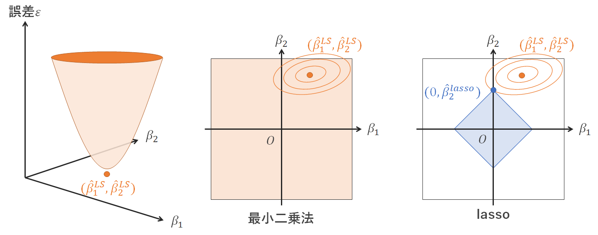

```{r include = FALSE}
knitr::opts_chunk$set(fig.align = 'center', message = F, warning = F)
```

$$
% 定義
\newcommand{\argmin}{\mathop{\rm arg~min}\limits}
$$

# 本講義の目的

- 正則化
- 交差検証
- ハイパーパラメータ

について学ぶ


# パッケージの読み込み

今回の分析で使うパッケージを読み込む。

```{r}
pacman::p_load(tidyverse, 
               MLmetrics, # 予測精度の評価指標
               patchwork, # グラフ結合用
               gridExtra, # グラフ結合用
               glmnet) # lassoやリッジ回帰のライブラリ
```


# 汎化性能と過学習

機械学習で行いたいことは学習に使用したデータのみへの予測精度を高めることではなく、学習に使用していない未知のデータに対しても高い予測精度をもつこと、すなわち**汎化性能**を高めることである。

逆に、学習用データに対しての予測精度は高いものの、未知のデータに対する予測精度が低い（汎化性能が低い）予測モデルのことを**過学習**（overfitting）しているという。

数値例を示そう。ある変数$\{x,y\}$について50個のデータが得られ、そのうち25個を学習用データにして予測モデルを作るとする。

```{r, fig.width=8}
# seedを固定
set.seed(11111)

# データの生成
n <- 50
x <- 1:n * 1/n
y <- 0.5 + 0.4*sin(2*pi*x) + rnorm(n = n, sd = 0.1)
df <- tibble(y,
             x, 
             x2 = x^2, 
             x3 = x^3, 
             x4 = x^4, 
             x5 = x^5, 
             x6 = x^6, 
             x7 = x^7, 
             x8 = x^8, 
             x9 = x^9)


# データの分割
# ID列を追加
df <- df %>% rownames_to_column("ID")

# 50%を学習用データに
train <- df %>% sample_frac(size = 0.5)

# 学習用データに使っていないIDの行をテスト用データに
test <- anti_join(df, train, by = "ID")

# ID列の削除
df <- df %>% dplyr::select(-ID)
train <- train %>% dplyr::select(-ID)
test <- test %>% dplyr::select(-ID)
```


```{r, fig.width=5, fig.height=3.5}
train %>% ggplot(aes(x, y)) +
  geom_point()
```

データは非線形な分布をしているため、以下のような多項式回帰をいくつか作って比較してみるとする。

$$
y = \beta_0 + \beta_1 x + \beta_2 x^2 + \cdots + \beta_p x^p + \varepsilon
$$

以下の図が次数をいくつか変えていった多項式回帰の回帰曲線である。

<!--
```{r}
# plot
p <- 1
p1 <- ggplot(train, aes(x, y))+
  geom_point()+
  geom_smooth(method = "lm", 
              se = F, 
              formula = y ~ poly(x, 1)) +  # poly()は変数を使えないので数字を直接入れる
  labs(title = str_c(p,"次多項式回帰"))

p <- 2
p2 <- ggplot(train, aes(x, y)) +
  geom_point() +
  geom_smooth(method = "lm", 
              se = F, 
              formula = y ~ poly(x, 2)) +
  labs(title = str_c(p,"次多項式回帰"))

p <- 3
p3 <- ggplot(train, aes(x, y)) +
  geom_point() +
  geom_smooth(method = "lm", 
              se = F, 
              formula = y ~ poly(x, 3)) +
  labs(title = str_c(p,"次多項式回帰"))

p <- 5
p5 <- ggplot(train, aes(x, y))+
  geom_point()+
  geom_smooth(method = "lm", 
              se = F, 
              formula = y ~ poly(x, 5)) +
  labs(title = str_c(p,"次多項式回帰"))

p <- 7
p7 <- ggplot(train, aes(x, y))+
  geom_point()+
  geom_smooth(method = "lm", 
              se = F, 
              formula = y ~ poly(x, 7)) +
  labs(title = str_c(p,"次多項式回帰"))

p <- 9
p9 <- ggplot(train, aes(x, y))+
  geom_point()+
  geom_smooth(method = "lm", 
              se = F, 
              formula = y ~ poly(x, 9)) +
  labs(title = str_c(p,"次多項式回帰"))


# patchworkを使ってグラフ結合
(p1 + p2 + p3) / (p5 + p7 + p9)

# gridExtra::grid.arrange()を使ってもいい
# gridExtra::grid.arrange(grobs = list(p1, p2, p3, p5, p7, p9), ncol = 3)
```
-->

```{r}
# plot
plots <- list() # グラフを格納するリストを用意
orders <- c(1, 2, 3, 5, 7, 9)  # 試していきたい多項式回帰の次数を用意
for (i in 1:length(orders)) {
  # 訓練データと訓練データにfitさせた多項式回帰のグラフを描き、plotsに格納する
  plots[[i]] <- train %>% ggplot(aes(x, y)) +
    geom_point() +
    geom_smooth(method = "lm", se = F, 
                formula = as.formula(str_c("y ~ poly(x, degree = ", orders[i], ")"))) +
    labs(title = str_c(orders[i], "次多項式回帰"))
}

# gridExtraを使って複数のグラフをまとめる
gridExtra::grid.arrange(grobs = plots, ncol = 3)

# patchworkを使って複数のグラフをまとめる場合
# (plots[[1]] + plots[[2]] + plots[[3]]) / (plots[[4]] + plots[[5]] + plots[[6]])
```

次数の高いモデルのほうがデータの分布をよく近似する曲線を描いている。

では次数が最も高い多項式回帰が最も良い汎化性能を持つのかというと、そうとは限らない。

次数の異なる多項式回帰モデルごとに学習用データでの誤差とテストデータでの誤差を測ってみよう。

```{r}
# 次数を変えながら学習・予測
for(p in 1:9){
  reg <- lm(y ~ ., data = train[,1:(p+1)]) # 学習
  # trainへの予測精度
  y_train_pred <- predict(reg, train[,1:(p+1)])   # 予測
  train_error <- RMSE(y_train_pred, train$y) # 誤差
  # testへの予測精度
  y_test_pred <- predict(reg, test[,1:(p+1)])   # 予測
  test_error <- RMSE(y_test_pred, test$y) # 誤差
  if(p == 1) result <- tibble(p, train_error, test_error) # p=1の場合、データフレーム作る
  if(p != 1) result <- rbind(result, tibble(p, train_error, test_error)) # p=2以上の場合はrbindで繋げる
}

# ggplotで多項式回帰と誤差(RMSE)の関係を描画
ggplot(result %>% gather(key, error, -p),
       aes(x = p, 
           y = error, 
           color = key)) +
  geom_point() +
  geom_line(size = 1) +
  scale_x_continuous(breaks = c(1:9)) +
  labs(color = "", 
       x = "多項式回帰の次数", 
       y = "誤差（RMSE)",
       title = "モデルの複雑さと過学習")
```

多項式回帰の次数が高くなるほど学習用データへの予測誤差（train_error）は減少しているが、テストデータに対する予測誤差（test_error）は次数が5以上になると増加しており、過学習していることがわかる。

次数が高い多項式回帰モデルは高い表現力をもつ複雑なモデルであるが、データに対して過剰に複雑なモデルを使用してしまうと過学習をおこすことになる。

過学習を抑えたい場合に使われる手法の1つに**正則化**（regularization）という手法がある。以下では有名な正則化回帰である**リッジ回帰**と**lasso**について述べる。

<!-- # 正則化 -->

<!-- この多項式の例で、次数を下げる（投入する変数を選ぶ）以外の方法で過学習を抑えたい場合に使われる手法の1つに**正則化**（regularization）という手法がある。 -->

<!-- 正則化は通常の誤差関数$E(\boldsymbol{\beta})$に正則化のための項を加えたもの -->

<!-- $$ -->
<!-- E(\boldsymbol{\beta}) + \lambda \frac{1}{p} \sum_{j=1}^p |\beta_j|^q -->
<!-- $$ -->

<!-- を誤差関数に使用してパラメータ$\beta$の推定を行う。 -->

<!-- 以下では有名な正則化回帰である**リッジ回帰**と**lasso**について述べる。 -->


# リッジ回帰

## リッジ回帰

**リッジ回帰**（ridge regression）は推定するパラメータの二乗和がある値$R$を超えない範囲で推定するという制約条件の下で残差二乗和$\sum^n_{i=1}(y_i - \hat{y}_i)^2$（$\hat{y}$は予測値）を最小化するようなパラメータを推定する。

$$
\min_\beta \sum^n_{i=1}(y_i - \hat{y}_i)^2 ,\hspace{1em}
\text{subject to }\sum_{j=1}^p \beta_j^2 \leq R
$$

このことについて、パラメータが２つ（$\beta_1, \beta_2$）の場合を例に最小二乗法による推定値($(\hat{\beta}_1^{LS}, \hat{\beta}_2^{LS})$)とリッジ回帰による推定値($(\hat{\beta}_1^{ridge}, \hat{\beta}_2^{ridge})$)を視覚的に比較したものが下の図である。


最小化したい残差二乗和は放物面のような形になっており（左図）、それを最小化するパラメータが最小二乗推定量$(\hat{\beta}_1^{LS}, \hat{\beta}_2^{LS})$となる。

左図を真上から見るようにして２次元の図にしたものが中央の図で、楕円は放物面の等高線（誤差二乗和が等しい点を結んだ線）を表している。

最小二乗法は採用するパラメータに制約が無いためパラメータ空間全体を使うことができる（中央図）。

リッジ回帰は制約条件を満たす範囲がパラメータ空間の原点を中心とする円になるため、円の領域の中で残差二乗和を最小化するパラメータを探索することになる（右図）。制約条件の$R$は円の大きさを表している。

なお、最小二乗法で得られる推定量がリッジ回帰の円の中にある場合は最小二乗推定量とリッジ回帰の推定量は同じものになる。


書き方を変えると、リッジ回帰のパラメータの推定量（のベクトル）$\hat{\boldsymbol{\beta}}^{ridge}$は
$$
\hat{\boldsymbol{\beta}}^{ridge} = \argmin_{\boldsymbol{\beta}} \left\{\sum_{i=1}^n(y_i - \hat{y}_i)^2 + \lambda \sum_{j=1}^p \beta_j^2\right\}
$$
というものになる。

最小二乗法の推定量は残差二乗和$\sum_{i=1}^n(y_i - \hat{y}_i)^2$を最小化するパラメータ
$$
\hat{\boldsymbol{\beta}}^{OLS} = \argmin_{\boldsymbol{\beta}} \sum_{i=1}^n(y_i - \hat{y}_i)^2
$$

であった。リッジ回帰は残差二乗和に$\lambda \sum_{j=1}^p \beta_j^2$の項を加えたものを誤差関数とし、それを最小化している。

$\lambda$は**正則化パラメータ**（regularization parameter）と呼ばれ、**正則化項**（regularization term）$\sum_{j=1}^p \beta_j^2$の影響の程度を調整するパラメータである。

$\lambda$は予測モデルによってデータから推定されるパラメータ$\beta_j$とは異なり、分析者が適切な値を指定する必要がある。こうした予測モデル外から設定する必要があるパラメータを**ハイパーパラメータ**（hyperparameter）という。

## データの標準化

変数の測定単位が異なる場合、回帰分析のパラメータ$\beta_j$も異なってくる。

リッジ回帰は正則化項$\sum_{j=1}^p \beta_j^2$でパラメータの値に基づいて推定を行うため、正則化法を使用する際には各変数の測定単位の違いやパラメータ$\beta$の大きさの差をなくすために説明変数を**標準化**する必要がある。

標準化とは、変数の平均を0、分散を1にすることであり、ある変数$x$の平均$\mu$と標準偏差$\sigma$を用いて

$$
z = \frac{x - \mu}{\sigma}
$$

のように変換することである。

適当に乱数を生成して比較したものが次のグラフである。標準化することによって分布の中心が原点$(0,0)$になる。これを**中心化**という。

```{r, echo=F, fig.height=3.5}
pacman::p_load(patchwork)

# data
x1 <- rnorm(n = 100, mean = 5, sd = 3)
e <- rnorm(n = 100, mean = 5, sd = 6)
X <- tibble(x1, x2 = 2*x1 + e)

# plot
g1 <- ggplot(X, aes(x = x1, y = x2)) +
  geom_point() +
  geom_vline(xintercept = 0) +
  geom_hline(yintercept = 0) +
  labs(title = "元のデータ")

g2 <- ggplot(scale(X) %>% data.frame(), aes(x = x1, y = x2)) +
  geom_point()+
  geom_vline(xintercept = 0)+
  geom_hline(yintercept = 0)+
  labs(title = "標準化後のデータ")


# patchworkを使ってグラフ結合
g1 + g2
```

<!-- 標準化によって各変数の長さ（$L_2$ノルム$||\boldsymbol{x}||_2=\sqrt{x_1^2+x_2^2+\cdots+x_p^2}$）も統一される。 -->

<!-- これにより、変数の測定単位の違いによる推定への影響を無くすことができる。 -->

<!-- ```{r} -->
<!-- # ノルム -->
<!-- L2norm <- function(x){ -->
<!--   x^2 %>% sum() %>% sqrt() -->
<!-- } -->

<!-- # norm -->
<!-- bind_cols(data = c("元のノルム", "標準化後のノルム"), -->
<!--           rbind(X %>% apply(2, L2norm), -->
<!--                 X %>% scale() %>% apply(2, L2norm)) %>%  -->
<!--             as_data_frame()) %>%  -->
<!--   knitr::kable() -->
<!-- ``` -->

Rでは`scale()`関数で標準化を行うことができる。


## Rでの実践

冒頭で作成したデータを用いて検証していく。

リッジ回帰を実行する関数`glmnet()`では説明変数と目的変数を分ける必要があるので、あらかじめ分けておく

```{r}
# glmnetは説明変数Xと目的変数yを別々に入れる必要があるので分ける

# train
X_train <- train %>% select(-y) %>% as.matrix() # as.matrix()でmatrix型のデータにする
y_train <- train$y

# test
X_test <- test %>% select(-y) %>% as.matrix()
y_test <- test$y
```


### glmnet関数

`{glmnet}`パッケージの`glmnet()`関数で正則化回帰を行うことができる。

`glmnet()`関数は以下のように書く。

```
glmnet(x = X, y = y, lambda = 1, alpha = 0)
```

- `x`：説明変数。データフレームではなくmatrix型で指定する必要がある。
    - 説明変数のみを含むデータフレームを`as.matrix()`関数に通せばよい
- `y`：被説明変数（目的変数）。ベクトル型で指定する。
- `lambda`：正則化パラメータ$\lambda$の値
- `alpha`：モデルの指定。`alpha = 0`でリッジ回帰になる。

なお、事前に説明変数の標準化を行うかどうかを指定する`standardize`という引数もあり、デフォルトでは`TRUE`になっているため自動的に標準化を行ってくれる。


```{r}
# 9次多項式でリッジ回帰
reg_ridge <- glmnet(x = X_train, # 特徴量
                    y = y_train, # 目的変数
                    lambda = 0.1, # λ：任意の値
                    alpha = 0) # alpha = 0でリッジ回帰

# trainに対する予測精度
y_train_pred <- predict(reg_ridge, X_train) # 予測
train_error <- RMSE(y_train_pred, y_train) # 誤差
str_c("train_error: ", round(train_error, 3)) %>% print() # 結果を表示

# testに対する予測精度
y_test_pred <- predict(reg_ridge, X_test) # 予測
test_error <- RMSE(y_test_pred, y_test) # 誤差

# 結果を表示 (str_cは複数のstringsを1つにまとめる関数)
str_c("test_error: ", round(test_error, 3)) %>% print() 
```

学習用データに対する予測誤差（RMSE）は`r round(train_error,3)`、テストデータに対しては`r round(test_error,3)`となった。

この結果は正則化パラメータ$\lambda$の値によって大きく変化する。次節では適切な$\lambda$の推定方法について述べる。

# 交差検証とハイパーパラメータのチューニング

## 交差検証

**k-分割交差検証**（k-fold cross validation）とは予測精度の測り方の一つであり、

1. データセットを$k$個（例えば5個や10個）のサブセットへ無作為に分割する
2. $k-1$個のサブセットのデータで予測モデルを学習させる
3. 残りの$1$個のサブセットのデータをテスト用に回して予測誤差を測る
4. これを$k$回繰り返して予測誤差の平均値を使って予測性能を評価する

という手順で予測精度を測定するものである。

<center></center>

これまではデータを学習用データ・テスト用データに2分割して予測性能を評価してきたが（この方法をホールドアウト法という）、
交差検証は手元のデータすべてを学習とテストに使用できるため、データが少ない場合においてはホールドアウト法よりもよい予測性能の評価方法になる。

$k$をサンプルサイズと同じにした場合、つまり1レコードだけをテストデータに回して残りの$n-1$レコードを訓練データにする交差検証を**1つ抜き交差検証**（leave-one-out cross validation: LOOCV）と呼ぶ。

## cv.glmnet()関数によるハイパーパラメータの探索

機械学習の分野においては基本的に**パラメータ**（parameter）という言葉はデータによって学習（推定）される対象を指す。一方で正則化パラメータ$\lambda$のような値はデータから推定されるものではなく、学習に先立って分析者が設定していくことになる。このような値のことを**ハイパーパラメータ**（hyperparameter）と呼ぶ。

ハイパーパラメータの調整（tuning）は、ハイパーパラメータを変えて学習と予測精度の評価を行う実験を繰り返して最適値を探して調整していくことになる。

`{glmnet}`パッケージには正則化パラメータ$\lambda$を少しずつ変えながら交差検証で予測性能を評価することにより良い予測性能を与える$\lambda$を推定するための関数`cv.glmnet()`があるため、簡単に調整を行うことができる（なお、`cv`=cross validation=交差検証である）。

```{r}
# ラムダを変えながら交差検証で誤差を評価
ridge_cv <- cv.glmnet(x = X_train, # 説明変数
                      y = y_train, # 目的変数
                      nfolds = nrow(X_train), # 1つ抜き交差検証
                      grouped = FALSE,
                      lambda = seq(0.000001, 0.001, length.out = 200), # 探索する範囲を指定（任意）
                      alpha = 0) # alpha = 0でリッジ回帰

# ラムダと交差検証誤差のグラフ
plot(ridge_cv)
```

`plot()`で$\lambda$を変えながら交差検証で誤差（MSE)を計算したときのグラフを見ることができる。縦の破線は最適と考えられる$\lambda$の値を示している。左側の破線は交差検証でMSEが最小だった$\lambda$であり、右側の破線は「最小のMSE+その標準誤差未満」の範囲で最大の$\lambda$である。

（後者を選択するというのは、交差検証のMSEが小さい中でもできるだけ$\lambda$が大きい（正則化項の影響が大きい）モデルを採用して過学習を回避しようとする$\lambda$の選択方法である。これは**1標準誤差ルール**（one standard error rule）と呼ばれる。）


## 推定値

`coef()`関数で推定されたパラメータを見ることができる。その際に`s = "lambda.min"`と指定することで交差検証でMSEが最小だった$\lambda$にアクセスできる。

```{r}
# 誤差(MSE)を最小にしたラムダを採択したときの係数推定値
coef(ridge_cv, s = "lambda.min") %>% round(3)

# (参考)MSE+1SEの中で最大のラムダを採用したときの係数推定値
coef(ridge_cv, s = "lambda.1se") %>% round(3)
```


## 予測精度

続いて予測精度を評価してみる。

`predict()`でも同様に`s = "lambda.min"`と指定することで、誤差を最小化していた$\lambda$を採用したときの予測値を算出できる。

```{r}
# trainに対する予測精度
y_train_pred <- predict(ridge_cv, 
                        X_train, 
                        s = "lambda.min") # 予測

train_error <- RMSE(y_train_pred, y_train) # 誤差

str_c("train_error: ", round(train_error, 3)) %>% print() # 結果を表示

# testに対する予測精度
y_test_pred <- predict(ridge_cv, 
                       X_test, 
                       s = "lambda.min") # 予測

test_error <- RMSE(y_test_pred, y_test) # 誤差

str_c("test_error: ", round(test_error, 3)) %>% print() # 結果を表示
```

```{r, echo=F}
# 後で使うので格納
y_test_pred_ridge <- y_test_pred
y_train_pred_ridge <- y_train_pred
```


学習用データに対する予測誤差（RMSE）は`r round(train_error,3)`、テストデータに対しては`r round(test_error,3)`となった。

リッジ回帰でなく最小二乗法で9次多項式回帰を推定した際のテストデータに対する誤差が`r round(result[result$p == 9, "test_error"][[1]],3)`であったのと比べると、過学習が抑制されている。

テスト用データに対する予測値のグラフをみても、最小二乗法（OLS）は（学習用データに対してぴったり予測するように過学習しているため）極端に外している値があるのに対し、リッジ回帰（Ridge）は9次多項式回帰であっても穏当な誤差になっている様子がみられる。


```{r}
# testへの9次多項式OLS
reg_ols <- lm(y ~ ., train)
y_test_pred_ols <- predict(reg_ols, test)

# data
data_for_plot <- tibble(x = test$x, 
                        y = test$y,
                        OLS = y_test_pred_ols,
                        Ridge = c(y_test_pred)) 

#long形式に変換
data_for_plot <- data_for_plot %>%
  tidyr::pivot_longer(OLS:Ridge,
                      names_to = "model",
                      values_to = "value")

# plot
data_for_plot %>% ggplot(aes(x = x,
                             y = value,
                             color = model))　+
  geom_point(aes(x = x,
                 y = y),
             size = 1.5, 
             color = "black") +
  geom_line(size = 1.5, alpha = 0.5) +
  geom_point(size = 2, alpha = 0.5) +
  scale_color_brewer(palette = "Set1")+
  labs(title = "9次多項式回帰によるtestデータに対する予測",
       y = "y and predicted y")
```


# lasso

## 特徴量選択

本資料の序盤で述べた多項式回帰の例のように、無駄な説明変数が多く過度に複雑なモデルは過学習を起こしやすい。


```{r, fig.width=5, fig.height=3, echo=F}
ggplot(result %>% gather(key, error, -p),
       aes(x = p, 
           y = error, 
           color = key)) +
  geom_point() +
  geom_line(size = 1) +
  scale_x_continuous(breaks = c(1:9))+
  labs(color = "", 
       x = "多項式回帰の次数", 
       y = "誤差（RMSE)",
       title = "モデルの複雑さと過学習（再掲）")
```

より良い予測モデルを構築するには、適切な説明変数（機械学習の分野では**特徴量** featureとも呼ばれる）を投入する必要がある。

そのためのプロセスは**特徴量エンジニアリング**（feature engineering）と呼ばれ、次の作業から構成される。

- **特徴量選択**（feature selection）：既存の特徴量から予測モデルの構築に役立つ特徴量を選択する。
- **特徴量抽出**（feature extraction）：既存の特徴量を組み合わせて、より役に立つ１つの特徴量を生み出す。
- 新しいデータの収集による特徴量の追加

次節で紹介するlassoは特徴量エンジニアリングのうち**特徴量選択**をデータから自動的に行うことができる手法である。


## lasso

**lasso**（least absolute shrinkage and selection operator）は
$$
\min_\beta \sum^n_{i=1}(y_i - \hat{y}_i)^2 ,\hspace{1em}
\text{subject to }\sum_{j=1}^p |\beta_j| \leq R
$$

の制約付き最小化問題の解によってパラメータを推定するもので、そのパラメータは

$$
\hat{\boldsymbol{\beta}}^{lasso} = \argmin_{\boldsymbol{\beta}} \left\{\sum_{i=1}^n(y_i - \hat{y}_i)^2 + \lambda \sum_{j=1}^p |\beta_j|\right\}
$$

となる。上記の式は、リッジ回帰のものと非常に似ているが、正則化項が$\sum_{j=1}^p \beta_j^2$ではなく$\sum_{j=1}^p |\beta_j|$である点が異なっている。なお、前者を$L_2$正則化、後者を$L_1$正則化と呼ぶ。

最小二乗法による推定値($(\hat{\beta}_1^{LS}, \hat{\beta}_2^{LS})$)とlassoによる推定値($(\hat{\beta}_1^{lasso}, \hat{\beta}_2^{lasso})$)を視覚的に比較したものが下の図である。



lassoの制約条件を満たす推定量はパラメータ空間の原点を中心にしたひし形の領域になる（右図）。

もし最小二乗推定量$(\hat{\beta}_1^{LS}, \hat{\beta}_2^{LS})$がlassoのひし形の制約領域の外にある場合、制約領域内で残差二乗和を最小化するパラメータがlassoの推定量となるため、残差二乗和の等高線の楕円とlassoのひし形の領域が接する点がlassoの推定量となる。残差二乗和の等高線の形状によってはlassoの推定量が$(0, \hat{\beta}_2^{lasso})$のように一部のパラメータが0と推定される。

0と推定されたパラメータに対応する説明変数は目的変数に寄与しないと解釈することができ、特徴量の選択が行われたモデルを得ることができる。リッジ回帰はパラメータを縮小するものの、ぴったり0に縮小することはない。パラメータをぴったり0に推定することで特徴量選択を行うことができるのはlassoの長所である。

なお、正則化パラメータ$\lambda$を大きくすると0と推定されるパラメータの数が多くなり、$\lambda$を小さくすると0と推定されるパラメータの数は少なくなる。


## Rでの実践

リッジ回帰のときと同じデータ（xの9次多項式のデータ）でlassoを実行してみよう。


`glmnet()`関数で引数に`alpha = 1`と指定すればlassoを実行できる。

まず`cv.glmnet()`関数で適切な$\lambda$を推定する

```{r}
# ラムダを変えながら交差検証で誤差を評価
lasso_cv <- cv.glmnet(x = X_train, # 特徴量
                      y = y_train, # 目的変数
                      nfolds = nrow(X_train), # 1つ抜き交差検証
                      grouped = FALSE,
                      lambda = seq(-20, 0, 0.5) %>% exp(), # 探索する範囲を指定（任意）
                      alpha = 1) # alpha = 1でlasso

# ラムダと交差検証MSEのグラフ
plot(lasso_cv)
```

推定されたパラメータを確認する

```{r}
# 誤差(MSE)を最小にしたラムダを採択したときの係数推定値
coef(lasso_cv, s = "lambda.min") %>% round(3)
```

いくつかのパラメータはぴったり0と推定されたため説明変数として採用されなかったことが`.`で示されている。

```{r}
# (参考) MSE + 1SEの中で最大のラムダを採用したときの係数推定値
coef(lasso_cv, s = "lambda.1se") %>% round(3)
```


```{r}
# trainに対する予測精度
y_train_pred <- predict(lasso_cv, 
                        X_train, 
                        s = "lambda.min") # 予測

train_error <- RMSE(y_train_pred, y_train) # 誤差

str_c("train_error: ", round(train_error, 3)) %>% print() # 結果を表示

# testに対する予測精度
y_test_pred <- predict(lasso_cv, 
                      X_test, 
                      s = "lambda.min") # 予測

test_error <- RMSE(y_test_pred, y_test) # 誤差(MSE)

str_c("test_error: ", round(test_error, 3)) %>% print() # 結果を表示
```

テスト用データに対する予測の誤差は`r round(test_error, 3)`となった。

最小二乗法で9次多項式回帰を推定した際のテストデータに対する誤差が`r round(result[result$p == 9, "test_error"][[1]],3)`であったのと比べると、過学習が抑制されており、よりよい予測モデルになっている。


# まとめ

## 推定量

最小二乗法残差二乗和$\sum_{i=1}^n(y_i - \hat{y}_i)^2$という誤差関数を最小化するパラメータ$\hat{\boldsymbol{\beta}}^{LS}$を採用するというものだった。

$$
\hat{\boldsymbol{\beta}}^{LS} = \argmin_{\boldsymbol{\beta}} \sum_{i=1}^n(y_i - \hat{y}_i)^2
$$

リッジ回帰は残差二乗和に$\lambda \sum_{j=1}^p \beta_j^2$を加えた誤差関数を最小化するパラメータ$\hat{\boldsymbol{\beta}}^{ridge}$を採用するというものだった。

$$
\hat{\boldsymbol{\beta}}^{ridge} = \argmin_{\boldsymbol{\beta}} \left\{\sum_{i=1}^n(y_i - \hat{y}_i)^2 + \lambda \sum_{j=1}^p \beta_j^2\right\}
$$

lassoは残差二乗和に$\lambda \sum_{j=1}^p |\beta_j|$を加えた誤差関数を最小化するパラメータ$\hat{\boldsymbol{\beta}}^{lasso}$を採用するというものだった。

$$
\hat{\boldsymbol{\beta}}^{lasso} = \argmin_{\boldsymbol{\beta}} \left\{\sum_{i=1}^n(y_i - \hat{y}_i)^2 + \lambda \sum_{j=1}^p |\beta_j|\right\}
$$


## 推定結果

今回、例として使用した9次多項式回帰モデルでは、次のような推定結果になった。


まず、最小二乗法、リッジ回帰、lassoで推定されたパラメータは次のようになった。

```{r, echo=F}
coef_df <- cbind(OLS = coef(reg_ols) %>% round(3),
                Ridge = coef(ridge_cv, 
                             s = "lambda.min") %>% 
                  as.matrix() %>% round(3),
                Lasso = coef(lasso_cv, 
                             s = "lambda.min") %>% 
                  as.matrix() %>% round(3)) %>% 
  as.data.frame()

colnames(coef_df) <- c("OLS","Ridge","Lasso")

knitr::kable(coef_df)
```

テスト用データに対する予測値は次のようになった。

```{r, echo=F}
# 予測値のオブジェクト名を一応変えておく
y_test_pred_lasso <- y_test_pred

# data
data_for_plot <- tibble(x = test$x, 
                        y = test$y,
                        OLS = y_test_pred_ols,
                        Ridge = c(y_test_pred_ridge),
                        Lasso = c(y_test_pred_lasso))　
# long形式に変換
data_for_plot <- data_for_plot %>% tidyr::pivot_longer(OLS:Lasso,
                                                      names_to = "model",
                                                      values_to = "value")

#旧式のgather()を使う場合は以下のようになる
#data_for_plot <- data_for_plot %>% gather(model, value, -x,-y)


## 順番を指定
data_for_plot$model <- factor(data_for_plot$model, 
                             levels = unique(data_for_plot$model))

# plot
data_for_plot %>% ggplot(aes(x = x,
                             y = value,
                             color = model)) +
  geom_point(aes(x = x,
                 y = y), 
             size = 1.5, 
             color = "black") +
  geom_line(size = 1.5, alpha = 0.5) +
  geom_point(size = 2, alpha = 0.5) +
  scale_color_brewer(palette = "Set1") +
  labs(title = "9次多項式回帰によるtestデータに対する予測",
       y = "y and predicted y")
```

その予測誤差（RMSEで測ったもの）は次のようになった。

```{r, echo=F}
error_df <- data.frame(OLS = RMSE(y_test_pred_ols, y_test),
                      Ridge = RMSE(y_test_pred_ridge, y_test),
                      Lasso = RMSE(y_test_pred_lasso, y_test)) 
rownames(error_df) <- "RMSE"
knitr::kable(error_df)
```


# （参考）エラスティックネット

リッジ回帰とlassoを結合したエラスティックネット（elastic net）というアルゴリズムも存在する。

$$
\hat{\boldsymbol{\beta}}^{EN} = \argmin_{\boldsymbol{\beta}} \left\{
\sum_{i=1}^n(y_i - \hat{y}_i)^2 
+ \lambda \sum_{j=1}^p 
\left ( \alpha |\beta_j|  + (1-\alpha) \beta_j^2 \right )
\right\}
$$

$\alpha$はlassoとリッジ回帰のどちらに重きを置くかのウェイトで、これもハイパーパラメータである。

実は`glmnet()`はエラスティックネットの関数であり、`glmnet()`を実行するときに、「リッジ回帰なら`alpha = 0`」と指定していたのがこの$\alpha$にあたる。


```{r}
# Elastic Net

# ラムダを変えながら交差検証で誤差を評価
EN_cv <- cv.glmnet(x = X_train, # 特徴量
                   y = y_train, # 目的変数
                   alpha = 0.35) # 任意のα

# testに対する予測精度
y_test_pred <- predict(EN_cv, X_test, s = "lambda.min") # 予測
test_error <- RMSE(y_test_pred, y_test) # 誤差
str_c("test_error: ", round(test_error, 3)) %>% print() # 結果を表示
```

# 参考文献

Jamesほか（2018）『[Rによる統計的学習入門](https://www.asakura.co.jp/books/isbn/978-4-254-12224-4/)』、朝倉書店。 （[原著ウェブサイト](https://www.statlearning.com/)、[原著PDF](https://hastie.su.domains/ISLR2/ISLRv2_website.pdf)）

Hastieほか（2014）『[統計的学習の基礎-データマイニング・推論・予測](https://www.kyoritsu-pub.co.jp/book/b10004471.html)』、共立出版。
（[原著ウェブサイト](https://hastie.su.domains/ElemStatLearn/)、[原著PDF](https://hastie.su.domains/ElemStatLearn/printings/ESLII_print12_toc.pdf)）

岩波データサイエンス刊行委員会編（2017）『[岩波データサイエンス Vol.5 スパ―スモデリングと多変量データ解析](https://www.iwanami.co.jp/book/b280246.html)』

川野ほか（2018） 『[スパース推定法による統計モデリング](https://www.kyoritsu-pub.co.jp/book/b10003918.html)』、共立出版。

