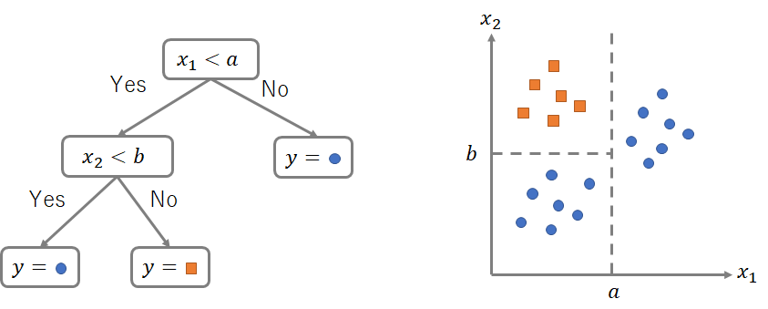

```{css, echo=F}
.card {
  border: solid silver 1px;
  border-radius: 5px;
  background-color: white;
  padding: 0.5em;
}
.card ol {
  padding-inline-start: 2em;
  margin: 1em;
}
```

```{r include = FALSE}
knitr::opts_chunk$set(fig.align = 'center', message = F, warning = F)
```

$$
% 定義
\newcommand{\argmin}{\mathop{\rm arg~min}\limits}
$$

# 本講義の目的

- 決定木、ランダムフォレスト、勾配ブースティングといったアルゴリズムの基礎を学ぶ
- アンサンブル学習について学ぶ
- 決定木、ランダムフォレスト、勾配ブースティングを実行する方法を学ぶ


# パッケージの読み込み

今回の分析で使うパッケージを読み込む。

```{r}
pacman::p_load(
  tidyverse,
  carData, # タイタニック号データを使用
  rpart, # 決定木の実行
  partykit, #決定木の作図
  randomForest, #ランダムフォレストのライブラリ
  MLmetrics, # 機械学習で用いる評価関数
  xgboost, # GBDTのライブラリ
  lightgbm # GBDTのライブラリ
)
```

# 決定木

## ツリーモデル

**決定木**（decision
tree）は特徴量の値に応じて条件分岐を繰り返して木のような構造をとるアルゴリズムである。

以下の図は$x_1,x_2$という特徴量を使って目的変数$y$の分類を決定木によって行うときのイメージである。
左側の図が木構造のモデルの様子を表しており、まず予測対象のレコードが「$x_1<a$」であるかどうかによって分岐し、もしそうであれば$x_1<a$がYesであったほうの枝において更に「$x_2<b$」であるかどうかで分岐するようにして、そのレコードがどちらのクラスに属するかの分類を行う。
右側の図はこの条件分岐によって生み出される識別境界（$x_1, x_2$の軸からなる空間の分割）を示している。

なお、木の分岐の結節点や終端を**ノード**（node）と呼び、木の末端にあるノードは終端ノード（terminal
node）や葉ノード（leaf
node）と呼ぶ。各葉ノードは、右側の図の分割された各部分空間に対応している。



## 学習の仕組み

線形回帰の場合、予測モデルの学習とはパラメータ$\beta$を推定することであったが、決定木では最適な分割を推定して木を分岐させていくことが学習にあたる。以下でその仕組みを概説する。

### 予測値の算出

目的変数$y$がカテゴリカル変数である場合、決定木の予測値は葉ノード内の学習データのうち、最も割合の多いクラスを使う（上の図のように）。

目的変数$y$が量的変数である場合、葉ノード内の学習データの$y$の平均値を予測値とする。

### 不純度

決定木では、他の機械学習アルゴリズムが誤差関数で予測精度の良し悪しを評価していたのと同様に、分割の良し悪しについての指標である**不純度**（impurity）という関数を用いて予測精度が最もよい分割を探索する。

目的変数$y$が$K$個のクラスからなるカテゴリカル変数である場合、不純度には**ジニ係数**（Gini
index）

$$
I(t) = 1 - \sum_{k=1}^K p_{tk}^2, \hspace{1em} (k=1,2, ...,K)
$$ が使われることが多い。

ここで$t$はノード、$k$は目的変数の値で、$p_{tk}$はノード$t$の領域に属する学習用データのサンプルサイズ$N(t)$のうち目的変数が$k$の値をとるデータ数$N_k(t)$の割合

$$
p_{kt} = \frac{N_k(t)}{N(t)}
$$ である。

```{r, echo=F, fig.height=2, fig.width=3}

# 2-class Gini impurity
gini <- function(p) {
  p_vec = c(p, 1-p)
  return(1 - sum(p_vec^2))
}

gini_range = c()
p_range = 0:100 * 0.01
for (p in p_range) {
  gini_range = append(gini_range, gini(p))
}

# plot
library(tidyverse)
ggplot(data_frame(gini_range, p_range),
       aes(x = p_range, y = gini_range))+
  geom_line(color = "SteelBlue")+
  labs(y = "Gini index", x = expression(p[kt]), title = "2クラス分類におけるジニ係数")+
  theme_classic()
```

上の図は分類すべきクラスが2つ（$K=2$）である場合のジニ係数の推移である。

例えば$p_{tk}=0.5$のとき、すなわち2つのクラスに属するデータが半々の比率で混じり合っている場合には、その葉ノードのジニ係数は

$$
I(t) = 1 - \sum_{k=1}^2 {p_{tk}}^2 = 1 - (0.5^2 + 0.5^2)= 0.5
$$

となる。グラフからわかるように、これは2クラス分類の状況下での最大の不純度である。

逆に、同クラスに属するデータのみをうまく切り分けることに成功し、1つめのクラスに属するデータのみが葉ノード$t$に含まれる場合は$p(k=1|t)=1.0$であるから

$$
I(t) = 1 - \sum_{k=1}^2 {p_{tk}}^2 = 1 - (1.0^2 + 0.0^2)= 0
$$

となる。

回帰（目的変数が量的変数）の場合、不純度$I(t)$にはノード$t$内の学習データでの予測値$\hat{y}_i$と実測値$y_i$の平均2乗誤差

$$
I(t) = \frac{1}{N(t)}\sum_{\boldsymbol{x}_i \in t} (y_i - \hat{y})^2
$$

を使用する。なお、予測値$\hat{y}$がそのノード$t$内での平均値であるため、これはノード内での$y$の分散である。


### 分割規則の決定

不純度を使って、冒頭の例における「$x_1<a$」のような分岐の条件を探索していく。

ノード$t$から左右に分割される子ノード達を$t_{L},t_{R}$と表記する。不純度$I(t_L),I(t_R)$と子ノードの領域に属するサンプルサイズ$N(t_L),N(t_R)$を用いて算出される、分割後の不純度の重み付き和

$$
\left\{\frac{N(t_L)}{N(t)} I(t_{L}) + \frac{N(t_R)}{N(t)} I(t_{R})\right\}
$$

と分割前の不純度$I(t)$との差

$$
I(t) - \left\{\frac{N(t_L)}{N(t)} I(t_{L}) + \frac{N(t_R)}{N(t)} I(t_{R})\right\}
$$

を**情報利得**（information
gain）と呼び、これを最大化する（分割後の不純度の和を最も下げる）ような分割の条件を探索する。

より具体的には、以下のような手順で学習が行われていく。

::: card
1.  葉ノード$t$において、すべての特徴量$x_j\ (j=1,2,...d)$について、$x_j$で分割可能なすべての点での情報利得を計算する
2.  すべての葉ノードで1.の計算を行い、最も情報利得の多い葉・特徴量・分割点の条件で木を分岐させる
3.  上記1.,2.を、何らかの基準（例えば「いずれかの葉ノード内の学習データの数が5個未満になるまで」）を満たすまで繰り返し、延々と決定木を成長（分岐）させていく
:::

## Rで実践

### データの準備

`{carData}`パッケージに含まれるタイタニック号の乗客データ`TitanicSurvival`を使う。

```{r}
# データ読み込み
data("TitanicSurvival")
head(TitanicSurvival)
```

このデータセットは1912年のタイタニック号の沈没事故の乗客の生死に関するデータで、次の変数が含まれている

-   `survived`：生存したかどうか
-   `sex`：性別
-   `age`：年齢（1歳に満たない幼児は小数）。263の欠損値を含む。
-   `passengerClass`：船室の等級

このデータセットには欠損値が含まれているため、まず欠損値を除去する

```{r}
# NA（欠損値）を含む行を削除
titanic <- na.omit(TitanicSurvival)
```

そしてデータを学習用・テスト用に分割する。

```{r}
# ID列を追加
df = titanic %>% rownames_to_column("ID")

# 80%を学習用データにランダムサンプリング
set.seed(1)  # 乱数の種を固定
train <- df %>% sample_frac(size = 0.8)

# 学習用データに使っていないIDの行をテスト用データに
test <- anti_join(df, 
                  train, 
                  by = "ID")

# ID列は予測に使わないため削除しておく
train <- train %>% dplyr::select(-ID)
test <- test %>% dplyr::select(-ID)
```

### 決定木の実行

決定木の実行には`{rpart}`パッケージを使う。決定木の作図用に`{partykit}`も使う。

`rpart()`関数を用いて決定木を実行できる。`lm()`関数と同様に、`formula`の引数にモデルの構造すなわち被特徴量・特徴量の関係を記述し`data`の引数にデータのオブジェクトを入れる。

```{r}
# rpartを実施し、titanic_treeに結果を保存
# lmと同様に「y ~ x1 + x2」の形で変数を指定できる。"." は「残りのすべての変数」の意味
titanic_tree <- rpart::rpart(survived ~ . , data = train)
```

ここでは表示しないが、結果は`summary()`や`print()`で表示できる。

```{r  eval=F}
summary(titanic_tree)
print(titanic_tree)
```

`{partykit}`パッケージを使えば決定木を描くことができる。

```{r, fig.height=6, fig.width=10}
# 決定木のプロット
plot(as.party(titanic_tree))
```

まず性別で分岐し、男性の場合は年齢が9.5歳未満だと生存する割合が高くなるが、9.5歳以上だと生存する割合は低くなっている。

女性の場合、船室の等級が1stや2ndであれば生存する割合が極めて高いが、3rdの場合は年齢が高いほど生存する割合は低くなっていることがわかる。

決定木はこのようにデータの解釈・説明を行うことができる。そのため線形回帰などと並んでマーケティングの現場などビジネスにおいても使われる。

次に、実際の値と予測値を比べる。正解率を計算するため`MLmetrics`パッケージの`Accuracy()`を使用する。

まずは訓練データで検証する。

```{r}
# 予測値を保存
y_pred_train <- predict(titanic_tree, 
                        train, 
                        type = "class")

# 混同行列:実際の値と予測値を比べる
table(train$survived, y_pred_train)

# 訓練データでの正解率
MLmetrics::Accuracy(y_pred = y_pred_train, 
                    y_true = train$survived)
```

次いで、テストデータで検証する。

```{r}
# 予測値を保存
y_pred_test <- predict(titanic_tree, 
                       test, 
                       type = "class")

# 混同行列:実際の値と予測値を比べる
table(test$survived, y_pred_test)

# テストデータでの正解率
MLmetrics::Accuracy(y_pred = y_pred_test, 
                    y_true = test$survived)
```

## （参考）線形モデルと非線形モデル {.unnumbered}

### 回帰の場合 {.unnumbered}

回帰問題の場合で、特徴量$x$を横軸に、目的変数$y$を縦軸にとった場合の散布図と、決定木と線形回帰の予測値を線としてプロットしたものが次の図である。

このような非線形データに対しては線形回帰よりも決定木のほうが当てはまりがよい。

```{r, echo=FALSE}
set.seed(0)
n <- 100
x <- runif(n, min = 0, max = 10)
f <- function(x) 10 * log(x) + 10 * sin(x) + rnorm(n=length(x), mean = 0, sd = 1)
y <- f(x)
df <- tibble(x, y)

reg_lm <- lm(y ~ x, data=df)
reg_tree <- rpart::rpart(y ~ x , data = df)

df_ <- tibble(x = seq(0.01, 10, 0.01)) %>% mutate(y = f(x))
pred_lm <- predict(reg_lm, df_)
rmse_lm <- MLmetrics::RMSE(df_$y, pred_lm) %>% round(2)
label_lm <- str_c("線形回帰 (RMSE=",  rmse_lm, ")")
df_[label_lm] <- pred_lm

pred_tree <- predict(reg_tree, df_)
rmse_tree <- MLmetrics::RMSE(df_$y, pred_tree) %>% round(2)
label_tree <- str_c("決定木 (RMSE=",  rmse_tree, ")")
df_[label_tree] <- pred_tree
df_ <- df_ %>% pivot_longer(cols = c(label_lm, label_tree),
                            names_to = "method", values_to = "predicted value")

df %>% ggplot(aes(x = x, y = y)) +
  geom_point(alpha = 0.8) +
  geom_line(aes(x = x, y = `predicted value`, group = method, color = method),
            data = df_, size = 1, alpha = 0.7) + 
  labs(title="非線形データに対する線形回帰と決定木モデルのあてはめ")

```

これまで扱ってきた機械学習アルゴリズム（線形回帰、ロジスティック回帰、リッジ回帰など）は線形モデルと呼ばれる。
線形モデルは回帰問題においては特徴量と目的変数が線形の関係にあるようなデータを仮定し、それ以外のデータでは予測誤差が大きくなる。

### 分類の場合 {.unnumbered}

次の図は特徴量$x1, x2$をそれぞれ横軸と縦軸にとり目的変数$y\in\{0, 1\}$で色を塗り分けた散布図に、線形モデル（ロジスティック回帰）と決定木の予測値がどちらのクラスに決定されるかの境目（**決定境界**
decision boundary）の線を書き込んだものである。

2次元平面において2つの集合を1つの線で分断できることを**線形分離可能**（linearly
separable）という。
線形モデルは線形の決定境界を生むため、線形分離可能なデータの分類問題とは相性が良い。

```{r, echo=F}
# -----------------------------------
# 線形分離可能問題
# -----------------------------------
# train data
set.seed(10)
n <- 1000
s <- 0.2
X <- rbind(
  MASS::mvrnorm(n/2, mu=c(-1, -1), Sigma=matrix(c(s, 0, 0, s), 2, 2)),
  MASS::mvrnorm(n/2, mu=c(1, 1), Sigma=matrix(c(s, 0, 0, s), 2, 2))
)
y <- c(rep(0, n/2), rep(1, n/2)) %>% as.factor()
colnames(X) <- c("x1", "x2")
df <- X %>% as.data.frame() %>% tibble() %>% mutate(y=y)


# data for plotting
x_range <- seq(-3, 3, 0.02)
df_ <- tidyr::crossing(tibble(x1 = x_range), tibble(x2 = x_range))

# fit and predict
clf_lm <- glm(y ~ ., data=df, family=binomial(link="logit"))
acc_lm <- MLmetrics::Accuracy(y_true = df$y,
                              y_pred = predict(clf_lm, df, type="response") %>% round())
label_lm <- str_c("ロジスティック回帰 (Accuracy=", acc_lm, ")")
df_[label_lm] <- predict(clf_lm, df_, type="response") %>% round()


clf_tree <- rpart::rpart(y ~ . , data = df)
acc_tree <- MLmetrics::Accuracy(y_true = df$y,
                                y_pred = 1 * (predict(clf_tree, df)[, 2] > 0.5))
label_tree <- str_c("決定木 (Accuracy=", acc_tree, ")")
df_[label_tree] <- 1 * (predict(clf_tree, df_)[, 2] > 0.5)


# plot
df_ <- df_ %>% pivot_longer(cols = c(label_lm, label_tree),
                            names_to = "method", values_to = "predicted value")

ggplot() +
  geom_point(aes(x = x1, y = x2, color=y, group=y), data=df, alpha=0.7) +
  geom_contour(aes(x = x1, y = x2, z = `predicted value`, color=method, group=method), data=df_, alpha=0.7) +
  labs(title = "線形分離可能問題")
```

しかし、線形モデルは線形分離不可能問題ではうまく分類することができない。
決定木は非線形モデルであるため、線形分離不可能なデータでもうまく扱うことができる。

```{r, echo=F}
# -----------------------------------
# 線形分離不可能問題
# -----------------------------------
# train data
set.seed(0)
X <- rbind(
  MASS::mvrnorm(n/4, mu=c(-1, -1), Sigma=matrix(c(s, 0, 0, s), 2, 2)),
  MASS::mvrnorm(n/4, mu=c(1, 1), Sigma=matrix(c(s, 0, 0, s), 2, 2)),
  MASS::mvrnorm(n/4, mu=c(1, -1), Sigma=matrix(c(s, 0, 0, s), 2, 2)),
  MASS::mvrnorm(n/4, mu=c(-1, 1), Sigma=matrix(c(s, 0, 0, s), 2, 2))
)
y <- c(rep(0, n/2), rep(1, n/2)) %>% as.factor()
colnames(X) <- c("x1", "x2")
df <- X %>% as.data.frame() %>% tibble() %>% mutate(y=y)


# data for plotting
x_range <- seq(-3, 3, 0.02)
df_ <- tidyr::crossing(tibble(x1 = x_range), tibble(x2 = x_range))

# fit and predict
clf_lm <- glm(y ~ ., data=df, family=binomial(link="logit"))
acc_lm <- MLmetrics::Accuracy(y_true = df$y,
                              y_pred = predict(clf_lm, df, type="response") %>% round())
label_lm <- str_c("ロジスティック回帰 (Accuracy=", acc_lm, ")")
df_[label_lm] <- predict(clf_lm, df_, type="response") %>% round()


clf_tree <- rpart::rpart(y ~ . , data = df)
acc_tree <- MLmetrics::Accuracy(y_true = df$y,
                                y_pred = 1 * (predict(clf_tree, df)[, 2] > 0.5))
label_tree <- str_c("決定木 (Accuracy=", acc_tree, ")")
df_[label_tree] <- 1 * (predict(clf_tree, df_)[, 2] > 0.5)


# plot
df_ <- df_ %>% pivot_longer(cols = c(label_lm, label_tree),
                            names_to = "method", values_to = "predicted value")

ggplot() +
  geom_point(aes(x = x1, y = x2, color=y, group=y), data=df, alpha=0.7) +
  geom_contour(aes(x = x1, y = x2, z = `predicted value`, color=method, group=method), data=df_, alpha=0.7) +
  labs(title = "線形分離不可能問題")
```

# ランダムフォレスト　

決定木は異なる学習データで学習し直した時に学習結果が大きく変化しやすい特性があり、単一の決定木での予測精度はあまり高くない。

しかし、複数の予測モデルを統合して予測値を出す**アンサンブル学習**（ensemble
learning）という学習方法を用いることで、予測モデルの予測精度を向上させることができることが知られている。

例えば、60%の確率で正しい分類ができる予測モデルがあるとする。もしこの予測モデルを単体で使うのであればあまり信用できないモデルである。しかし、もしそのようなモデルが10個あり互いの予測の相関がなければ、平均的には10個のうち6個のモデルは正しい分類を行うと考えられるため、それらで多数決を行えば良い精度の予測モデルが得られると考えられる。

以下の図はこの考えをもとにシミュレーションを行ったものである。「単体」の予測モデルは試行回数を増やすにつれて0.6に収束していくが、「10個の多数決」のほうは約0.85の累積正解率に収束しているのが分かる。

```{r, echo=F, fig.height=3, fig.width=6}
set.seed(1)

# 多数決を行う予測モデル
aggregated_estimator <- function(n=5, p=0.6) {
  # y: {0,1}のいずれかを確率pで返すn個の独立な予測モデルのアウトプット、という想定
  # 正解は1とする
  y = rbinom(n=n, size=1, prob=p)
  # 多数決をとる
  if (length(y[y == 1]) >= length(y[y == 0])) {
    y_hat = 1
  } else {
    y_hat = 0
  }
  return(y_hat)
}

# Monte-Carlo Simulation
n_estimators = 10
p_true = 0.6
baseline = p_true
n_iter = 1000

cum_accuracy = c()
cum_accuracy_ag = c()
y_vec = c()
y_ag_vec = c()

for (i in 1:n_iter) {
  # single estimator
  y = rbinom(n=1, size=1, prob=p_true)
  y_vec = append(y_vec, y)
  cum_accuracy = append(cum_accuracy, mean(y_vec))
  # aggregated estimator
  y_ag = aggregated_estimator(n=n_estimators, p=p_true)
  y_ag_vec = append(y_ag_vec, y_ag)
  cum_accuracy_ag = append(cum_accuracy_ag, mean(y_ag_vec))
}

# plot
df = data_frame(iteration = 1:n_iter, "単体" = cum_accuracy, "10個の多数決" = cum_accuracy_ag)
df = gather(df, key="予測モデル", value="value", -iteration)

ggplot(df, aes(x=iteration, y=value, color=予測モデル))+
  geom_line()+
  # geom_hline(yintercept = baseline)+
  labs(y = "累積正解率", x = "試行回数", 
       title = "正解率60%の予測モデルのモンテカルロシミュレーション")+
  theme_classic()
```


**ランダムフォレスト**（random
forest）は上記の例のような考え方に基づき「互いの相関が低い複数の決定木を生成して多数決をとる」というアルゴリズムである（Breiman,
2001）。 ランダムフォレストの学習は以下のような流れで行われる。

::: card
1.  学習データから重複を許して無作為抽出（**ブートストラップサンプリング**）を$B$回繰り返し、$B$個のデータセットを得る。
2.  $B$個の各データセットで$B$個の決定木を生成する。その際には決定木間の相関を減らすため、あらかじめ決めておいた数の特徴量をランダムに選択し、それらの特徴量だけを使って決定木を生成する。
3.  予測を行う際は、目的変数がカテゴリカル変数なら$B$個の決定木の予測結果の多数決をランダムフォレストの予測結果とする。目的変数が量的変数なら$B$個の決定木の予測結果の平均をランダムフォレストの予測結果とする。
:::

なお、このようにブートストラップによって多数の予測モデルを構築した後にそれらの予測結果を集約（aggregating）するアンサンブル学習の方法は**バギング**（bagging; bootstrap aggregatingの略）と呼ばれる。


## Rで実践

`{randomForest}`パッケージを使う。

```{r}
# パッケージの読み込み
set.seed(0)

# randomForestを実施し、titanic_RFに保存。
titanic_RF <- randomForest(survived ~ . , 
                           data = train,
                           mtry = 3,       # ランダムに選んで使用する特徴量の数
                           nodesize = 5,   # 葉ノードに含まれる学習データの最小数
                           sampsize = 100, # ブートストラップサンプルのサンプルサイズ
                           ntree = 2000)   # ブートストラップの反復回数であり、作成する決定木の数
```

結果の概略は`print`によって表示できる。

```{R}
print(titanic_RF)
```

なお、ここでの`OOB estimate of error rate`とはランダムフォレストの予測誤差の推定値であり、ブートストラップサンプリングを行った際に使われなかった学習データが生じることを利用して予測精度を測っている（OOBはout-of-bagの意味）。

`titanic_RF$err.rate`には木の数ごとのOOB誤り率が含まれているため、`ntree`に指定すべき最適な木の数を考える際の参考になる。

```{r, echo=F, fig.height=3, fig.width=4}
errors = as_tibble(titanic_RF$err.rate)

# plot
ggplot(errors, aes(x=1:nrow(errors), y=OOB))+
  geom_line(color="SteelBlue")+
  labs(y = "OOB誤分類率", x = "木の数", 
       title = "ランダムフォレストの木の数と誤分類率")+
  theme_classic()
```

<!-- ```{r} -->

<!-- # ntreeの最適化 -->

<!-- # OOB誤り率を取得する -->

<!-- OOB_errors = as_data_frame(titanic_RF$err.rate)$OOB -->

<!-- # 最小のOOB誤り率を返す木の数 -->

<!-- best_n_tree = which(OOB_errors == min(OOB_errors))[1] -->

<!-- # randomForestを実施し、titanic_RFに保存。 -->

<!-- titanic_RF <- randomForest(survived ~ . , data = train, -->

<!--                            mtry = 3,       # ランダムに選んで使用する特徴量の数 -->

<!--                            nodesize = 5,   # 葉ノードに含まれる学習データの最小数 -->

<!--                            sampsize = 200, # ブートストラップサンプルのサンプルサイズ -->

<!--                            ntree = best_n_tree)   # ブートストラップの反復回数であり、作成する決定木の数 -->

<!-- ``` -->

テストデータを用いて予測精度を測る。

```{r}
# 予測
y_pred_test = predict(titanic_RF, 
                      test, 
                      type = "class")

# 混同行列
table(test$survived, y_pred_test)

# 正解率
MLmetrics::Accuracy(y_pred = y_pred_test, 
                    y_true = test$survived)
```

また、ランダムフォレストでは、`$importance`でジニ係数の減少に基づいて算出される**特徴量重要度**（feature 
importance）を確認することができる。これは分割時の不純度の減少量の観点から、予測モデルにおいて各特徴量がどの程度予測に寄与しているのかの目安を示している。

```{r}
# 特徴量重要度
titanic_RF$importance
```


# 勾配ブースティング決定木

ランダムフォレストとはまた別のアンサンブル学習の方法の一つに**ブースティング**（boosting）がある。
ブースティングでは決定木を逐次的に用いて、$m$回目の反復では$m-1$回目の反復で予測誤差が多かったサンプルを重視するようなアプローチで学習していく。

## 前向き段階的加法モデル

複数の関数に重みをかけて足し合わせた関数

$$
f(x) = f_0(x; \theta_0) + \beta_1 f_1(x; \theta_1) + \cdots + \beta_M f_M(x; \theta_M)
$$

の形で予測モデルを構築することを考える。ここで$\theta_0, \dots, \theta_M$は関数を形づくるパラメータ（例えば線形回帰の重み）である。

このモデルは$\beta_1, \beta_2, \dots, \beta_M$と$\theta_0, \theta_1, \dots, \theta_M$のパラメータを推定する必要がある。
今回はすべてのパラメータを一度に学習するのではなく、$\beta_m f_m(x; \theta_m)$を一つずつ学習していく方法を考える。具体的には次のように行う。

::: card
**前向き段階的加法モデリング（forward stagewise additive modeling）**

1.  $f_0(x) = 0$で初期化
2.  $m = 1$から$M$までについて、
    1.  パラメータを推定する：$(\beta_m, \theta_m) = \argmin_{\beta, \theta} \sum^N_{i=1} L(y_i, f_{m-1}(x_i) + \beta f(x_i; \theta))$
    2.  新たなモデルを足す：$f_m(x) = f_{m-1}(x) + \beta_m f(x; \theta_m)$
:::

これを前向き段階的加法モデリング（forward stagewise additive
modeling）という。

誤差関数が二乗誤差$L(y, f(x)) = (y - f(x))^2$の場合、

$$
\begin{align}
L(y_i, f_{m-1}(x_i) + \beta f(x_i; \theta))
&= (y_i - f_{m-1}(x_i) - \beta f(x_i; \theta))^2 \\
&= (\text{residual}_{im} - \beta f(x_i; \theta))^2
\end{align}
$$

となり、$m-1$回目のモデルの残差を近似するように$m$回目のモデルを学習させていると捉えることができる。残差が大きければそれだけ訓練中に重視されるため「間違えた箇所を重点的に学習する手法」とも捉えることができる。

これがブースティングの基本的な考え方である。


## （参考）最適化の観点から説明

### 最急降下法

数理最適化において関数の最小化問題

$$
\min_x f(x)
$$

を解く方法のひとつに**最急降下法**（steepest descent method）というものがある。これは目的変数の1次の導関数である**勾配**（gradient）を用いて

$$
x_{m} = x_{m-1} - \alpha \frac{\partial f(x_{m-1})}{\partial x_{m-1}}
$$

という値の更新を何度も繰り返して最適化を行っていく。（$\alpha$は学習率で、値の更新量が多すぎると最適解を通り過ぎてしまうことがあるので小さめの値を乗じて更新幅を抑えるためのハイパーパラメータ）

最終的に$M$回反復して得た最適解$x^*$は

$$
x^* = x_0
- \alpha \frac{\partial f(x_{1})}{\partial x_{1}}
- \alpha \frac{\partial f(x_{2})}{\partial x_{2}}
- \cdots
- \alpha \frac{\partial f(x_{M})}{\partial x_{M}}
$$

と、前向き段階的加法モデルと似た形になる。
実は前向き段階的加法モデルは最急降下法の負の勾配$- \alpha \frac{\partial f(x)}{\partial x}$を機械学習モデル$\beta f(x_i; \theta)$に置き換えたものである。

先程の例で、二乗誤差の場合は残差との誤差を最小化しているとを述べたが、これは残差（負の勾配）を近似する機械学習モデルを構築している。


### ブースティング

機械学習においては誤差関数を最小化するような予測モデル$\hat{f}(x)$を得たいため、勾配は誤差関数の予測モデル（あるいは予測モデルを形づくるパラメータ）による微分ということになる。

例えば、二乗誤差$L(y, f(x)) = \frac{1}{2} (y - f(x))^2$の場合は負の勾配が残差になる。

$$
- \frac{ \partial L(y, f(x)) }{ \partial f(x) }
= y - f(x) = \text{residual}
$$


## 勾配ブースティング決定木

**勾配ブースティング決定木（gradient boosting decision tree:
GBDT）**は上記のような加法モデルの構築を決定木を用いて行うアルゴリズムである。

二乗誤差を誤差関数とする勾配ブースティング決定木は先述の前向き段階的加法モデルにおいて関数$f(x; \theta)$を決定木$T(x; \theta)$に置き換えたもの

$$
\begin{align}
L(y_i, f_{m-1}(x_i) + \beta T(x_i; \theta))
&= (y_i - f_{m-1}(x_i) - \beta T(x_i; \theta))^2 \\
&= (\text{residual}_{im} - \beta T(x_i; \theta))^2
\end{align}
$$

に相当する。


## XGBoost

XGBoost（Chen & Guestrin,
2016）は勾配ブースティング決定木を拡張したアルゴリズムおよびパッケージである。
内部のアルゴリズムは上記のような古典的な勾配ブースティングからかなり改善されているが、基本的な考え方は同じなので本講義では割愛し、Rでの使い方の解説を重視していく。

XGBoostはfactor型を使うことができないため、データ型を数値のみに変更する。factor型を`as.numeric()`で数値型にするとカテゴリに応じた整数に変換されるので、それを用いる。
（なお、決定木ベースのアルゴリズムでは回帰分析のような線形モデルとは異なり、カテゴリカル変数をダミー変数にせずにカテゴリに応じた整数にするだけでも扱うことができる。決定木の内部で`3 < x & x <= 4`のような分岐を作れば「x
= カテゴリ4」を表現できるためである。）

```{r}
# factor型の変数たちを数値に変えていく
y_train <- 1 * (train$survived == "yes")
X_train <- train %>% mutate(
  sex = as.numeric(sex),
  passengerClass = as.numeric(passengerClass)
) %>% select(-survived)
```

`xgboost()`関数を呼び出すことで学習を行うことができる。

```{r, results='hide'}
# xgboostの学習
xgb <- xgboost(
  data = as.matrix(X_train),     # 特徴量（matrix型にする必要があるので注意）
  label = y_train,               # 目的変数（教師ラベル）
  objective = "binary:logistic", # 目的関数（誤差関数） binary = 二値分類
  max.depth = 4,                 # 決定木の深さ。大きすぎると過学習を招く
  nrounds = 300,                 # 反復回数
  learning_rate = 0.1            # 学習率
)
```

XGBoostには様々なハイパーパラメータが存在し、モデルの挙動を細かく設定していくことができる。

-   `objective`: 目的関数（誤差関数）
    -   例えば二乗誤差の場合は`"reg:squarederror"`と指定する
-   `nrounds`: 反復回数。使用する決定木の数でもある。
-   `learning_rate`:
    学習率。追加される決定木にどれだけの重みを乗じるか。
    -   小さくすると多くの反復回数が必要になり学習に時間がかかるがより高精度なモデルになることが多い

リッジ回帰やLASSOのように正則化の設定を行うこともできる。

-   `lambda`: L2正則化
-   `alpha`: L1正則化

ランダムフォレストのようにブートストラップサンプリングを行って決定木を構築することもできる。これは次の2つのハイパーパラメータを1より小さい値にすればよい。

-   `subsample`: 訓練データのサンプリングの割合
-   `colsample_bytree`: 決定木の構築に使う特徴量のサンプリングの割合

```{r}
# testもfactor型を数値に変える
y_test <- 1 * (test$survived == "yes")
X_test <- test %>% mutate(
  sex = as.numeric(sex),
  passengerClass = as.numeric(passengerClass)
) %>% select(-survived)

# 予測値を算出する
p_pred = predict(xgb, as.matrix(X_test))  # predictの返り値はy=1の確率値P(y=1)なので注意
y_pred = 1 * (p_pred > mean(p_pred)) # 平均以上なら1（生存）とすると変換

# 混同行列
table(y_test, y_pred)

# 正解率
MLmetrics::Accuracy(y_pred = y_pred, y_true = y_test)
```

```{r}
# 特徴量重要度
xgb.importance(model=xgb) %>% xgb.plot.importance()

# i番目の決定木を表示する
xgb.plot.tree(model=xgb, trees=c(1))
```

## LightGBM

LightGBM (Ke et al. 2017)
も勾配ブースティング決定木のアルゴリズムである。
XGBoostなど従来の勾配ブースティング決定木に比べて、

1.  計算の高速化
2.  カテゴリカル変数の扱い方の改善

などの特徴を持っている[^1]。

[^1]: 厳密にはLightGBMの論文で新規に提案された技術はGOSS（勾配情報に基づく効率的なサブサンプリング）とEFB（ダミー変数のようにゼロが多くスパースなデータを効率良く扱う技術）である。しかしLightGBMのパッケージにおいてGOSSはデフォルトでは無効化されており、EFBはスパースではない通常のデータではあまり恩恵がないため、実用上のLightGBMの目立った特徴は列挙した2点であると判断した。

### 計算の高速化

通常の決定木は分岐点を探索する時間計算量（計算回数）が多い。例えばある特徴量にユニークな値が$m$個あった場合、分岐点の候補はそれらの間となるため$m-1$個の候補点があり、それぞれの点において分岐するかどうかを判定していく必要がある。

LightGBMはHistogram-based
Treeを採用している。これはヒストグラムのように連続変数をいくつかのグループ（bin）に分割して扱っていくタイプの決定木である。最大のbinの数もハイパーパラメータの一つであり、デフォルトでは256であるため、その場合は分岐の候補点は255個に絞られる。

この処置は$m-1$回の探索を厳密に行う方法に比べると大幅な近似となってしまうため解の厳密性を落とすものの、サンプル数が非常に多くなり$m$が数百万となっているようなデータセットにおいてはこの工夫による計算量の削減が著しいものとなる。

また近似しているといってもLightGBMがXGBoostに比べて性能が劣るとは限らず、経験的には多くのタスクにおいてXGBoostと同程度の性能を発揮することが知られている。

### カテゴリカル変数の扱い方の改善

通常の決定木は`x <= 10`のような大小比較で分岐を行うが、LightGBMでは`x == 10`のような一致の判定や複数カテゴリの集合に含まれるかどうか（`x in (1, 3, 6)`）の判定を行うことができる。

これによりカテゴリカル変数をより効率よく扱うことができるようになっている。

### Rで実践

```{r, results='hide'}
lgb <- lightgbm(
  params = list(
    objective = "binary",  # 目的関数
    max.depth = 4,         # 決定木の深さ。大きすぎると過学習を招く
    learning_rate = 0.1,   # 学習率
    categorical_feature = c(1L, 3L)  # カテゴリカル変数のインデックス番号を指定（1Lは1番目の意味。1Lは整数integer型になる）
  ),
  data = as.matrix(X_train), # 訓練データの特徴量
  label = y_train,           # 訓練データの目的変数
  nrounds = 10               # 反復回数
)
```

```{r, results='hide'}
d_train <- lgb.Dataset(
  data = as.matrix(X_train),
  label = y_train,
  categorical_feature = c(1L, 3L)  # カテゴリカル変数のインデックス番号を指定（1Lは1番目の意味。1Lは整数integer型になる）
)


lgb <- lgb.train(
  params = list(
    objective = "binary",  # 目的関数
    max.depth = 4,         # 決定木の深さ。大きすぎると過学習を招く
    learning_rate = 0.1    # 学習率
  ),
  data = d_train,
  nrounds = 10,           # 反復回数
)
```

```{r}
# 予測値を算出する
p_pred = predict(lgb, as.matrix(X_test))  # predictの返り値はy=1の確率値P(y=1)なので注意
y_pred = 1 * (p_pred > mean(p_pred)) # 平均以上なら1（生存）とすると変換

# 混同行列
table(y_test, y_pred)

# 正解率
MLmetrics::Accuracy(y_pred = y_pred, y_true = y_test)
```

```{r}
# 特徴量重要度
lgb.importance(lgb) %>% lgb.plot.importance()

# plot.tree()はR版には無い（Python版にはある）
```

# 参考文献

[Breiman, L. (2001). Random forests. *Machine learning*, *45*(1),
5-32.](https://link.springer.com/content/pdf/10.1023/A:1010933404324.pdf)

[Chen, T., & Guestrin, C. (2016, August). Xgboost: A scalable tree
boosting system. In Proceedings of the 22nd acm sigkdd international
conference on knowledge discovery and data mining (pp.
785-794).](https://arxiv.org/abs/1603.02754)

[Ke, G., Meng, Q., Finley, T., Wang, T., Chen, W., Ma, W., ... & Liu, T.
Y. (2017). Lightgbm: A highly efficient gradient boosting decision tree.
Advances in neural information processing systems,
30.](https://proceedings.neurips.cc/paper/2017/hash/6449f44a102fde848669bdd9eb6b76fa-Abstract.html)

Hastie, T., Tibshirani, R., & Friedman, J. (2014) 『統計的学習の基礎:
データマイニング・推論・予測』, 共立出版

James et al.(2018)『Rによる統計的学習入門』8章「木に基づく方法」

平井有三(2012)『はじめてのパターン認識』第11章「識別器の組み合わせによる性能強化」

[Package
`randomForest`](https://cran.r-project.org/web/packages/randomForest/randomForest.pdf)

[XGBoost R Package --- xgboost 1.7.5
documentation](https://xgboost.readthedocs.io/en/stable/R-package/index.html)

[Light Gradient Boosting Machine •
lightgbm](https://lightgbm.readthedocs.io/en/v3.3.2/R/index.html)

# 参考ウェブサイト & スライド

[初心者の初心者による初心者のための決定木分析](https://qiita.com/3000manJPY/items/ef7495960f472ec14377)

濵田晃一(2010)「[はじめてでもわかる RandomForest
入門－集団学習による分類・予測
－](https://www.slideshare.net/hamadakoichi/randomforest-web)」

渡部斉(2015)「[ランダムフォレスト](https://www.slideshare.net/HitoshiHabe/ss-58784421)」

<!-- ```{r} -->

<!-- library(caret) -->

<!-- clf_RF <- train(form = survived ~ . , # survivedを目的変数に、残りのすべての列を特徴量にする -->

<!--                 data = train, -->

<!--                 method = "rf", # 決定木を指定 -->

<!--                 trControl = trainControl(method = "cv"), -->

<!--                 # tuneGrid = expand.grid(cp = 1:10 * 0.03)) -->

<!--                 tuneLength = 10) -->

<!-- clf_RF -->

<!-- ``` -->

<!-- ```{r} -->

<!-- library(caret) -->

<!-- clf_tree <- train(form = survived ~ . , # survivedを目的変数に、残りのすべての列を特徴量にする -->

<!--                   data = train, -->

<!--                   method = "rpart", # 決定木を指定 -->

<!--                   trControl = trainControl(method = "cv"), -->

<!--                   # tuneGrid = expand.grid(cp = 1:10 * 0.03), -->

<!--                   tuneLength = 10) -->

<!-- clf_tree -->

<!-- # 決定木のプロット -->

<!-- library(partykit) -->

<!-- plot(as.party(clf_tree$finalModel)) -->

<!-- ``` -->
