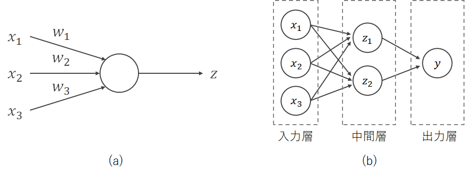

```{r include = FALSE}
knitr::opts_chunk$set(fig.align = 'center', message = F, warning = F)
```

$$
% 定義
\newcommand{\argmin}{\mathop{\rm arg~min}\limits}
$$

# ニューラルネットワーク

## パーセプトロン

### 生体ニューロン

生物の脳神経には多数のニューロン（神経細胞）があり、それらが結合してネットワークを形成している。生物のニューロン（生体ニューロン）ではニューロンの樹状突起が他のニューロンのシナプスから信号（神経伝達物質を受容することで発生する電気信号）を受け取り、閾値を超える電気信号を受け取ると別のニューロンに信号を送るような仕組みになっている。

シナプスと樹状突起の結合の強さ（神経伝達物質の放出量）はそれぞれ異なり、よく使う神経回路はシナプス結合が強くなり、そうすることで学習が進行する。

<center></center>
画像出所：http://nkdkccmbr.hateblo.jp/entry/2016/10/06/222245

### 人工ニューロン

こうしたニューロンの仕組みを数理モデルにした人工ニューロン（ユニットと呼ばれる）を用いてネットワークを作ったものが**ニューラルネットワーク**（neural network）である。以下の図(a)は1つのユニットを、図(b)はニューラルネットワークの一例を示している。



ユニットにはさまざまな入力$x_i$が異なる結合の強さ$w_i$で入ってきており、その重み付き和
$$
u = \sum_{i = 1}^p x_i w_i
$$
が総入力となる。$u$は**活性**（activation）とも呼ばれる。活性に**バイアス**（bias）と呼ばれる定数項$b$を加えて**活性化関数**（activation function）を通したものがこのユニットからの出力$z$となる。
$$
z = f(u + b) = f\left(\sum_{i = 1}^p x_i w_i + b \right)
$$
生体ニューロンにおいて総入力がある閾値を超えたときに信号を出力することを再現するのが活性化関数であり、**階段関数**（step function）
$$
\theta(x) = 
\begin{cases}
1 & (x \geq b)\\
0 & (x < b)
\end{cases}
$$
や**シグモイド関数**（sigmoid function）
$$
\sigma(x) = \frac{1}{1 + \exp(-x)}
$$
を使用する。


```{r, fig.height=4, fig.width=8, echo=F}
library(gridExtra)
library(tidyverse)

# 階段関数
step = function(x, b) ifelse(x >= -b, 1, 0)
# シグモイド関数
sigmoid = function(x) 1 / (1 + exp(-x))


# データ生成
x = -100:100 * 0.1

# plot
g1 <- ggplot(tibble(x, y = step(x, 0)),
             aes(x = x, y = y))+
  geom_line(color = "dodgerblue")+
  labs(y = expression(y), x = expression(x), title = "階段関数")

g2 <- ggplot(tibble(x, y = sigmoid(x)),
             aes(x = x, y = y))+
  geom_line(color = "dodgerblue")+
  labs(y = expression(y), x = expression(x), title = "シグモイド関数")

grid.arrange(g1, g2, ncol = 2)
```


重み$w_i$とバイアス$b$はデータから学習させる。その際には、まず重みの初期値としてランダムに設定し、その後は誤差を下げる方向に重みの更新を繰り返していくように学習していく。


## Rで実践

### データの準備

`{carData}`パッケージに含まれるタイタニック号の乗客データ`TitanicSurvival`を使う。

```{r}
# 準備
library(tidyverse)
set.seed(666)

# データ読み込み
library(carData)
data("TitanicSurvival")
head(TitanicSurvival)
```

このデータセットは1912年のタイタニック号の沈没事故の乗客の生死に関するデータで、次の変数が含まれている

- `survived`：生存したかどうか
- `sex`：性別
- `age`：年齢（1歳に満たない幼児は小数）。263の欠損値を含む。
- `passengerClass`：船室の等級

このデータセットには欠損値が含まれているため、まず欠損値を除去する

```{r}
# NA（欠損値）を含む行を削除
tita <- na.omit(TitanicSurvival)
```

そしてデータを学習用・テスト用に分割する。

```{r}
# ID列を追加
df <- tita %>% rownames_to_column("ID")

# 80%を学習用データに
train <- df %>% sample_frac(size = 0.8)

# 学習用データに使っていないIDの行をテスト用データに
test <- anti_join(df, train, by = "ID")

# ID列は予測に使わないため削除しておく
train <- train %>% select(-ID)
test <- test %>% select(-ID)
```

### ニューラルネット

中間層が1層のニューラルネットワークは`{nnet}`パッケージで実行することができる。

引数に指定している`size`は中間層のユニット数、`decay`は重みを更新するときの減衰率である。

<!-- nnetではBroyden, Fletcher, Goldfarb and Shanno(1970)の準ニュートン法を用いてパラメータを推定する。 -->

```{r}
# 単一中間層
library(nnet)
titanic_nnet <- nnet(survived ~ . , data = train,
                     size = 2, decay = 0.1)
```

`{NeuralNetTools}`パッケージを使用するとnnetのネットワーク構造を図にすることができる。Iはinput（入力層）、Bはbias（定数項）、Hはhidden（中間層、隠れ層）、Oはoutput（出力層）である。

```{r fig.height=6, fig.width=10}
if(!require(NeuralNetTools)) {install.packages("NeuralNetTools")} # インストールされていなければインストールする
library(NeuralNetTools)
plotnet(titanic_nnet)
```


訓練データでの正解率は以下のように計算できる。
```{r}
# 予測
y_pred_train = predict(titanic_nnet, train, type = "class")

# 混同行列
table(train$survived, y_pred_train)

# 正解率
library(MLmetrics)
Accuracy(y_pred = y_pred_train, y_true = train$survived)
```

テストデータでの正解率は以下のように計算できる。
```{r}
# 予測
y_pred_test = predict(titanic_nnet, test, type = "class")

# 混同行列
table(test$survived, y_pred_test)

# 正解率
library(MLmetrics)
Accuracy(y_pred = y_pred_test, y_true = test$survived)
```


# ディープラーニング

## 登場の経緯

ディープラーニングは多層ニューラルネットワークを用いた手法である。中間層を多層化するとニューラルネットの表現力が向上し、複雑な識別境界を描くことができる。

しかし、1990年代~2000年代には

1. **勾配消失**：活性化関数にシグモイド関数を用いて多層にすると、浅い層のパラメータが出力に影響を与えなくなって更新されなくなり学習が困難になる
2. **過学習**：表現力が向上する一方で過学習しやすくなる
3. **計算コスト**：並列計算が必要で、従来のCPUはこのタスクに向かない

といった問題が解決できなかった。

その後研究が進み、これらの問題は次のように解決できるようになった。

1. 勾配消失 → **ReLU**（rectified linear unit、活性化関数に正規化線形関数を使ったユニット）を使用する
   - $f(x) = \max(x, 0)$という活性化関数を使用する
2. 過学習 → **Dropout**：中間層のニューロンを学習のたびにいくつかランダムに無効化しつつ学習する
3. 計算コスト → **General Purpose GPU（GPGPU）**：並列演算用の処理装置の登場

そして2012年に画像認識のコンテストILSVRC2012においてディープラーニングを使用したチームが他のチームを圧倒する成績を出したことでその性能が注目されるようになり、ディープラーニングのブームが始まった。現在もディープラーニング（AI、人工知能）ブームは続いている。

## Rで実践

### データの用意

```{r}
# パッケージの読み込み
library(tidyverse)
library(MLmetrics)

# 乱数の種を固定
set.seed(0)
```

[MNIST database](http://yann.lecun.com/exdb/mnist/)の手書き数字の画像データを使う。

```{r}
# MNISTデータのダウンロード
if (!dir.exists('data')) { # もしdataディレクトリがないなら作成
    dir.create('data')
}
if (!file.exists('data/train.csv')) { # もしdataディレクトリにtrain.csvがないならダウンロード
    download.file(url='https://raw.githubusercontent.com/wehrley/Kaggle-Digit-Recognizer/master/train.csv',
                  destfile='data/train.csv')
}
```

ダウンロードしたら、まずデータを読み込む。

```{r}
# データの読み込み
mnist <- read.csv('data/train.csv')
```


どんなデータか、みてみる。

```{r}
# 1レコード目の1~10列
mnist[1, 1:10]

# 1レコード目の210~220列
mnist[1, 210:220]

# 1レコード目の最後の10列
k = ncol(mnist)
mnist[1, (k-10):k]
```

1レコードにつき1枚の画像のデータが格納されており、`label`は画像に書かれている数字（目的変数）、`pixel0`~`pixel783`は、28 x 28=784ピクセルの手書き文字の画像データ（特徴量＝説明変数）である。

```{r fig.width=4, fig.height=4.2}
# 教師データ（目的変数）= 1列目
y <- mnist[,1]

# 特徴量（説明変数）= 残りの784列
X <- mnist[,-1]

# 0から1の値になるよう正規化し、(数値が0~255なので、255で割る)、行と列をt()で入れ替える
X <- t(X/255)

# 扱っているデータを覗く
i = 10 # 10レコード目
pixels = matrix(X[,i], nrow=28, byrow=TRUE)
image(t(apply(pixels, 2, rev)) , col=gray((255:0)/255), 
      xlab="", ylab="", main=paste("Label for this image:", y[i]))

i = 1000 # 1000レコード目
pixels = matrix(X[,i], nrow=28, byrow=TRUE)
image(t(apply(pixels, 2, rev)) , col=gray((255:0)/255), 
      xlab="", ylab="", main=paste("Label for this image:", y[i]))
```


次に、訓練データとテストデータに分ける。

```{r}
# testとtrainに分割
# ID列を追加
df = mnist %>% rownames_to_column("ID")

# 80%を学習用データに
train <- df %>% sample_frac(size = 0.8)

# 学習用データに使っていないIDの行をテスト用データに
test <- anti_join(df, train, by = "ID")

# ID列は予測に使わないため削除しておく
train <- train %>% select(-ID)
test <- test %>% select(-ID)
```

目的変数（教師データ）は0~9のラベルで、それぞれ3000レコード程度ある

```{r}
# 教師データのラベル
table(train[, 1])
```

### DNN (Deep Neural Network)

<!-- # h2oを使う場合 -->

[h2o.ai](https://www.h2o.ai/)という企業が開発・公開している`{h2o}`パッケージを使用する。


```{r message=F}
# ライブラリの用意
if(!require(h2o)) {install.packages("h2o")}
library(h2o)

# 初期化
h2o.init()

# データをh2o用のデータ型に変換
train <- as.h2o(train)
test <- as.h2o(test)

# 1列目（目的変数）をfactor型に変換
train[,1] = h2o::as.factor(train[,1])
test[,1] = h2o::as.factor(test[,1])
```

訓練データをさらに分ける。80%は学習に使用し、20%は学習中の未知のデータへの予測誤差を測るために使用する。

```{r message=F}
# trainデータを学習用のものと検証用のものに分ける
splits <- h2o.splitFrame(train, ratios = 0.8, seed = 0)
```


ネットワーク構造の定義と学習を行う。ここでは中間層は1層目を128ユニット、2層目を64ユニット、3層目を16ユニットとしてみる。


```{r message=F}
# 学習
mnist_dl = h2o.deeplearning(
  x = 2:ncol(train), # 特徴量の列番号を指定
  y = 1,             # 目的変数の列番号を指定
  training_frame = splits[[1]],   # 訓練データを指定
  validation_frame = splits[[2]], # 検証データを指定（学習には使わず、精度を測るためだけに使う）
  activation = c("RectifierWithDropout"), # 活性化関数を指定
  hidden = c(128, 64, 16), # 中間層（隠れ層）のサイズ
  epochs = 15,       # エポック数。学習データ何回分の学習を反復させて重みを更新していくか。
  hidden_dropout_ratios = c(0.5, 0.5, 0.5), # 各中間層においてdropoutするユニットの割合
  sparse = TRUE,     # 0が多いデータ（スパースデータ）の取り扱い方を変え、メモリ使用量を抑える。
  standardize = TRUE,# データの標準化を学習前に行う
  seed = 0
)
```


モデルの情報（レイヤー構造、混同行列など）

```{r}
mnist_dl
```

`plot()`を使うとエポック（訓練データを何回分使って重みの更新を反復させたか）ごとの予測誤差の推移を可視化することができる。（今回はepochsを小さな値にしているが、実際のデータ分析では「epochsを十分大きな値にしておいて、エポックを増やしてもvalidationデータに対する予測誤差が改善しなくなったら学習を打ち切る」という戦略（early stopping）を取ることも多い）

```{r fig.height=4, fig.width=6}
# 予測誤差の推移
plot(mnist_dl)
```


テストデータでの予測を行う。

```{r message=F}
# 予測
pred <- h2o.predict(mnist_dl, test)
```

予測結果は`predict`列に予測したラベルの値（0~9の数字のうちどれだと予測したか）が入っており、残りの列にはそのレコードが目的変数の各クラスに属する確率を推定したものが入っている。

```{r}
# 予測結果
pred

# 予測確率
round(pred[,2:11], 3)
```


```{r}
y_true = as.vector(test[,1])
y_pred = as.vector(pred[,1])

# 混同行列
table(y_true, y_pred)
```

```{r message=F}
# 混同行列（h2oパッケージの関数を使う場合）
h2o.confusionMatrix(mnist_dl, test)
```


```{r}
# 正解率
library(MLmetrics)
Accuracy(y_pred = y_pred, y_true = y_true)
```


# 参考文献

大関真之（2016）『機械学習入門 ボルツマン機械学習から深層学習まで』、オーム社.

瀧雅人（2017）『これならわかる深層学習入門: 機械学習スタートアップシリーズ』、講談社.


<!-- # mxnetを使う場合 -->

<!-- ディープラーニングを行うには`{mxnet}`パッケージを使用する。インストール方法が少し面倒だが次のように書いてインストールすればよい -->
<!-- （参考：[mxnetの公式サイト](http://mxnet.incubator.apache.org/versions/master/install/index.html)）。 -->

<!-- **注：最新のバージョンのRでは動かないかもしれません。** -->

<!-- ```{r, eval=F} -->
<!-- # mxnetのインストール -->
<!-- cran <- getOption("repos") -->
<!-- cran["dmlc"] <- "https://apache-mxnet.s3-accelerate.dualstack.amazonaws.com/R/CRAN/" -->
<!-- options(repos = cran) -->
<!-- install.packages("mxnet") -->
<!-- ``` -->


<!-- まずネットワーク構造を決める。以下では多層ニューラルネットワークを使ってみる。 -->

<!-- ```{r} -->
<!-- library(mxnet) -->
<!-- # ネットワーク構造の宣言： Deep Neural Network -->

<!-- data <- mx.symbol.Variable("data") -->
<!-- # 第1中間層 -->
<!-- fc1 <- mx.symbol.FullyConnected(data, name="fc1", num_hidden=128) # ユニット数128 -->
<!-- act1 <- mx.symbol.Activation(fc1, name="relu1", act_type="relu")  # ReLUの活性化関数 -->
<!-- # 第2中間層 -->
<!-- fc2 <- mx.symbol.FullyConnected(act1, name="fc2", num_hidden=64) # ユニット数64 -->
<!-- act2 <- mx.symbol.Activation(fc2, name="relu2", act_type="relu") # ReLUの活性化関数 -->
<!-- # 第3中間層 -->
<!-- fc3 <- mx.symbol.FullyConnected(act2, name="fc3", num_hidden=10) # ユニット数10 -->
<!-- softmax <- mx.symbol.SoftmaxOutput(fc3, name="sm") # softmax活性化関数（シグモイド関数の多値バージョン） -->
<!-- ``` -->


<!-- ```{r} -->
<!-- # 計算に使うデバイスを宣言 -->
<!-- devices <- mx.cpu() -->
<!-- ``` -->

<!-- ```{r} -->
<!-- # ニューラルネットを訓練 -->
<!-- mx.set.seed(0) -->
<!-- dnn_model <- mx.model.FeedForward.create(softmax, X=train_X, y=train_y, -->
<!--                                      ctx=devices, num.round=10, array.batch.size=100, -->
<!--                                      learning.rate=0.07, momentum=0.9,  eval.metric=mx.metric.accuracy, -->
<!--                                      initializer=mx.init.uniform(0.07), -->
<!--                                         epoch.end.callback=mx.callback.log.train.metric(100)) -->
<!-- ``` -->

<!-- 訓練データでの予測。 -->

<!-- ```{r} -->
<!-- # 予測 -->
<!-- pred_train <- predict(dnn_model, train_X) -->
<!-- predicted_labels_train <- max.col(t(pred_train)) - 1 -->

<!-- # 混同行列 -->
<!-- table(train_y, predicted_labels_train) -->
<!-- ``` -->


<!-- テストデータでの予測。 -->

<!-- ```{r} -->
<!-- # 予測 -->
<!-- pred_test <- predict(dnn_model, test_X) -->
<!-- predicted_labels_test <- max.col(t(pred_test)) - 1 -->

<!-- # 混同行列 -->
<!-- table(test_y, predicted_labels_test) -->
<!-- ``` -->


