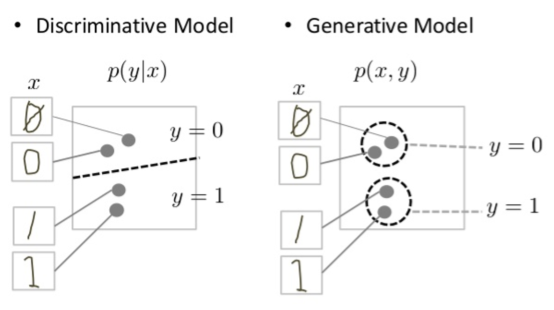

```{r include = FALSE}
knitr::opts_chunk$set(fig.align = 'center', message = F, warning = F)
```

$$
% 定義
\newcommand{\argmin}{\mathop{\rm arg~min}\limits}
$$

# 本講義の目的

# パッケージの読み込み

```{r}
# 準備
pacman::p_load(
  tidyverse, # dplyr, tibbleなどのパッケージ群の読み込み
  MLmetrics, # 予測精度の評価指標
  carData,   # TitanicSurvivalデータセットのため
  nnet,      # 小規模なニューラルネットワークを扱うライブラリ
  NeuralNetTools  # ニューラルネットワークの可視化
)
```

# ニューラルネットワーク

## 生体ニューロン

生物の脳神経には多数のニューロン（神経細胞）があり、それらが結合してネットワークを形成している。生物のニューロン（生体ニューロン）ではニューロンの樹状突起が他のニューロンのシナプスから信号（神経伝達物質を受容することで発生する電気信号）を受け取り、閾値を超える電気信号を受け取ると別のニューロンに信号を送るような仕組みになっている。

シナプスと樹状突起の結合の強さ（神経伝達物質の放出量）はそれぞれ異なり、よく使う神経回路はシナプス結合が強くなり、そうすることで学習が進行すると考えられている。

<center>
  
  <br/>
  <span style="font-size: 0.8em;">
      出所：<a href="http://nkdkccmbr.hateblo.jp/entry/2016/10/06/222245">
      http://nkdkccmbr.hateblo.jp/entry/2016/10/06/222245</a>
  </span>
</center>


## 形式ニューロンとパーセプトロン

こうしたニューロンの仕組みを数理モデルにしたものが**形式ニューロン**（formal neuron）と呼ばれるモデルである。 入力$x_1, x_2, \dots, x_m$に重み$w_1, w_2, \dots, w_m$を乗じて定数項$b$をつけた総和$u = \sum_{j = 1}^m x_j w_j + b$を**活性化関数**（activation function）と呼ばれる関数$h$に通したものを出力$z$とする。

$$
z = h(u) = h \left(\sum_{j = 1}^m x_j w_j + b \right)
$$

この計算を図にしたものが次の図である。

<center></center>

活性化関数は生体ニューロンにおいて総入力がある閾値を超えたときに信号を出力することを再現する関数であり、伝統的には**階段関数**（step function）

$$
h(x) = 
\begin{cases}
  0 & (x \leq 0)\\
  1 & (x > 0)
\end{cases}
$$

や**シグモイド関数**（sigmoid function）

$$
h(x) = \frac{1}{1 + \exp(-x)}
$$

が用いられてきた。 近年は**ReLU（rectified linear unit）**

$$
h(x) = \max(0, x)
$$

が用いられる事が多い。
これらの関数を示したものが次の図である。

```{r, fig.height=2, fig.width=8, echo=F}
pacman::p_load(tidyverse, gridExtra)

step = function(x, b) ifelse(x >= -b, 1, 0)
sigmoid = function(x) 1 / (1 + exp(-x))
relu = function(x) purrr::map_vec(x, function(x) { max(0, x) } )

x <- seq(-5, 5, 0.01)

g1 <- ggplot(tibble(x, y = step(x, 0)),
             aes(x = x, y = y))+
  geom_line(color = "dodgerblue")+
  labs(y = expression(y), x = expression(x), title = "階段関数")

g2 <- ggplot(tibble(x, y = sigmoid(x)),
             aes(x = x, y = y))+
  geom_line(color = "dodgerblue")+
  labs(y = expression(y), x = expression(x), title = "シグモイド関数")

g3 <- ggplot(tibble(x, y = relu(x)),
             aes(x = x, y = y))+
  geom_line(color = "dodgerblue")+
  labs(y = expression(y), x = expression(x), title = "ReLU")

grid.arrange(g1, g2, g3, ncol = 3)
```

形式ニューロンはモデルとしての構造のみの存在であり、重みを更新する仕組みまでは存在しなかった。 後に重みの更新方法が提案され、そちらは**パーセプトロン**（perceptron）あるいは**単純パーセプトロン**と呼ばれる。

パーセプトロンにおいて、重み$w_i$とバイアス$b$はデータから学習させる。その際にはまず重みの初期値をランダムに設定し、その後は誤差を下げる方向に重みの更新を繰り返していくように学習していく。


## 多層パーセプトロン

パーセプトロンの出力を別のパーセプトロンの入力とすることで多層化したものを**多層パーセプトロン（multilayer perceptron: MLP）**あるいは**ニューラルネットワーク**（neural network）と呼ぶ。

<center></center>


### 線形分離可能性

単純パーセプトロンは線形モデルであるため、線形分離不可能なデータをうまく分類することができない。
しかし多層パーセプトロンは非線形モデルとなり、線形分離不可能なデータも分類することができる。

次の図は典型的な線形分離不可能問題のデータに対して単純パーセプトロンと多層パーセプトロンを用いて学習させた場合の決定境界である。なお、多層パーセプトロンは中間層を1層、中間層のユニット数（形式ニューロンの数）は3個の構造にした。

```{r, echo=F}
# train data
set.seed(0)
n <- 1000
s <- 0.2
X <- rbind(
  MASS::mvrnorm(n/4, mu=c(-1, -1), Sigma=matrix(c(s, 0, 0, s), 2, 2)),
  MASS::mvrnorm(n/4, mu=c(1, 1), Sigma=matrix(c(s, 0, 0, s), 2, 2)),
  MASS::mvrnorm(n/4, mu=c(1, -1), Sigma=matrix(c(s, 0, 0, s), 2, 2)),
  MASS::mvrnorm(n/4, mu=c(-1, 1), Sigma=matrix(c(s, 0, 0, s), 2, 2))
)
y <- c(rep(0, n/2), rep(1, n/2)) %>% as.factor()
colnames(X) <- c("x1", "x2")
df <- X %>% as.data.frame() %>% tibble() %>% mutate(y=y)

# data for plotting
x_range <- seq(-3, 3, 0.02)
df_ <- tidyr::crossing(tibble(x1 = x_range), tibble(x2 = x_range))

# fit and predict
# 中間層のユニット数が1 → 実質的に単純パーセプトロン
clf_lm <- nnet(y ~ ., data=df, size=1, trace=F)
acc_lm <- MLmetrics::Accuracy(y_true = df$y, y_pred = predict(clf_lm, df, type="class") %>% as.factor())
label_lm <- str_c("単純パーセプトロン (Accuracy=", acc_lm, ")")
df_[label_lm] <- predict(clf_lm, df_, type="class") %>% as.numeric()

# 中間層のユニット数が2以上 → 中間層と出力層で2層あることを活かしている
clf_nlm <- nnet(y ~ ., data=df, size=3, trace=F)
acc_nlm <- MLmetrics::Accuracy(y_true = df$y, y_pred = predict(clf_nlm, df, type="class") %>% as.factor())
label_nlm <- str_c("多層パーセプトロン (Accuracy=", acc_nlm, ")")
df_[label_nlm] <- predict(clf_nlm, df_, type="class") %>% as.numeric()

# plot
df_ <- df_ %>% pivot_longer(cols = c(label_lm, label_nlm),
                            names_to = "method", values_to = "predicted value")

ggplot() +
  geom_point(aes(x = x1, y = x2, color=y, group=y), data=df, alpha=0.7) +
  geom_contour(aes(x = x1, y = x2, z = `predicted value`, color=method, group=method), data=df_, alpha=0.7) +
  labs(title = "線形分離不可能問題")
```

## Rで実践

### データの準備

`{carData}`パッケージに含まれるタイタニック号の乗客データ`TitanicSurvival`を使う。

```{r}
# データ読み込み
data("TitanicSurvival")
head(TitanicSurvival)
```

このデータセットは1912年のタイタニック号の沈没事故の乗客の生死に関するデータで、次の変数が含まれている

-   `survived`：生存したかどうか
-   `sex`：性別
-   `age`：年齢（1歳に満たない幼児は小数）。263の欠損値を含む。
-   `passengerClass`：船室の等級

このデータセットには欠損値が含まれているため、まず欠損値を除去する

```{r}
# NA（欠損値）を含む行を削除
tita <- na.omit(TitanicSurvival)
```

そしてデータを学習用・テスト用に分割する。

```{r}
# ID列を追加
df <- tita %>% rownames_to_column("ID")

# 80%を学習用データに
set.seed(0)
train <- df %>% sample_frac(size = 0.8)

# 学習用データに使っていないIDの行をテスト用データに
test <- anti_join(df, train, by = "ID")

# ID列は予測に使わないため削除しておく
train <- train %>% select(-ID)
test <- test %>% select(-ID)
```

### ニューラルネットワークの学習

中間層が1層のニューラルネットワークは`{nnet}`パッケージで実行することができる。

```{r}
titanic_nnet <- nnet(
  formula = survived ~ .,
  data = train,
  size = 2
)
```

引数に指定している`size`は中間層のユニット数（形式ニューロンの数）である。
なお出力層の活性化関数はデフォルトではシグモイド関数である。

`{NeuralNetTools}`パッケージを使用するとnnetのネットワーク構造を図にすることができる。

```{r fig.height=6, fig.width=10}
NeuralNetTools::plotnet(titanic_nnet)
```

`I`は入力層（input）、`B`は定数項（bias）、`H`は中間層（hidden; 隠れ層）、`O`は出力層（output）である。
線の色は重みの正負を表しており、黒は正の値、灰色は負の値である。線の太さは重みの相対的な大きさを表している。

テストデータでの正解率は以下のように計算できる。

```{r}
# 予測
y_pred <- predict(titanic_nnet, test, type = "class")

# 混同行列
table(test$survived, y_pred)

# 正解率
Accuracy(y_pred = y_pred, y_true = test$survived)
```


# ディープラーニング

中間層が2層以上のニューラルネットワークを**DNN（deep neural network）**や**ディープラーニング（deep learning）**と呼ぶ。
ニューラルネットワークの層をさらに重ねることでモデルの表現力がさらに向上し、より複雑なデータに対応できるようになる。

DNNの研究は過学習の問題や勾配消失問題と呼ばれる予測誤差の情報が層を経て極端に小さくあるいは大きくなって消える現象に苦しむこととなった。
しかし、

- 勾配の消失が起きにくい活性化関数である**ReLU**の登場
- 正則化手法の発展（ランダムに一部のニューロンの出力を0に固定して無効化することで過学習を回避する**ドロップアウト**など）
- パラメータ最適化に用いる勾配法の改良手法の登場
- 計算機の発展

などの要因により、DNNをランダムな初期値からでも学習することができるようになった。


## Rによる実践

Rでは`{h2o}`パッケージや`{rtorch}`パッケージなどでDNNを実行することができる。


```{r}
# パッケージの読み込み
pacman::p_load(
  tidyverse,
  MLmetrics,
  h2o
)

# 初期化
h2o.init()
```

```{r message=F}
# データをh2o用のデータ型に変換
train <- as.h2o(train)
test <- as.h2o(test)

# 1列目（目的変数）をfactor型に変換
train[,1] = h2o::as.factor(train[,1])
test[,1] = h2o::as.factor(test[,1])

# trainデータを学習用のものと検証用のものに分ける
splits <- h2o.splitFrame(train, ratios = 0.8, seed = 0)
```

ネットワーク構造の定義と学習を行う。ここでは中間層は1層目を128ユニット、2層目を64ユニット、3層目を16ユニットとしてみる。

```{r message=F}
# 学習
mnist_dl = h2o.deeplearning(
  x = 2:ncol(train), # 特徴量の列番号を指定
  y = 1,             # 目的変数の列番号を指定
  training_frame = splits[[1]],   # 訓練データを指定
  validation_frame = splits[[2]], # 検証データを指定（学習には使わず、精度を測るためだけに使う）
  activation = c("RectifierWithDropout"), # 活性化関数を指定
  loss = c("CrossEntropy"), # 誤差関数をCrossEntropy（二項分布の負の対数尤度）へ
  hidden = c(3, 3, 3), # 中間層（隠れ層）のサイズ
  epochs = 1000,       # エポック数。学習データ何回分の学習を反復させて重みを更新していくか。
  hidden_dropout_ratios = c(0.5, 0.5, 0.5), # 各中間層においてdropoutするユニットの割合
  seed = 0
)
```

モデルの情報（レイヤー構造、混同行列など）

```{r}
mnist_dl
```

`plot()`を使うとエポック（訓練データを何回分使って重みの更新を反復させたか）ごとの予測誤差の推移を可視化することができる。（今回はepochsを小さな値にしているが、実際のデータ分析では「epochsを十分大きな値にしておいて、エポックを増やしてもvalidationデータに対する予測誤差が改善しなくなったら学習を打ち切る」という戦略（early stopping）を取ることも多い）

```{r fig.height=4, fig.width=6}
# 予測誤差の推移
plot(mnist_dl)
```

テストデータでの予測を行う。

```{r message=F}
# 予測
pred <- h2o.predict(mnist_dl, test)
```

予測結果は`predict`列に予測したラベルの値が入っており、残りの列にはそのレコードが目的変数の各クラスに属する確率を推定したものが入っている。

```{r}
# 予測結果
pred
```

```{r}
y_true <- test$survived %>% as.vector()
y_true <- 1 * (y_true == "yes")
p_pred <- pred$yes %>% as.vector()
y_pred <- 1 * (p_pred >= 0.5)

# ROC-AUC
AUC(p_pred, y_true)

# 正解率
Accuracy(y_pred, y_true)

# 混同行列
table(y_true, y_pred)
```

```{r message=F}
# 混同行列（h2oパッケージの関数を使う場合）
h2o.confusionMatrix(mnist_dl, test)
```


## （参考）A Neural Network Playground {-}

Tensorflow（Googleが開発したディープラーニングのライブラリ）の[A Neural Network Playground](http://playground.tensorflow.org/)というサイトでは、いくつかのサンプルデータに対するディープラーニングの挙動を簡単に確認することができる。

<center>
  
  <br/>
  <span style="font-size: 0.8em;">
    出所：http://playground.tensorflow.org/
  </span>
</center>

非公式の[日本語版サイト](https://deepinsider.github.io/playground)も存在する。


# 自然言語処理入門

ディープラーニングは日本語や英語などの**自然言語**（natural language）の分析や画像の分析を中心として活用されている。 今回は自然言語データの分析（**自然言語処理** natural language processing: NLP）を例にとって説明を行うことにする。

この節では自然言語処理の概要や、自然言語をコンピュータで扱う（計算可能にする）ためにどのように前処理を行うのかを概説する。

## 自然言語処理のタスク

自然言語処理の分野では、例えば次のようなタスクを行っていく。

- **機械翻訳**（machine translation）：ある言語を別の言語に翻訳する
  - 応用例：Google翻訳、DeepLなど
- **固有表現抽出**（named entity recognition: NER）：文章中の固有表現（人名、組織名、地名、日付など）を取り出す
  - 応用例1：[ニュース配信における固有表現抽出の取り組み / Extraction of Unique Expressions in News Distribution - Speaker Deck](https://speakerdeck.com/sansandsoc/extraction-of-unique-expressions-in-news-distribution?slide=6)
  - 応用例2：[AIによる有価証券報告書のキーワード分析　～BERTを用いた固有表現抽出の検証～ | DCS blog](https://blog.dcs.co.jp/ai/20230222-nlp.html)
- **感情分析**（sentiment analysis）：文章中のネガティブな表現やポジティブな表現を抽出し、全体としてポジティブかネガティブかを評価する
  - 応用例：[青嶋智久, & 中川慧. (2019). 日本語 BERT モデルを用いた経済テキストデータのセンチメント分析](https://www.jstage.jst.go.jp/article/pjsai/JSAI2019/0/JSAI2019_4Rin127/_article/-char/ja/)
- **文章生成**（text generation）：指定された文章を生成したり、文章を要約したり、チャットボットとしての返答を生成したりなど
  - 応用例：ChatGPT、Bing AIなど


## トークン化

自然言語のデータを計算可能な状態にしていくにあたって、まず文章をトークンという単位に分けていく。例えば文字単位や単語単位に分割していく。

単語単位に分割する場合、英語のように単語と単語の間にスペースがある言語の場合はスペースを頼りに分割すればよい。
しかし日本語のようにスペースが入らない言語の場合は形態素解析という処理を行い、どの文字からどの文字までが1つの単語を構成するのかを判定して分割していく必要がある。

形態素解析器のひとつが[MeCab](https://taku910.github.io/mecab/)（めかぶ）である。MeCabを別途パソコンにインストールした状態で`{RMeCab}`パッケージを使用すると、次のようにRからMeCabを呼び出して文章を分割することができる。

```{r eval=F}
# （参考）RMeCabパッケージによる形態素解析の例
# （注）MeCabを予めインストールしておく必要がある
install.packages("RMeCab", repos = "http://rmecab.jp/R")
library(RMeCab)
res <- RMeCabC("すもももももももものうち")
unlist(res)
```

```
> unlist(res)
    名詞     助詞     名詞     助詞     名詞     助詞     名詞 
 "すもも"     "も"   "もも"     "も"   "もも"     "の"   "うち" 
```


## 言語モデル

自然言語処理においては、文章が生成される確率を推定するモデルを構築することを通じて自然言語処理モデルを構築することが少なくない。
この「文章が生成される確率のモデル」を**言語モデル（language model）**という。

言語モデルでは、もっともらしい（確率的にありえる）文章の確率が高く評価されるように学習したい。例えば次のような評価をしたい。

$$
P(昨日は雨が降りました) > P(昨日は飴が降りました)
$$

文章をトークンに置き換えて考えると、文章の確率ではなくトークンの同時確率として扱うことができる

$$
P(昨日, は, 雨, が, 降り, ました) 
$$

記号にすると、ある文章$S$をトークン化したのを$(w_1, w_2, \cdots, w_T)$とすると、

$$
P(S)=P(w_1, w_2, \cdots, w_T)
$$

を求めたいということになる。この同時分布$P(w_1, w_2, \cdots, w_n)$は条件付き確率の積として表すことができる。

$$
\begin{align}
P(w_1, w_2, \cdots, w_T)
&= P(w_1) \times P(w_2|w_1) \times P(w_3|w_1, w_2) \times \cdots \times p(w_T|w_1, \dots, w_{T-1})\\
&= \prod_{t=1}^T p(w_t|w_1, \dots, w_{t-1})
\end{align}
$$

$w_t$より前のトークン列$w_1,w_2,\cdots,w_{t-1}$は**文脈**（context）と呼ばれる。
よって言語モデルの学習は「文脈（これまで出たトークン）をもとに次のトークンを予測する問題」と捉えることもできる。


# RNNとLSTM

## RNN

言語モデルを学習する際、文脈$w_1,w_2,\cdots,w_{t-1}$をもとに次の単語$w_t$を予測するような問題を解くことになるわけだが、これは時点$1, 2, \dots, t-1$のデータから$t$時点のデータを予測するような時系列予測問題のような構造になっている。

こうした系列性をうまく表現するようなネットワークの構造（アーキテクチャ）が**RNN（recurrent neural network）**である。

<center>
  
  <br/>
  <span style="font-size: 0.8em;">
      （出所：<a href="http://nkdkccmbr.hateblo.jp/entry/2016/10/06/222245">
      http://nkdkccmbr.hateblo.jp/entry/2016/10/06/222245</a>）
  </span>
</center>


<!-- TODO: 単語も書き込まれた画像いれる -->

RNNは$t$期の入力だけでなく$1, 2, \dots, t-1$期の入力も用いて$t$期の出力を行うモデルである。
ある中間層の値は、入力$x_{t}$と入力層の重み$w^{(in)}$だけでなく、1期前の$t-1$期の中間層の出力$z_{t-1}$と重み$w^{(hid)}$を使って計算される。

$$
z^{(t)}_j = h \left( \sum^J_{j=1} w_j^{(in)} x_{j, t} + \sum_{j=1}^J w^{(hid)}_j z_{j, t-1} + b \right)
$$

RNNの活性化関数には双曲線正接（hyperbolic tangent: **tanh**）関数

$$
\text{tanh}(x) = \frac{e^x - e^{-x}}{e^x + e^{-x}}
$$

が使われることが多い。$tanh$はシグモイド関数と似ているが、出力値が0から1ではなく-1から1の範囲になる点が異なる


```{r, fig.height=3, fig.width=6, echo=F}
pacman::p_load(tidyverse)

sigmoid = function(x) 1 / (1 + exp(-x))
x <- seq(-5, 5, 0.01)

df <- tibble(x, sigmoid(x), tanh(x))
df <- df %>% pivot_longer(cols=colnames(df)[-1],
                          names_to = "function", values_to = "y")

df %>% ggplot(aes(x = x, y = y,
                  group = `function`, color = `function`)) +
  geom_line() +
  labs(title = "シグモイド関数とtanh関数")
```


なお、RNNのような自己回帰性のあるニューラルネットワークと対比して、多層パーセプトロンのような自己回帰性を持たないネットワークたちは**順伝播型ニューラルネットワーク（feedforward network）**と呼ばれる。


## LSTM

RNNは時刻（トークン）数が長くなると勾配消失が起こりやすく、何も工夫しなければ10時刻程度で勾配が消失するという報告もある。

勾配消失を防ぐための工夫がなされたものが**LSTM（long short-term memory）**である。


```{r}
pacman::p_load(torch)

```


# Transformer

## Attention

Attention機構を用いた


RNNやLSTMは勾配消失の問題だけでなく**並列計算**（parallel computing; 複数の処理装置で同時並行で計算することで計算を高速化すること）に向いていないためモデルやデータの規模の増加が難しいという問題も存在したが、Attentionは並列計算に向いているため、その点でも優れていた。


## Transformer


# 大規模言語モデル

## 基盤モデル

**基盤モデル（foundation model）**という考え方


scaling law

GPT（Generative Pretrained Transformer）


### （参考）textパッケージによる学習済みモデルの利用

[{text}](https://r-text.org/index.html)パッケージを用いてGPT-2などの学習済みLLMによる言語処理を体験することができる（インストール・推論にやや時間がかかるので注意）

例えば`textGeneration()`関数でGPT-2を利用して`"Hello, I'm"`に続く文章を生成させると、次のようなそれっぽい文章が生成される

```{r, eval=F}
# （注）Posit Cloud無料枠ではスペック不足で動かない
pacman::p_load(text)

# Pythonの仮想環境をセットアップ
textrpp_install()
textrpp_initialize(save_profile = TRUE)

# 文章生成
generated_text <- textGeneration("Hello, I'm",
                                 model = "gpt2")
generated_text %>% as.vector()
```

```
$x_generated
[1] "Hello, I'm a new employee at Drexel University! Last Friday, I was an excellent choice for a professor teaching math and math courses at the college we currently offer at Georgetown. After making the move to a local university in California, I"
```

### （参考）Hugging Face

[Hugging Face](https://huggingface.co/)は大規模なAIのコミュニティであり、学習済みモデルやデータセットが公開されている。

学習済みモデルはPythonの[Transformers](https://huggingface.co/docs/transformers/index)パッケージとしても公開されており、実はRの[{text}](https://r-text.org/index.html)パッケージはこのパッケージをRから読み込んでいる。

Hugging Faceのウェブサイト上で学習済みモデルを動かすことができるInference APIという機能もある。

例えばrinna株式会社の[rinna/japanese-gpt2-medium · Hugging Face](https://huggingface.co/rinna/japanese-gpt2-medium?text=%E7%94%9F%E5%91%BD%E3%80%81%E5%AE%87%E5%AE%99%E3%80%81%E3%81%9D%E3%81%97%E3%81%A6%E4%B8%87%E7%89%A9%E3%81%AB%E3%81%A4%E3%81%84%E3%81%A6%E3%81%AE%E7%A9%B6%E6%A5%B5%E3%81%AE%E7%96%91%E5%95%8F%E3%81%AE%E7%AD%94%E3%81%88%E3%81%AF)は日本語のデータを用いてGPT-2を学習したモデルである。Inference APIもあるためウェブサイト上で試すことができる。


# ChatGPT

## 概要

ChatGPTはOpenAI社が開発したチャットボットサービスである。

バックエンドにはGPT-3やGPT-4を利用


# 文章生成モデルの課題と対策

## Hallucination

文章生成をさせた際に利用者の意図と異なる文章を生成したり事実と異なる事を述べるといった不誠実なふるまいをする現象を**Hallucination**（ハルシネーション；「幻覚」の意味）という。

例えば次の画像は立教大学についてChatGPTに尋ねたものであるが、随所に事実と異なる説明が混じっていることがわかる。

<center>
  
  <br/>
  <span style="font-size: 0.8em;">
    バックエンドにGPT-3.5（May 24 ver.）を利用したChatGPTによる回答。撮影日は2023年6月26日。
  </span>
</center>

こうしたふるまいがHallucinationである。
（※ChatGPTは日本語に弱い。英語で質問すれば立教大学についても妥当な答えを返してくれた。）


## Prompt Engineering

大規模言語モデルは質問文（**プロンプト  prompt**）の書き方に応じて生成結果が変わる。

プロンプトの書き方を工夫することによって大規模言語モデルの挙動を制御しようという試みを**プロンプト・エンジニアリング**（Prompt Engineering）という。

以下では代表的なプロンプト・エンジニアリングの例を述べる。


### Few-shot

解かせたいタスクの例を先に示してあげることで生成される回答を制御する方法。

<center>
  
  <br/>
  <span style="font-size: 0.8em;">
    出所：[Brown, et al. (2020). Language models are few-shot learners.](https://arxiv.org/abs/2005.14165)
  </span>
</center>

例を1つ示すことを**one-shot prompting**、複数例示することを**few-shot prompting**という。
それらに対し、単純に質問文だけを書く方法は**zero-shot prompting**という。


### Chain-of-Thought

Few-shotの際に解答例を単に答えだけにするのではなく、思考過程も含めてよりタスクを細分化し具体化している回答にしてやることで適切な答えを返しやすくする方法を**chain of thought (CoT)**という（図中の「Few-shot-CoT」）。

単に「Let's think step by step」をつけるだけで正答率が上がることを利用した**Zero-shot CoT**という派生手法も存在する。

<center>
  
  <br/>
  <span style="font-size: 0.8em;">
    出所：[Kojima, et al. (2022). Large language models are zero-shot reasoners.](https://arxiv.org/abs/2205.11916)
  </span>
</center>


## Retrieval Augmented Generation

モデル内に学習されている知識は訓練時点での情報がベースとなるため、新しい情報に関する適切な返答を行うことは難しい。
例えば「今の日本の首相は？」と質問しても訓練時点での首相の名前が返答される。

学習に必要な計算量があまり大きくない機械学習モデルであれば、定期的にモデルを学習し直すことでこうした情報更新を行うことが可能である。
しかし、大規模言語モデルは1回の学習に要するコストが膨大であるため、モデルの再学習により情報を更新する方法は容易ではない。

このような情報の不足もHallucinationを引き起こす原因となりかねない。

こうした問題に対して、モデル内に学習された知識ではなくモデル外の知識を利用して回答文を生成する方法が考えられている。


[Retrieval Augmented Generative QA - a Hugging Face Space by deepset](https://huggingface.co/spaces/deepset/retrieval-augmentation-svb)


# 文章生成モデル

近年、生成モデルとしての応用が進み、非技術者への普及が進んだ。概要を軽く紹介する。

**生成モデル**（generative model）とは、データの分布を学習するモデルであり、$p(X, Y)$あるいは教師ラベルがなければ単に$p(X)$を学習する。

一方でこれまで学んできたようなアプローチは**判別モデル**（discriminative model）と呼ばれ、条件付き分布$p(Y|X)$を学習するモデルである（例えばロジスティック回帰では$p(y=1|x) = \sigma(\beta_0 + \beta_1 x_1)$を学習していた）



GPT

教師あり学習では教師ラベル（予測の正解データ）が必要だったが、

## 文章生成

ChatGPTの背景で動く言語モデル

Scaling lawの発見後、開発競争が進んだ。これらの大規模なモデルたちはLLMと言われる

ChatGPTはLLMをベースに、強化学習（明確な正解がない問題について、良し悪しのフィードバックをもとに学習していく）を用いて人間がフィードバックを行って問題のないチャットAIとなるようにした（従来のチャットAIは

原理としては次に出てくるもっともらしい単語を予測するモデルに過ぎないが、知性を持っていると思われるような振る舞いになり、AIの研究としても興味深いものになっている。

# 参考文献

大関真之（2016）『機械学習入門 ボルツマン機械学習から深層学習まで』、オーム社.

瀧雅人（2017）『これならわかる深層学習入門: 機械学習スタートアップシリーズ』、講談社.

# 参考ウェブサイト&スライド

清水遼平（2023）「[DiffusionによるText2Imageの系譜と生成画像が動き出すまで](https://speakerdeck.com/nhamanasu/diffusionniyorutext2imagenoxi-pu-tosheng-cheng-hua-xiang-gadong-kichu-sumade)」

岡崎直観（2023）「[大規模言語モデルの驚異と脅威](https://speakerdeck.com/chokkan/20230327_riken_llm)」

岩澤有祐（2023）「[基盤モデルの技術と展望](https://speakerdeck.com/yusuke0519/jsai2023-tutorial-ji-pan-moderunoji-shu-tozhan-wang)」

[Prompt Engineering Guide](https://www.promptingguide.ai/)

-   [Posit AI Blog: State-of-the-art NLP models from R](https://blogs.rstudio.com/ai/posts/2020-07-30-state-of-the-art-nlp-models-from-r/)

