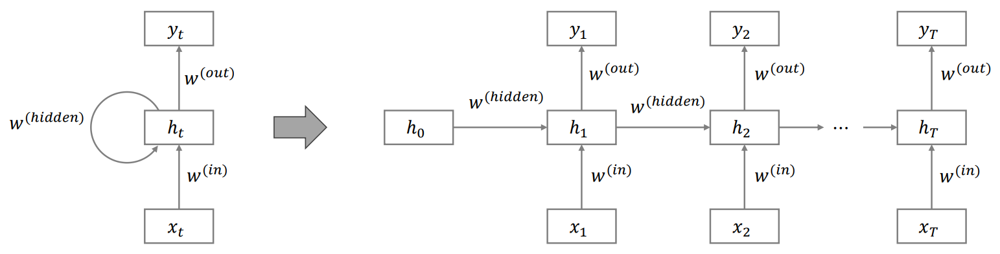
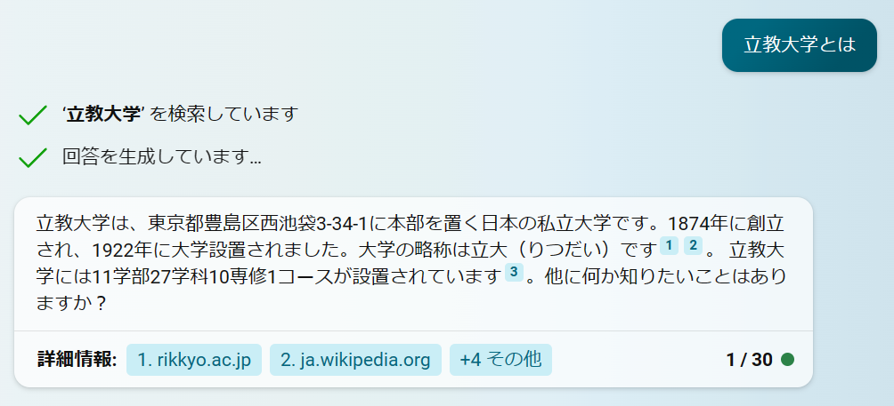

```{r include = FALSE}
knitr::opts_chunk$set(fig.align = 'center', message = F, warning = F)
```

$$
% 定義
\newcommand{\argmin}{\mathop{\rm arg~min}\limits}
$$


# 本講義の目的

- ニューラルネットワークの基礎を学ぶ
- 自然言語処理の概要を学ぶ
- 大規模言語モデルの概要と技術的な特性について学ぶ


# ニューラルネットワーク

## 生体ニューロン

生物の脳神経には多数のニューロン（神経細胞）があり、それらが結合してネットワークを形成している。生物のニューロン（生体ニューロン）ではニューロンの樹状突起が他のニューロンの軸索末端から信号（神経伝達物質を受容することで発生する電気信号）を受け取り、閾値を超える電気信号を受け取ると別のニューロンに信号を送るような仕組みになっている。

ニューロン間の結合部（シナプス）の結合の強さ（神経伝達物質の放出量など）はそれぞれ異なり、よく使う神経回路はシナプス結合が強くなり、そうすることで学習が進行すると考えられている。

<center>
  
  <br/>
  <span style="font-size: 0.8em;">
      出所：<a href="http://nkdkccmbr.hateblo.jp/entry/2016/10/06/222245">
      http://nkdkccmbr.hateblo.jp/entry/2016/10/06/222245</a>
  </span>
</center>


## 形式ニューロンとパーセプトロン

こうしたニューロンの仕組みを数理モデルにしたものが**形式ニューロン**（formal neuron）と呼ばれるモデルである。 入力$x_1, x_2, \dots, x_m$に重み$w_1, w_2, \dots, w_m$を乗じて定数項$b$をつけた総和$u = \sum_{j = 1}^m x_j w_j + b$を**活性化関数**（activation function）と呼ばれる関数$h$に通したものを出力$z$とする。

$$
z = h(u) = h \left(\sum_{j = 1}^m x_j w_j + b \right)
$$

この計算を図にしたものが次の図である。

<center></center>

活性化関数は生体ニューロンにおいて総入力がある閾値を超えたときに信号を出力することを再現する関数であり、伝統的には**階段関数**（step function）

$$
h(x) = 
\begin{cases}
  0 & (x \leq 0)\\
  1 & (x > 0)
\end{cases}
$$

や**シグモイド関数**（sigmoid function）

$$
h(x) = \frac{1}{1 + \exp(-x)}
$$

が用いられてきた。 近年は**ReLU（rectified linear unit）**

$$
h(x) = \max(0, x)
$$

が用いられる事が多い。
これらの関数を示したものが次の図である。

```{r, fig.height=2, fig.width=8, echo=F}
pacman::p_load(tidyverse, gridExtra)

step = function(x, b) ifelse(x >= -b, 1, 0)
sigmoid = function(x) 1 / (1 + exp(-x))
relu = function(x) purrr::map_vec(x, function(x) { max(0, x) } )

x <- seq(-5, 5, 0.01)

g1 <- ggplot(tibble(x, y = step(x, 0)),
             aes(x = x, y = y))+
  geom_line(color = "dodgerblue")+
  labs(y = expression(y), x = expression(x), title = "階段関数")

g2 <- ggplot(tibble(x, y = sigmoid(x)),
             aes(x = x, y = y))+
  geom_line(color = "dodgerblue")+
  labs(y = expression(y), x = expression(x), title = "シグモイド関数")

g3 <- ggplot(tibble(x, y = relu(x)),
             aes(x = x, y = y))+
  geom_line(color = "dodgerblue")+
  labs(y = expression(y), x = expression(x), title = "ReLU")

grid.arrange(g1, g2, g3, ncol = 3)
```

形式ニューロンはモデルとしての構造のみの存在であり、重みを更新する仕組みまでは存在しなかった。 後に重みの更新方法が提案され、そちらは**パーセプトロン**（perceptron）あるいは**単純パーセプトロン**と呼ばれる。

パーセプトロンにおいて、重み$w_i$とバイアス$b$はデータから学習させる。その際にはまず重みの初期値をランダムに設定し、その後は誤差を下げる方向に重みの更新を繰り返していくように学習していく。


## 多層パーセプトロン

パーセプトロンの出力を別のパーセプトロンの入力とすることで多層化したものを**多層パーセプトロン（multilayer perceptron: MLP）**あるいは**ニューラルネットワーク**（neural network）と呼ぶ。

<center></center>


### 多層パーセプトロンの識別境界

単純パーセプトロンは線形モデルであるため、線形分離不可能なデータをうまく分類することができない。
しかし多層パーセプトロンは非線形モデルとなり、線形分離不可能なデータも分類することができる。

次の図は典型的な線形分離不可能問題のデータに対して単純パーセプトロンと多層パーセプトロンを用いて学習させた場合の識別境界である。なお、多層パーセプトロンは中間層を1層、中間層のユニット数（形式ニューロンの数）は3個の構造にした。

```{r, echo=F}
pacman::p_load(nnet, MLmetrics)

# train data
set.seed(0)
n <- 1000
s <- 0.2
X <- rbind(
  MASS::mvrnorm(n/4, mu=c(-1, -1), Sigma=matrix(c(s, 0, 0, s), 2, 2)),
  MASS::mvrnorm(n/4, mu=c(1, 1), Sigma=matrix(c(s, 0, 0, s), 2, 2)),
  MASS::mvrnorm(n/4, mu=c(1, -1), Sigma=matrix(c(s, 0, 0, s), 2, 2)),
  MASS::mvrnorm(n/4, mu=c(-1, 1), Sigma=matrix(c(s, 0, 0, s), 2, 2))
)
y <- c(rep(0, n/2), rep(1, n/2)) %>% as.factor()
colnames(X) <- c("x1", "x2")
df <- X %>% as.data.frame() %>% tibble() %>% mutate(y=y)

# data for plotting
x_range <- seq(-3, 3, 0.02)
df_ <- tidyr::crossing(tibble(x1 = x_range), tibble(x2 = x_range))

# fit and predict
# 中間層のユニット数が1 → 実質的に単純パーセプトロン
clf_lm <- nnet(y ~ ., data=df, size=1, trace=F)
acc_lm <- Accuracy(y_true = df$y, y_pred = predict(clf_lm, df, type="class") %>% as.factor())
label_lm <- str_c("単純パーセプトロン (Accuracy=", acc_lm, ")")
df_[label_lm] <- predict(clf_lm, df_, type="class") %>% as.numeric()

# 中間層のユニット数が2以上 → 中間層と出力層で2層あることを活かしている
clf_nlm <- nnet(y ~ ., data=df, size=3, trace=F)
acc_nlm <- Accuracy(y_true = df$y, y_pred = predict(clf_nlm, df, type="class") %>% as.factor())
label_nlm <- str_c("多層パーセプトロン (Accuracy=", acc_nlm, ")")
df_[label_nlm] <- predict(clf_nlm, df_, type="class") %>% as.numeric()

# plot
df_ <- df_ %>% pivot_longer(cols = c(label_lm, label_nlm),
                            names_to = "method", values_to = "predicted value")

ggplot() +
  geom_point(aes(x = x1, y = x2, color=y, group=y), data=df, alpha=0.7) +
  geom_contour(aes(x = x1, y = x2, z = `predicted value`, color=method, group=method), data=df_, alpha=0.7) +
  labs(title = "線形分離不可能問題")
```

## Rで実践

### パッケージの読み込み

```{r}
# 準備
pacman::p_load(
  tidyverse, # dplyr, tibbleなどのパッケージ群の読み込み
  MLmetrics, # 予測精度の評価指標
  carData,   # TitanicSurvivalデータセットのため
  nnet,      # 小規模なニューラルネットワークを扱うライブラリ
  NeuralNetTools  # ニューラルネットワークの可視化
)
```

### データの準備

`{carData}`パッケージに含まれるタイタニック号の乗客データ`TitanicSurvival`を使う。

```{r}
# データ読み込み
data("TitanicSurvival")
head(TitanicSurvival)
```

このデータセットは1912年のタイタニック号の沈没事故の乗客の生死に関するデータで、次の変数が含まれている

-   `survived`：生存したかどうか
-   `sex`：性別
-   `age`：年齢（1歳に満たない幼児は小数）。263の欠損値を含む。
-   `passengerClass`：船室の等級

このデータセットには欠損値が含まれているため、まず欠損値を除去する

```{r}
# NA（欠損値）を含む行を削除
titanic <- na.omit(TitanicSurvival)
```

そしてデータを学習用・テスト用に分割する。

```{r}
# ID列を追加
df <- titanic %>% rownames_to_column("ID")

# 80%を学習用データに
set.seed(0)
train <- df %>% sample_frac(size = 0.8)

# 学習用データに使っていないIDの行をテスト用データに
test <- anti_join(df, train, by = "ID")

# ID列は予測に使わないため削除しておく
train <- train %>% select(-ID)
test <- test %>% select(-ID)
```

### ニューラルネットワークの学習

中間層が1層のニューラルネットワークは`{nnet}`パッケージで実行することができる。

```{r}
titanic_nnet <- nnet(
  formula = survived ~ .,
  data = train,
  size = 2
)
```

引数に指定している`size`は中間層のユニット数（形式ニューロンの数）である。
なお出力層の活性化関数はデフォルトではシグモイド関数である。

`{NeuralNetTools}`パッケージを使用するとnnetのネットワーク構造を図にすることができる。

```{r fig.height=6, fig.width=10}
NeuralNetTools::plotnet(titanic_nnet)
```

`I`は入力層（input）、`B`は定数項（bias）、`H`は中間層（hidden; 隠れ層）、`O`は出力層（output）である。
線の色は重みの正負を表しており、黒は正の値、灰色は負の値である。線の太さは重みの相対的な大きさを表している。

テストデータでの正解率は以下のように計算できる。

```{r}
# 予測
y_pred <- predict(titanic_nnet, test, type = "class")

# 混同行列
table(test$survived, y_pred)

# 正解率
Accuracy(y_pred = y_pred, y_true = test$survived)
```


# DNN

中間層が2層以上のニューラルネットワークを**DNN（deep neural network）**や**ディープラーニング（deep learning）**と呼ぶ。
ニューラルネットワークの層をさらに重ねることでモデルの表現力がさらに向上し、より複雑なデータに対応できるようになる。

DNNの研究は過学習の問題や勾配消失問題と呼ばれる予測誤差の情報が層を経て極端に小さくあるいは大きくなって消える現象に苦しむこととなった。
しかし、

- 勾配の消失が起きにくい活性化関数である**ReLU**の登場
- 正則化手法の発展（ランダムに一部のニューロンの出力を0に固定して無効化することで過学習を回避する**ドロップアウト**など）
- パラメータ最適化に用いる勾配法の改良手法の登場
- 計算機の発展

などの要因により、DNNをランダムな初期値からでも学習することができるようになった。


## Rによる実践

Rでは`{h2o}`パッケージや`{torch}`パッケージなどでDNNを実行することができる。

### `{h2o}`パッケージによるDNNの実行

```{r, results='hide'}
# パッケージの読み込み
pacman::p_load(
  tidyverse,
  MLmetrics,
  h2o
)

# h2oの仮想環境の起動
h2o.init()
```

```{r, results='hide'}
# データをh2o用のデータ型に変換
train <- as.h2o(train)
test <- as.h2o(test)

# 1列目（目的変数）をfactor型に変換
train[,1] = h2o::as.factor(train[,1])
test[,1] = h2o::as.factor(test[,1])

# trainデータを学習用のものと検証用のものに分ける
splits <- h2o.splitFrame(train, ratios = 0.8, seed = 0)
```

`h2o.deeplearning()`でネットワーク構造の定義と学習を行う。

```{r results='hide'}
# 学習
model <- h2o.deeplearning(
  x = 2:ncol(train), # 特徴量の列番号を指定
  y = 1,             # 目的変数の列番号を指定
  training_frame = splits[[1]],   # 訓練データを指定
  validation_frame = splits[[2]], # 検証データを指定（学習には使わず、精度を測るためだけに使う）
  activation = c("RectifierWithDropout"), # 活性化関数を指定
  loss = c("CrossEntropy"), # 誤差関数をCrossEntropy（二項分布の負の対数尤度）へ
  hidden = c(3, 3, 3), # 中間層（隠れ層）のサイズ
  epochs = 1000,       # エポック数。学習データ何回分の学習を反復させて重みを更新していくか。
  hidden_dropout_ratios = c(0.5, 0.5, 0.5), # 各中間層においてdropoutするユニットの割合
  seed = 0
)
```

`plot()`を使うとエポック（訓練データを何回分使って重みの更新を反復させたか）ごとの予測誤差の推移を可視化することができる。（今回はepochsを小さな値にしているが、実際のデータ分析では「epochsを十分大きな値にしておいて、エポックを増やしてもvalidationデータに対する予測誤差が改善しなくなったら学習を打ち切る」という戦略（early stopping）を取ることも多い）

```{r fig.height=4, fig.width=6}
# 予測誤差の推移
plot(model)
```

テストデータでの予測を行う。

```{r, results='hide'}
# 予測
pred <- h2o.predict(model, test)
```

予測結果は`predict`列に予測したラベルの値が入っており、残りの列にはそのレコードが目的変数の各クラスに属する確率を推定したものが入っている。

```{r}
# 予測結果
pred
```

```{r}
y_true <- test$survived %>% as.vector()
y_true <- 1 * (y_true == "yes")
p_pred <- pred$yes %>% as.vector()
y_pred <- 1 * (p_pred >= 0.5)

# ROC-AUC
AUC(p_pred, y_true)

# 正解率
Accuracy(y_pred, y_true)

# 混同行列
table(y_true, y_pred)
```

```{r message=F}
# 混同行列（h2oパッケージの関数を使う場合）
h2o.confusionMatrix(model, test)
```


```{r}
# h2oの仮想環境の終了
h2o.shutdown(prompt = FALSE)
```


## （参考）A Neural Network Playground {-}

Tensorflow（Googleが開発したディープラーニングのライブラリ）の[A Neural Network Playground](http://playground.tensorflow.org/)というサイトでは、いくつかのサンプルデータに対するディープラーニングの挙動を簡単に確認することができる。

<center>
  
  <br/>
  <span style="font-size: 0.8em;">
    出所：http://playground.tensorflow.org/
  </span>
</center>

非公式の[日本語版サイト](https://deepinsider.github.io/playground)も存在する。


# 自然言語処理

ディープラーニングは日本語や英語などの**自然言語**（natural language）の分析や画像の分析を中心として活用されている。 今回は自然言語データの分析（**自然言語処理** natural language processing: NLP）を例にとって説明を行うことにする。

この節では自然言語処理の概要や、自然言語をコンピュータで扱う（計算可能にする）ためにどのように前処理を行うのかを概説する。


## 自然言語処理のタスク

自然言語処理の分野では、例えば次のようなタスクを行っていく。

- **機械翻訳**（machine translation）：ある言語を別の言語に翻訳する
  - 応用例：Google翻訳、DeepLなど
- **文章生成**（text generation）：指定された文章を生成したり、文章を要約したり、チャットボットとしての返答を生成したりなど
  - 応用例：ChatGPT、Bing AIなど
- **固有表現抽出**（named entity recognition: NER）：文章中の固有表現（人名、組織名、地名、日付など）を取り出す
  - 応用例：[ニュース配信における固有表現抽出の取り組み / Extraction of Unique Expressions in News Distribution - Speaker Deck](https://speakerdeck.com/sansandsoc/extraction-of-unique-expressions-in-news-distribution?slide=7)
- **感情分析**（sentiment analysis）：文章中のネガティブな表現やポジティブな表現を抽出し、全体としてポジティブかネガティブかを評価する
  - 応用例：[青嶋智久, & 中川慧. (2019). 日本語 BERT モデルを用いた経済テキストデータのセンチメント分析](https://www.jstage.jst.go.jp/article/pjsai/JSAI2019/0/JSAI2019_4Rin127/_article/-char/ja/)


## 言語モデル

自然言語処理においては、「文章が生成される確率」を推定するモデルを構築することを通じて自然言語処理モデルを構築することが多い。
この文章が生成される確率のモデルを**言語モデル（language model）**という。

言語モデルでは、もっともらしい（確率的にありえる）文章の確率が高く評価されるように学習したい。例えば次のような評価をしたい。

$$
P(昨日は雨が降りました。) > P(昨日は飴が降りました。)
$$

文章を単語単位に切り分けて考えると、文章の確率は単語の同時確率として扱うことができる

$$
P(昨日, は, 雨, が, 降り, まし, た, 。) 
$$

記号にすると、ある文章$S$を単語に切り分けたものを$(w_1, w_2, \cdots, w_T)$とすると、

$$
P(S)=P(w_1, w_2, \cdots, w_T)
$$

を求めたいということになる。この同時確率$P(w_1, w_2, \cdots, w_n)$は条件付き確率の積として表すことができる。

$$
\begin{align}
P(w_1, w_2, \cdots, w_T)
&= P(w_1) \times P(w_2|w_1) \times P(w_3|w_1, w_2) \times \cdots \times p(w_T|w_1, \dots, w_{T-1})\\
&= \prod_{t=1}^T P(w_t|w_1, \dots, w_{t-1})
\end{align}
$$

$w_t$より前の単語列$w_1,w_2,\cdots,w_{t-1}$は**文脈**（context）と呼ばれる。
よって言語モデルの学習は「文脈（これまで出た単語）をもとに次の単語を予測する問題」と捉えることもできる。


::: card
**（参考）条件付き確率と同時確率**

$$
\underbrace{ P(A | B) }_{条件付き確率} = 
\frac{ \overbrace{ P(A, B) }^{同時確率}  }{P(B)}
\hspace{1em}
\to
\underbrace{ P(A, B) }_{ 同時確率 } = 
\underbrace{ P(A | B) }_{条件付き確率}
P(B)
$$
:::


## トークン化

上記の文章を切り分ける処理を**トークン化**（tokenization）といい、切り分けられた要素を**トークン**（token）と呼ぶ
（上記の例では単語単位に分割したが、文字単位など他の分割方法も存在する）。

単語単位に分割する場合、英語のように単語と単語の間にスペースがある言語の場合はスペースを頼りに分割すればよい。
しかし日本語のようにスペースが入らない言語の場合は**形態素解析**という処理を行い、どの文字からどの文字までが1つの単語を構成するのかを判定して分割していく必要がある。

形態素解析器のひとつが[MeCab](https://taku910.github.io/mecab/)（めかぶ）である。MeCabを別途パソコンにインストールした状態で`{RMeCab}`パッケージを使用すると、次のようにRからMeCabを呼び出して文章を分割することができる。

```{r eval=F}
# （参考）RMeCabパッケージによる形態素解析の例
# （注）MeCabを予めインストールしておく必要がある
install.packages("RMeCab", repos = "http://rmecab.jp/R")
library(RMeCab)

res <- RMeCabC("すもももももももものうち")
unlist(res)
```

```
    名詞     助詞     名詞     助詞     名詞     助詞     名詞 
 "すもも"     "も"   "もも"     "も"   "もも"     "の"   "うち" 
```


<details>
  <summary><bold>（参考）RMeCabを使ってみたい方へ</bold></summary>
  <section style="border: solid silver 1px; padding: 10px;">
  WindowsでRMeCabを使う際は文字化けに悩まされる可能性が高いため注意点を述べておく。

  Rはver.4.2.0以降、UTF-8という文字コードがデフォルトとなった。
  Windows版のMeCabインストールする際、Shift-JISという文字コードがデフォルトになっているが、MeCabをUTF-8でインストールしないとRMeCabを使用した際に結果が文字化けするので注意。
  2023年現在の大学PCにはShift-JIS版のMeCabがインストールされているため、上記のRMeCabのコードは文字化けする。
  
  また64bit/32bitの違いもあるため、[ikegami-yukino/mecab](https://github.com/ikegami-yukino/mecab/releases)から`.exe`ファイル（例えば`mecab-64-0.996.2.exe`をダウンロードし、インストールの際にUTF-8を選ぶ方法が（2023年7月現在としては）良いようである。

  （参考：[RMeCabパッケージ作者によるアナウンス](https://github.com/IshidaMotohiro/RMeCab/issues/20)）
  </section>
</details>


## 単語のベクトル化

続いて、トークン列を計算できるように数値に変えていく。

最もシンプルな方法は、各単語を特徴量の各次元と対応させて、入力$\boldsymbol{x}_i$が単語$w_t$であることを$\{0, 1\}$で表現するベクトルを用いる方法である。
例えば、データセット中の語彙が$(昨日, は, 雨, が, 降り, まし, た, 。)$のみだったとしたとき、「雨」という単語を

$$
\boldsymbol{x}_i = (0, 0, 1, 0, 0, 0, 0 ,0)
$$
と表すということである。

<!--
```{r, echo=F}
pacman::p_load(tidyverse)

text <- "昨日, は, 雨, が, 降り, まし, た, 。"
words <- str_split(text, ", ")[[1]]
l <- list()
for (w in words) {
  l[[w]] <- 1 * (w == words)
}
df <- data.frame(l)
colnames(df) <- words
rownames(df) <- words
df[rownames(df) == "雨",]
```
-->
<!--
自然言語処理の分野では
「ある単語の周辺に出現する単語を知ることでその単語を知ることができる」という**分布仮説**（distributional hypothesis）の考え方がある。

これに基づき、ある単語に対して周辺に出現したかどうかを$\{0, 1\}$で表したベクトルからなる行列（共起行列）を作る方法もある
-->

この方法は語彙数が多くなるとベクトルの次元が非常に大きくなってしまい、効率的ではない。
そこで密なベクトル（要素に$\{0, 1\}$ではなく実数をとるベクトル）にして、そのぶん次元数を圧縮する方法がとられることが多い（このような単語ベクトルを**単語埋め込み word embedding**や単語の**分散表現** distributed representationなどと呼ぶ）。

代表的な方法はWord2Vecで、この方法は例えば単語のベクトル$\boldsymbol{x}_t$をその周辺の単語のベクトル（例えば$\boldsymbol{x}_{t-2},\boldsymbol{x}_{t-1},\boldsymbol{x}_{t+1},\boldsymbol{x}_{t+2}$）で予測するようなDNNを構成し、学習したDNNの重みを単語のベクトルとするものである。重みなので実数ベクトルとなり、隠れ層のユニット数を語彙数より小さくすることで次元数を削減することができる。


`{word2vec}`パッケージを使うとword2vecを簡単に実行することができる。

```{r}
pacman::p_load(word2vec, text)

# textパッケージのデータセット。人生への満足感についての記述
data(Language_based_assessment_data_8)
texts <- Language_based_assessment_data_8$satisfactiontexts
texts <- texts %>% tolower() # 大文字を小文字へ変換

set.seed(0)
model <- word2vec(texts, dim = 100, window = 5)  # モデルの学習
embeddings <- as.matrix(model) # 単語埋め込みを取得
head(embeddings[,1:5])  # 単語埋め込み

# ある単語に類似した単語のtop5
# （データが少なくモデルの精度が悪いため、納得感のある結果にはならない）
e <- embeddings[c("happy"),]
predict(model, e, top_n = 5)
```

<!-- 精度が悪かった -->
<!-- e <- emb[c("work"),] -->
<!-- predict(model, e, top_n=5) -->

<!--
# text2vecの映画のレビューデータを使う場合（レコード数が多い）
pacman::p_load(word2vec, text2vec)
data("movie_review")
df <- movie_review %>% sample_n(1000)
-->


::: card
**（参考）日本語の単語ベクトルの例**

[朝日新聞単語ベクトル：朝日新聞社メディア研究開発センター 人工知能研究の取り組み](https://cl.asahi.com/api_data/wordembedding.html)

23億単語の記事データを使ってWord2Vec等を使った単語埋め込みの例。
単語の類似度だけでなく「`王`という単語から`男`を引いて`女`を足すと`女王`になる」といった演算もうまくいっている
:::

# RNN

自然言語処理の分野で多く使われてきたニューラルネットワークのアーキテクチャのひとつがRNNとその派生手法たちで、近年それらに代わってよく用いられるものがTransformerである。順に概説していく。


## RNNの構造

言語モデルを学習する際、文脈$w_1,w_2,\cdots,w_{t-1}$をもとに次の単語$w_t$を予測するような問題を解くことになるわけだが、これは時点$1, 2, \dots, t-1$のデータから$t$時点のデータを予測するような時系列予測問題のような構造になっている。

こうした系列性をうまく表現するようなネットワークの構造（アーキテクチャ）が**RNN（recurrent neural network）**である。


<center>
  
  <br/>
  <span style="font-size: 0.8em;">
      図：RNNの模式図。右の図は左の図を展開した表記で、表しているものは同じである。（出所：筆者作成）
  </span>
</center>


RNNは$t$期の入力だけでなく$1, 2, \dots, t-1$期の入力も用いて$t$期の出力を行うモデルである。

$t$期目の中間層の$j$番目のユニットの出力値は、入力$x^{(t)}$と入力層の重み$w^{(in)}$だけでなく、1期前の$t-1$期の中間層の出力$h^{(t-1)}$と重み$w^{(hidden)}$を使って次のように計算される（$f$は活性化関数）。

$$
h^{(t)}_j = f\left(
    \sum^{N(in)}_{i=1} w^{(in)}_{ij} x_j +
    \sum^{N(hidden)}_{i=1} w^{(hidden)}_{ij} h_j^{(t-1)} + 
    b_j^{(f)}
\right)
$$

RNNの活性化関数には双曲線正接（hyperbolic tangent: **tanh**）関数

$$
\text{tanh}(x) = \frac{e^x - e^{-x}}{e^x + e^{-x}}
$$

が使われることが多い。$tanh$はシグモイド関数と似ているが、出力値が0から1ではなく-1から1の範囲になる点が異なる

```{r, fig.height=3, fig.width=6, echo=F}
pacman::p_load(tidyverse)

sigmoid = function(x) 1 / (1 + exp(-x))
x <- seq(-5, 5, 0.01)

df <- tibble(x, sigmoid(x), tanh(x))
df <- df %>% pivot_longer(cols = colnames(df)[-1], names_to = "function", values_to = "y")
df %>% ggplot(aes(x = x, y = y, group = `function`, color = `function`)) +
  geom_line() +
  labs(title = "シグモイド関数とtanh関数")
```


出力値は関数$g$を用いて次のように計算される

$$
y^{(t)}_j = g \left(
    \sum^{N(out)}_{i=1} w^{(out)}_{ij} h_j^{(t)} + b^{(g)}_j
\right)
$$


出力層の関数$g$は目的変数に応じて異なる。例えば2クラス分類であればシグモイド関数だが、単語予測のように多クラス分類ならシグモイド関数を多クラス化した**ソフトマックス（softmax）関数**

$$
\text{softmax}(\boldsymbol{x})_i = \frac{\exp(x_i)}{\sum_{k=1}^{K} \exp (x_k)}
$$

を用いる。これは入力値$\boldsymbol{x}=(x_1, x_2, \dots, x_K)^\top$を0から1の値かつ全クラスの合計が1になるように（つまり「クラス$i$の確率」として）変換する関数である。


```{r}
x = c(-1, 3, 2)      # 生の予測値：各クラスの予測値としてのふさわしさ
exp(x) / sum(exp(x)) # softmaxで正規化した各クラスの値
```


なお、RNNのような自己回帰性のあるニューラルネットワークと対比して、多層パーセプトロンのような自己回帰性を持たないネットワークたちは**順伝播型ニューラルネットワーク（feed-forward network）**と呼ばれる。


## RNNの課題

RNNは時刻数（文脈・トークン数）が長くなると勾配消失が起こりやすい。これは例えば長い文章を扱っているときに文脈の最初の方の単語がなんであったかを忘れてしまうようなものである。何も工夫しなければ10時刻程度で勾配が消失するという報告もあるため、極端に長い文章でなくてもこの問題は発生する。

勾配消失を抑制するための工夫を施した**LSTM（long short-term memory）**や**GRU（gated recurrent unit）**といった手法も存在する。
しかし勾配消失の抑制にも限度があり、また**並列計算**（parallel computing; 複数の処理装置で同時並行で計算することで計算を高速化すること）に向いていないためモデルやデータの規模の増加が容易ではないという問題もある。

これらの課題を解消した方法が次に述べるTransformerである。


# Transformer

Transformerはself-attentionという計算処理を用いることが特徴的な、ディープラーニングのアーキテクチャ（ネットワーク構造）である。

TransformerはChatGPTの内部で使われる言語モデル（GPTシリーズ）やGoogleのBERTなど様々な言語モデルにおいて用いられており、画像処理の分野でも利用されている。


## Transformerの構造

理解しやすさのため、比較的シンプルな構造をしているGPTシリーズのTransformerを例にとって説明していく。
Transformerは次の図のような構造になっている。

<center>
  
  <br/>
  <span style="font-size: 0.8em;">
      図：GPT-1で用いられたTransformer
      （出所：[Radford et al. (2018)](https://cdn.openai.com/research-covers/language-unsupervised/language_understanding_paper.pdf)）
  </span>
</center>


各パーツを下から順に説明していくと、

「**Text & Position Embed**」は単語の埋め込みと位置情報の埋め込みを行う層である。Attentionは系列性を考慮せず、入力$x_t$と$x_{t'}$の順番を入れ替えたとしても出力$y_t$と$y_{t'}$が入れ替わるだけである。しかし言語モデルを学習させるにあたって順序の情報を考慮してほしいため、位置情報を渡すための工夫がなされている。

「**Masked Multi Self Attention**」はAttentionを使っている層で、Transformerにおいて非常に重要な層である。詳しくは後述する。

「**Layer Norm**」は学習中などに極端に大きい値にならないようにベクトルの各要素を正規化する（平均を引き標準偏差で割る）処理である。

「**Feed Forward**」は2層のニューラルネットワーク（多層パーセプトロン）である。ただし、入力の次元数よりも中間層の次元数（ユニット数）を大きくすることが多い。


## Attention

Attentionは入力の単語埋め込みに対して文脈の情報を付与していく仕組みである。
入力の単語埋め込み$\boldsymbol{x}$を、クエリ$\boldsymbol{q}$、キー$\boldsymbol{k}$、バリュー$\boldsymbol{v}$という3つのベクトルやsoftmax関数で計算して、文脈の情報を追加したベクトル$\boldsymbol{x}'$を構築していく。

<center>
  
  <br/>
  <span style="font-size: 0.8em;">
    attentionの概略図
  </span>
</center>


なお、$\boldsymbol{q}, \boldsymbol{k}, \boldsymbol{v}$は入力の単語埋め込み$\boldsymbol{x}$に重みを掛けて計算された$d$次元ベクトルで、その重みも学習によって決定される。

Attentionは次のような流れで計算されていく。
まず、$i$番目のトークンのクエリ$\boldsymbol{q}_i$と$j$番目のトークンのキー$\boldsymbol{k}_j$を使って、$i$番目のトークンから見た$j$番目のトークンとの関連性のスコア$s_{ij}$を次のように計算する。

$$
s_{ij} = \frac{ \sum_{m=1}^d q_{im} k_{jm} }{ \sqrt{d} }
$$

分子の計算は線形代数において内積と呼ばれる計算で、2つのベクトル間の類似度の計算に使われることもある計算である。$\sqrt{d}$で割っているのは内積が大きすぎる値になって学習が不安定になることを防ぐためである。

::: card
**（参考）内積とコサイン類似度**

2つの$d$次元ベクトル$\boldsymbol{a, b}$があるとき、その内積$a \cdot b = \sum_{i=1}^d a_i b_i$とベクトルの長さ（ノルム）$\|a\|=\sqrt{ \sum_{i=1}^d |a_i|^2 }$から計算される

$$
\cos(\boldsymbol{a}, \boldsymbol{b})
= 
\frac{ \boldsymbol{a} \cdot \boldsymbol{b} }{ \|\boldsymbol{a}\| \|\boldsymbol{b}\| }
=
\frac{ \sum^d_{i=1} a_i b_i }
{ \sqrt{ \sum^d_{i=1} |a_i|^2 } \sqrt{ \sum^d_{i=1} |b_i|^2 } }
$$

を**コサイン類似度**（cosine similarity）という。コサイン類似度は-1から1の値をとり、2つのベクトルの向きが近いほど高くなる。


:::


続いて、関連性のスコア$s_{ij}$のベクトル$\boldsymbol{s}_i = (s_{i1}, s_{i2}, \dots, s_{in})^\top$（$n$は入力トークン数）をsoftmax関数にかけて、合計が1になるように正規化する。

$$
\begin{align}
\boldsymbol{a}_i
  &= \text{softmax}( \boldsymbol{s}_i ) \\
  &= \left(
    \frac{ \exp(s_{i1}) }{ \sum^n_{j = 1} \exp(s_{ij}) },
    \dots,
    \frac{ \exp(s_{in}) }{ \sum^n_{j = 1} \exp(s_{ij}) }
  \right)^\top
\end{align}
$$

最終的な出力$\boldsymbol{x}'_i$はこの重み$\boldsymbol{a}_i$でバリュー$\boldsymbol{v}_j$を重み付き和にして得られる

$$
\boldsymbol{x}'_i = a_1 \boldsymbol{v}_1 + a_2 \boldsymbol{v}_2 + \cdots + a_n \boldsymbol{v}_n
$$

::: card
**（参考）softmaxの働きについて**

プログラミングにおいて、連想配列というデータ構造やキー・バリュー・ストアというデータベースがある。Rだと名前付きのlistがそれに相当し、名前がキー、値がバリューである。

```{r}
kvs <- list(昨日=0.2, は=0.1, 雨=0.7, が=0.1, 降った=0.1)
kvs["雨"]
```

attentionはsoftmaxを使うことでキー・バリュー・ストアをsoftに実装しているものと解釈することができる。
詳しくは以下で述べていく。

softmaxと似た関数にargmaxがある。
argmaxは、入力のベクトルのうち最も値が高い要素が1と出力され、それ以外の要素は全部0と出力される。

例えばベクトル$s$が

$$
\boldsymbol{s} = (1, 3, 5, 2, 0)^\top
$$

だったとすると、ベクトル$a$は次のように計算される

$$
\begin{align}
\boldsymbol{a}^{soft} &= \text{softmax}(\boldsymbol{s}) = (0.02, 0.11, 0.83, 0.04, 0.01)^\top
\\
\boldsymbol{a}^{arg} &= \text{argmax}(\boldsymbol{s}) = (0, 0, 1, 0, 0)^\top
\end{align}
$$

別のベクトル$\boldsymbol{v}=(v_1, v_2, v_3, v_4, v_5)^\top$と内積をとったとき、argmaxのほうは内積をとったベクトルの1つの要素だけを取り出す操作に相当し、キー・バリュー・ストアと同様のふるまいになる。

$$
\begin{align}
\sum_i a^{soft}_i v_i &= 0.02 v_1 + 0.11 v_2 + 0.83 v_3 + 0.04 v_4 + 0.01 v_5
\\
\sum_i a^{arg}_i v_i &= v_3
\end{align}
$$

一般的なattentionはsoftmaxを使用するため、「attentionはキー・バリュー・ストアをsoftに実装しているもの」（「取り出されるかどうか」の$\{0, 1\}$ではなく実数値で重みをつけて取り出すもの）と解釈することができる
:::


なお、「Masked Multi Self Attention」の「Masked Multi Self」の意味については次の通りである

- 「Masked」は未来の時点の情報を見せないように覆い隠す（要素をゼロで埋める）処理である
- 「Multi」はこのattentionが複数ある（multi-head attention）ことを示す。複数のAttentionを動かし、複数の観点から文脈情報を付与していく。
- 「Self」は、もともとattentionは2つのデータソースからの類似度を計算するものだったが、Transformerにおいては自身から計算したクエリとキーの類似度を計算しているself-attentionを採用しているためである


また、RNN系の問題は次のように解消されている

1. 長期記憶の保持（勾配消失）の問題：attentionはトークン系列同士を掛け合わせるため、時点（位置）が離れている入力同士も考慮される
2. 並列計算の問題：multi-head部分は並列に計算できるため


# 大規模言語モデル

パラメータ数が極めて多い言語モデル（「多い」に明確な基準はないが例えば「100億パラメータ以上」など）を**大規模言語モデル（large language model: LLM）**と呼ぶ。

例えばOpenAIが開発したGPT-1からGPT-4までのモデルは次の表のような変遷を辿っており、GPT-3では1750億ものパラメータ数となっている。


| モデル | 公開年 | パラメータ数 | データサイズ |
| ------ | ------ | ------------ | ------------ |
| GPT-1  | 2018   | 1.2億        | 5GB          |
| GPT-2  | 2019   | 15億         | 40GB         |
| GPT-3  | 2020   | 1750億       | 570GB        |
| GPT-4  | 2023   | 非公開       | 非公開       |


次の図は100億パラメータ以上の言語モデルを発表日順に並べたものである。巨大テック企業を中心に各社様々なモデルを開発している。

<center>
  
  <br/>
  <span style="font-size: 0.8em;">
      出所：<a href="https://arxiv.org/abs/2303.18223">Zhao et al. (2023). A survey of large language models.</a>
  </span>
</center>


ChatGPT、Bing AIなどの昨今の高精度な文章生成AIサービスは大規模言語モデルによって作られている。この章では大規模言語モデルの特徴や関連するトピックについて概観していく。


## 自己教師あり学習

大規模言語モデルが開発できた要因の1つに自己教師あり学習がある。

伝統的な自然言語処理においては教師あり学習を用いることが多かった。例えば機械翻訳のタスクにおいて、翻訳元の言語と翻訳先の言語（例えば英語とフランス語）のペアの文章を用意しておき、教師あり学習として学習させるような方法がとられていた。

GPTシリーズでは文脈から次のトークンを予測する問題を解く方法を用いて学習を行った。これは教師ラベルとペアとなる文章ではなく、通常の文章（例えばWikipediaの文章）を用意すればよいため、データの入手コストを大幅に削減し、データの規模を飛躍的に増加させることが可能になった。

このように教師ラベルがないデータの一部を教師ラベルとみなして教師あり学習を解く方法を**自己教師あり学習**（self-supervised learning）と呼ぶ。


## スケーリング則

Transformerを用いた言語モデルの性能は

1. 訓練に利用した計算量
2. データセットのサイズ
3. モデルのパラメータ数

に強く依存することが報告されている。
この法則性を**scaling law**という（日本語では**スケーリング則**や**べき乗則**などと呼ばれる）。

<center>
  
  <br/>
  <span style="font-size: 0.8em;">
    図：モデルの規模を拡大していったときの予測誤差の推移。なお$10^5$は10万、$10^7$は1000万、$10^9$は10億である。<br/>
    （出所：<a href="https://arxiv.org/abs/2001.08361">Kaplan et al. (2020). Scaling laws for neural language models.</a>）
  </span>
</center>

通常の研究開発ではその研究がうまくいくかどうかの不確実性は高く、ただ単純に大金を投じて大規模なモデルを作ればいいとは限らない。
しかしTransformerを用いた生成モデルの研究においてはどの程度の金額を投資すればどの程度の性能のモデルを作れるのかが予想しやすくなっている。

scaling lawの存在もあってか、実際にLLMの開発競争は激化していき、大胆な投資もなされるようになった。
（開発競争の激化を避けるためにモデルの開発費は秘匿される事が多いが、例えばOpenAIのCEOサム・アルトマンは[GPT-4の開発に1億ドル以上の費用が掛かったことを述べている](https://wired.jp/article/openai-ceo-sam-altman-the-age-of-giant-ai-models-is-already-over/)）。


## 創発的能力

言語モデルの規模を大きくしていったときに新たな能力を獲得し、それまで解くことができなかった問題を解けるようになる現象が報告されている。
この現象は**創発的能力（emergent abilities）**や**創発（emergence）**などと呼ばれる。

創発的能力のひとつは**in-context learning**という、自然言語によるその場限りの学習を行う能力である。

従来の言語モデルでは、事前学習しておいたモデルに対してタスクに応じた教師あり学習による追加的な学習（fine-tuning）を行ってから使用する方法が主流であった。例えばGPT-1では文脈からトークンを予測する問題を解くことで事前学習し、その後にテキスト分類や質問応答タスクのための教師あり学習を別途行っている。

一方でGPT-3では指示文（prompt）中に解きたいタスクの例を与えることで、そのタスクにおける正解率が向上する。
これは重みの更新を伴わないため、モデルは変更されずその場限りの学習になる。

<center>
  <section style="width: 100%">
    
    <br/>
    <span style="font-size: 0.8em;">
      図：in-context learningの例
      （出所：[Brown, et al. (2020).](https://arxiv.org/abs/2005.14165)）
    </span>
  </section>
</center>

<center>
  <section style="width: 70%">
    
    <br/>
    <span style="font-size: 0.8em;">
      図：与える例の数と予測精度の関係
      （出所：[Brown, et al. (2020).](https://arxiv.org/abs/2005.14165)）
    </span>
  </section>
</center>


GPT-3でもパラメータ数を縮小したものはこの能力を持たないため、この現象は規模に関係すると考えられている。
同様の創発現象はGPT-3以外の大規模言語モデルにおいても確認されている。

<center>
  <section style="width: 90%">
    
    <br/>
    <span style="font-size: 0.8em;">
      図：縦軸にfew-shotでの正解率、横軸に計算回数（浮動小数点演算数Floating-point OPerations: FLOPs）をとった図。左の図は多段階の四則演算をするタスク、中央の図は大学レベルの試験のタスク、右の図は文脈内の単語の意味を推定するタスクを表す。
      <br/>
      （出所：<a href="https://ai.googleblog.com/2022/11/characterizing-emergent-phenomena-in.html">Characterizing Emergent Phenomena in Large Language Models – Google Research Blog</a>）
    </span>
  </section>
</center>

こうした現象が起こる原因についてはいくつか仮説が提唱されているものの、解明中である。


## 人間のフィードバックからの強化学習

大規模言語モデルの主要な応用先のひとつが[ChatGPT](https://chat.openai.com/)をはじめとするAIチャットボットサービスである。
先述のようにin-context learningによってタスクに合わせた学習をその場で行い、高い精度の応答を見せるため、単なる喋り相手ではなくアシスタントのように使われることも多い。

GPT-3のような大規模言語モデルは言語モデルとして高いパフォーマンスを発揮したものの、チャットボットサービスに組み込むにあたっての課題もあり、改良がなされている。

例えばGPT-3は大規模言語モデルとして登場当初から評価が高かったものの、質問に応答するというタスクに対しての精度であったり、暴力的な内容（「爆弾の作り方を教えて」など）に対する回答の回避などといったチャットボットとして要求されるふるまいは身につけていないため、そのままチャットボットに組み込むことはできなかった。

GPT-3をチャットボット向けに改良したモデルの1つがInstructGPTである。

<center>
  <section style="width: 90%">
    
    <br/>
    <span style="font-size: 0.8em;">
    図：GPT-3とInstructGPTの比較。「以下のコードにおけるリスト`C`の意図は？」という質問をしたとき、GPT-3では「`C[i]`の値を入れるため」といった直接的で説明として不適切な答えをしてしまうが、InstructGPTでは「二項係数の値を格納するため」などのより適切な回答を返している。
      （出所：<a href="https://arxiv.org/abs/2203.02155">Ouyang et al. (2022)</a>）
    </span>
  </section>
</center>


InstructGPTは**人間のフィードバックからの強化学習**（reinforcement learning from human feedback: **RLHF**)という方法を用いて改良された。

RLHFは次のような流れで行う。

1. プロンプトに対する望ましい出力を人間が例示し、教師あり学習としてGPTをfine-tuningする
2. プロンプトに対するモデルの複数の出力を人間がランク付けし、その順序を報酬モデルを学習させる（教師あり学習）
3. プロンプトに対する出力結果を報酬モデルによって評価し、モデルを更新する（強化学習）

<center>
  <section style="width: 100%">
    
    <br/>
    <span style="font-size: 0.8em;">
      図：InstructGPTの開発手法
      （出所：<a href="https://arxiv.org/abs/2203.02155">Ouyang et al. (2022)</a>）
    </span>
  </section>
</center>


## 実際に触ってみる

### （参考）textパッケージによる学習済みモデルの利用

[{text}](https://r-text.org/index.html)パッケージを用いてGPT-2などの学習済みLLMによる言語処理を体験することができる（インストール・推論にやや時間がかかるので注意）

例えば`textGeneration()`関数でGPT-2を利用して`"Hello, I'm"`に続く文章を生成させると、次のようなそれっぽい文章が生成される

```{r, eval=F}
# （注）Posit Cloud無料枠ではスペック不足で動かない
pacman::p_load(text)

# Pythonの仮想環境をセットアップ
textrpp_install()
textrpp_initialize(save_profile = TRUE)

# 文章生成
generated_text <- textGeneration("Hello, I'm",
                                 model = "gpt2")
generated_text %>% as.vector()
```

```
$x_generated
[1] "Hello, I'm a new employee at Drexel University! Last Friday, I was an excellent choice for a professor teaching math and math courses at the college we currently offer at Georgetown. After making the move to a local university in California, I"
```


### Hugging Face

[Hugging Face](https://huggingface.co/)は大規模なAIのコミュニティであり、学習済みモデルやデータセットが公開されている。

学習済みモデルはPythonの[Transformers](https://huggingface.co/docs/transformers/index)パッケージからアクセスすることが可能で、実はRの[{text}](https://r-text.org/index.html)パッケージはTransformersパッケージをRから読み込んでいる。

Hugging Faceのウェブサイト上で学習済みモデルを動かすことができるInference APIという機能もある。

例えば株式会社ABEJAの[abeja/gpt2-large-japanese](https://huggingface.co/abeja/gpt2-large-japanese)は日本語のデータを用いてGPT-2を学習したモデルである。Inference APIもあるためウェブサイト上で試すことができる。


# 文章生成モデルの課題と対策

## Hallucination

文章生成をさせた際に利用者の意図と異なる文章を生成したり事実と異なる事を述べるといった不誠実なふるまいをする現象を**Hallucination**（ハルシネーション；「幻覚」の意味）という。

例えば次の画像は立教大学についてChatGPTに尋ねたものであるが、随所に事実と異なる説明が混じっていることがわかる。

<center>
  
  <br/>
  <span style="font-size: 0.8em;">
    図：バックエンドにGPT-3.5（May 24 ver.）を利用したChatGPTによる回答（撮影日：2023年6月26日）
  </span>
</center>

こうしたふるまいがHallucinationである。
（※ChatGPTは日本語に弱い。英語で質問すれば立教大学についても妥当な答えを返してくれた。）


## プロンプト・エンジニアリング

大規模言語モデルは質問文（**プロンプト  prompt**）の書き方に応じて生成結果が変わる。

プロンプトの書き方を工夫することによって大規模言語モデルの挙動を制御しようという試みを**プロンプト・エンジニアリング**（Prompt Engineering）という。

以下では代表的なプロンプト・エンジニアリングの例を述べる。


### Few-shot

in-context learningを利用し、解かせたいタスクの例を先に示してあげることで生成される回答を制御する方法。

<center>
  
  <br/>
  <span style="font-size: 0.8em;">
    出所：[Brown, et al. (2020). Language models are few-shot learners.](https://arxiv.org/abs/2005.14165)
  </span>
</center>

例を1つ示すことを**one-shot prompting**、複数例示することを**few-shot prompting**という。
それらに対し、単純に質問文だけを書く方法は**zero-shot prompting**という。


### Chain-of-Thought

Few-shotの際に解答例を単に答えだけにするのではなく、思考過程も含めてよりタスクを細分化し具体化している回答にしてやることで適切な答えを返しやすくする方法を**chain of thought (CoT)**という（図中の「Few-shot-CoT」）。

単に「Let's think step by step」をつけるだけで正答率が上がることを利用した**Zero-shot CoT**という派生手法も存在する。

<center>
  
  <br/>
  <span style="font-size: 0.8em;">
    出所：[Kojima, et al. (2022). Large language models are zero-shot reasoners.](https://arxiv.org/abs/2205.11916)
  </span>
</center>


なお、CoTもin-context learningと同様に創発的能力のひとつであり、規模が大きいモデルでなければうまく機能しないことが知られている。


## Retrieval Augumented Generation（RAG）

モデル内に学習されている知識は訓練時点での情報がベースとなるため、新しい情報に関する適切な返答を行うことは難しい。
例えば「今の日本の首相は？」と質問しても訓練時点での首相の名前が返答される。

学習に必要な計算量があまり大きくない機械学習モデルであれば、定期的にモデルを学習し直すことでこうした情報更新を行うことが可能である。
しかし、大規模言語モデルは1回の学習に要するコストが膨大であるため、モデルの再学習により情報を更新する方法は容易ではない。

このような情報の不足もHallucinationを引き起こす原因となりかねない。

こうした問題に対して、モデル内に学習された知識ではなくモデル外の知識を利用して回答文を生成する方法が考えられており、**Retrieval Augumented Generation（RAG）**あるいは**Retrieval Augmentation**と呼ばれる。

例えばMicrosoftの[Bing AI](https://www.bing.com/search?q=Bing+AI&showconv=1&FORM=hpcodx)はウェブ上の記事を外部知識として利用し、脚注として回答結果にも付与することで回答内容の信頼性を向上させている。

<center>
  
  <br/>
  <span style="font-size: 0.8em;">
    図：[Bing AI](https://www.bing.com/search?q=Bing+AI&showconv=1&FORM=hpcodx)の結果画面
  </span>
</center>


Hugging FaceにもWeb上で試すことができる[Demo](https://huggingface.co/spaces/deepset/retrieval-augmentation-svb)が存在し、RAGを使わない場合と使った場合の比較を簡単に行うことができる。

<center>
  
  <br/>
  <span style="font-size: 0.8em;">
    出所：[Retrieval Augmented Generative QA - a Hugging Face Space by deepset](https://huggingface.co/spaces/deepset/retrieval-augmentation-svb)
  </span>
</center>


# 参考文献

**書籍**

- 大関真之（2016）『機械学習入門 ボルツマン機械学習から深層学習まで』、オーム社。
- 瀧雅人（2017）『これならわかる深層学習入門: 機械学習スタートアップシリーズ』、講談社。
- 平井有三（2022）『はじめてのパターン認識 ディープラーニング編』、森北出版。

**ウェブサイト & スライド**

- 岡崎直観（2023）「[大規模言語モデルの驚異と脅威](https://speakerdeck.com/chokkan/20230327_riken_llm)」
- 岩澤有祐（2023）「[基盤モデルの技術と展望](https://speakerdeck.com/yusuke0519/jsai2023-tutorial-ji-pan-moderunoji-shu-tozhan-wang)」
- [Prompt Engineering Guide](https://www.promptingguide.ai/)
- 宮脇峻平（2023）「[Retrieval-based LM (RAG system) ざっくり理解する](https://speakerdeck.com/smiyawaki0820/retrieval-based-lm-rag-system-zatukurili-jie-suru)」
- [Natural Language Processing with R](https://s-ai-f.github.io/Natural-Language-Processing/)
- [Posit AI Blog: State-of-the-art NLP models from R](https://blogs.rstudio.com/ai/posts/2020-07-30-state-of-the-art-nlp-models-from-r/)
- 清水遼平（2023）「[DiffusionによるText2Imageの系譜と生成画像が動き出すまで](https://speakerdeck.com/nhamanasu/diffusionniyorutext2imagenoxi-pu-tosheng-cheng-hua-xiang-gadong-kichu-sumade)」
  - 今回紹介しきれなかった画像処理の分野の話。画像生成の最近の動きがまとまっている

