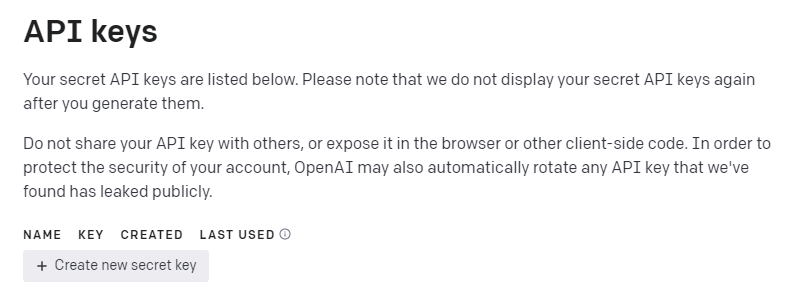
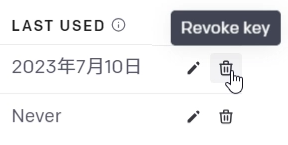

```{r include = FALSE}
knitr::opts_chunk$set(fig.align = 'center', message = F, warning = F)
```


Web APIを通じてRからウェブサービスを利用する方法と、その例としてOpenAI APIを利用してChatGPTをRから利用する方法を述べる。


# 使用するパッケージ

今回使用するパッケージは以下のものである。

```{r}
pacman::p_load(
  jsonlite,
  httr,
  tidyverse
)
```


# WebとAPIの基礎

APIとはapplication programming interfaceの略で、アプリケーション同士が互いに情報を送信しあうためのインターフェース（入り口）である。
Webを通じて提供されるものをWeb APIという（Webを省略して単にAPIと呼ばれることも多い）。


## そもそもWebとは？

Webの仕組みについて軽く述べておく。

### Webページ

ウェブサイト（例えばGoogleのトップページ www.google.com ）にアクセスする際は、ユーザーがブラウザ（Google Chromeなど）を通じてサーバーにWebページの情報を求めるリクエストを送り、サーバーが情報を返すという処理が行われる。
ブラウザのことを**Webクライアント**と呼ぶこともある。Webはこうしたクライアントとサーバーのやりとりで実現されている。

なお、サーバーが返してくる情報についてもう少し具体的に述べると、Webページはhtmlという形式のテキストファイルを中心として構成されているため、サーバーはhtmlなどを送信する。
htmlは、Google Chromeで閲覧中のページを右クリックして「ページのソースを表示」のメニューをクリックしたときに出てくる

```html
<!doctype html>
<html>
  <head>
    <meta charset="UTF-8">
...（以下略）...
```

などと書かれているファイルである。


## Web API

Webページの場合、基本的に人間が見ることを想定して開発されるものであるため、サーバーはhtmlなどを返す。
しかしWeb APIのユーザーは人ではなくアプリケーションであるため、基本的に機械にとって扱いやすいようなインターフェース（送受信するデータの形式）とする。


よく使われる形式のひとつはJSON形式である。JSONは次のような形式になっている。

```json
{
  "status": "OK",
  "values": [100, 200, 300]
}
```

JSONはキーと対応するバリュー（値）の集合になっており、多くのプログラミング言語に用意されているキー・バリュー・ストア（Rだと名前付きのリスト `list(key = "value")`のこと）に変換して扱うことができる。例えば`{jsonlite}`パッケージを使うことでJSONをlistに変えることができる。

```{r}
json_text <- '{
  "status": "OK",
  "values": [100, 200, 300]
}'

data <- jsonlite::fromJSON(json_text)
data["values"]
```


## HTTP

WebサーバーとはHTTPという通信方法を用いて通信する。

### リクエストメソッド

リクエストを送る際はメソッドというものが9種類存在し、状況に応じて使い分けていく。
例えば情報を閲覧したい際は`GET`メソッド、書き込みたい場合は`POST`メソッドを使う。

Rの場合、`{httr}`パッケージを使うことでHTTP通信を行うことができる。

```{r}
response <- httr::GET(url = "https://www.google.com")
```


### レスポンス

HTTPリクエストに対するサーバーからのレスポンスには**ステータスコード**（status code）と**ボディ**（body）が含まれる。

```{r}
response$status_code  # ステータスコード
```

ステータスコードは3桁の数字で、例えば次のようなものがある。


| ステータスコード | 名前                  | 意味                                 |
| ---------------- | --------------------- | ------------------------------------ |
| 200              | OK                    | 正常に通信できた                     |
| 404              | Not found             | ページが見つからない                 |
| 500              | Internal Server Error | サーバー側で想定外のエラーが発生した |


ボディはレスポンス内容の本文に相当するものであり、Webページであればhtml等が、Web APIであればJSON等が送られる。

```{r}
content(response) # response body
```

上記はGoogleのトップページ部分のhtmlである

# APIにアクセスする

## 例1: 不動産取引価格情報取得API

利用者登録が不要で手軽に利用できるWeb APIの例として、国土交通省の[土地総合情報システム](https://www.land.mlit.go.jp/webland/)の[API](https://www.land.mlit.go.jp/webland/api.html)を使って試していく。

土地総合情報システムはアンケート調査によって得た不動産価格を公開しているWebサイトで、このAPIを利用することで不動産価格のデータをRから直接取得することができる。

[APIの操作説明](https://www.land.mlit.go.jp/webland/api.html)を見ると2つAPIが存在するが、今回は「不動産取引価格情報取得API」を利用する。

操作説明にはURLとパラメータをどう指定すればよいのかが書かれている。
パラメータとはURLの`?`以降に`key=value`形式書かれるもので、`httr::GET()`では`query`という引数に`list()`形式で渡していく。

```{r}
res <- GET(
  # APIのURL
  url = "https://www.land.mlit.go.jp/webland/api/TradeListSearch",
  # クエリパラメータ
  query = list(
    from = 20224, # 何年の第何四半期以降の取引を取得するか
    to = 20231,   # 何年の第何四半期までの取引を取得するか
    area = 13     # 都道府県コード（東京は13）
  )
)
```

まずステータスコードを確認する。200であればリクエストに成功している。

```{r}
res$status_code
```

レスポンスからbodyを取り出す。

```{r}
body <- content(res)
```

結果はbody$dataに含まれているため、取り出してデータフレームに変換する

```{r}
rows <- data.frame()
for (row in body$data) {
  rows <- bind_rows(rows, as.data.frame(row))
}
```

このようなデータが取得できた

```{r}
# 最終的に得られたデータ
rows %>% tibble()
```


## （参考）例2：OpenAI API

ChatGPTはWebサイトだけでなくWeb APIも提供されているため、ChatGPTを例にとっていく。
利用登録が必要なため、参考として載せておく。


OpenAI APIは本来は有料のサービスであるが、アカウントを作成して3ヶ月間は18ドル分の無料枠があり、気軽に使うことができる。
（なお、有料でもGPT-3.5は1000トークンあたり0.002ドル程度とかなり安い）


### 利用登録

[OpenAI](https://openai.com/)にログインして右上の自分のプロフィール部分をクリックして開くメニューの「Veiw API Keys」をクリックする。
すると自分のAPIキー（APIで本人認証するための鍵となる情報）の管理画面が表示される。
まだキーを作ったことがなければ何も存在しない。


<center>
  
  <br/>
  <span style="font-size: 0.8em;">
    図：https://platform.openai.com/account/api-keys の画面
  </span>
</center>

下部の「＋Create new secret key」ボタンをクリックして新規作成する。
名前の入力欄が出てくるが任意の設定項目なので無視して先に進んでも問題ない。

作成するとキー（半角英数字の羅列）が出てくるため、コピーしておく。
（APIキーが万一流出してしまうと第三者に好き勝手にAPIを使われてしまうため、扱いには注意する。もしクレジットカード情報をOpenAI に登録して有料ライセンスを保有している場合は特に慎重に扱うこと）


### Rで実践

#### 環境変数の設定{-}

まずAPIキーの扱いについて述べる。APIキーのような機密情報はソースコード中に直接書き込まないことが望ましいため、**環境変数**（environment variable）に設定してRから読み込むことにする。環境変数はOSなどプログラムを動かす環境に設定した変数であり、環境変数を利用することでプログラム側（R側）ではあらかじめ定義済みの変数を呼び出すだけでよいことになる。

環境変数を定義する方法は複数あり、例えば`Sys.setenv(変数名="value")`のように書いてその場で実行したり、ホームディレクトリに`.Renviron`ファイルを作ってそちらに設定したりする。
今回は簡易的に`Sys.setenv()`を使う方法を紹介する。Rのスクリプトではなく、RStudioの左下の「Console」タブに、次のように打ち込んで実行する。

```{r, eval=F}
Sys.setenv("OPENAI_API_KEY"="（取得したAPIキー）")
```

なお環境変数を読み込むときは`Sys.getenv("変数名")`と書けばよい。


#### APIの呼び出し{-}

OpenAIの[ChatAPIのドキュメント](https://platform.openai.com/docs/api-reference/chat/create)を見ると`POST`メソッドを使用する必要があることがわかる。
POSTリクエストを送るには、`httr::POST()`を使用すればよい。

まず、先にリクエストボディを作成しておく。APIがJSON形式を受け取る仕様であるため、`list()`で記述していく。


```{r}
body <- list(
  # 使用する言語モデルを指定する
  model = "gpt-3.5-turbo",

  # メッセージを指定する
  messages = list(
    # role: user ならユーザーがAIに対して発したメッセージを意味する
    # content: メッセージ本文
    list(role="user", content="Hello!")
  )
)
```

```{r, eval=F}
res <- POST(
  url="https://api.openai.com/v1/chat/completions",
  # 認証情報などの付加的な情報
  config = add_headers(
    "Content-Type" = "application/json", # JSON形式で送ることを明示
    "Authorization" = str_c("Bearer ", Sys.getenv("OPENAI_API_KEY")) # 認証情報
  ),
  body = body,     # リクエストの本文
  encode = "json"  # リクエストはjsonで送るため、list形式で渡している
)
```

ステータスコードが200の場合、成功している。
401や403が返ってくる場合はAPIキーの情報をうまく渡せていない可能性が高いため、コードを今一度確認したほうがよい。

成功すると次のように返答が返ってくる。

```{r, eval=F}
body <- content(res)
body$choices[[1]]$message$content %>% cat()
```

```
Hello! How can I assist you today?
```

role=systemとしてシステム側からの指示を与えることもできる。

```{r, eval=F}
body <- list(
  model = "gpt-3.5-turbo",
  messages = list(
    # role: systemならシステムがAIに対して与えた指示になる
    list(role="system", content="あなたは英語の先生です。メッセージ内の英語に誤りがあれば訂正し、日本語で解説をしてください。"),
    list(role="user", content="This is pen.")
  )
)
```

```{r, eval=F}
res <- POST(
  url="https://api.openai.com/v1/chat/completions",
  # 認証情報などの付加的な情報
  config = add_headers(
    "Content-Type" = "application/json", # JSON形式で送ることを明示
    "Authorization" = str_c("Bearer ", Sys.getenv("OPENAI_API_KEY")) # 認証情報
  ),
  body = body,     # リクエストの本文
  encode = "json"  # リクエストはjsonで送るため、list形式で渡している
)
```

```{r, eval=F}
body <- content(res)
body$choices[[1]]$message$content %>% cat()
```

```
This is a pen.

「This is pen.」という表現には誤りがあります。正しくは、「This is a pen.」と言います。英語では、不特定の物を表す場合は冠詞「a」（または「an」）を使います。したがって、この文では「a pen」という具体的な物の名前の前に「a」を置く必要があります。
```

### APIキーの無効化

APIキーの不正利用を防ぐ手段のひとつは、使わなくなったキーを無効化して使えなくしておくことである。
必要になればすぐに新しいキーを作れるので、一通り試し終わったら無効化しておくことを推奨する。

再び[API keys](https://platform.openai.com/account/api-keys)ページに向かい、今回作ったキーを無効化する。

2つ以上のキーが存在する状態でなければ無効化できないようなので、「Create new secret key」から再度新たなキーを作り、今回作った方を削除する。

<center>
  
</center>


## （参考）公的統計のAPI

[e-Stat](https://www.e-stat.go.jp/)や[RESAS](https://resas.go.jp/)といった公的統計のサイトはAPIを公開している。
これらも`{httr}`パッケージでアクセスすることが可能である。

例えば、[矢内（2016）](https://yukiyanai.github.io/jp/classes/rm1/contents/R/R-and-API.html)はe-Stat APIにhttrパッケージでアクセスする方法を解説している。

しかし、APIによってはhttpリクエストを送ってbodyを整形する処理があらかじめ関数にまとめられパッケージとして提供されていることもある。
例えばe-Stat APIであれば[{estatapi}パッケージ](https://yutannihilation.github.io/estatapi/)が存在し、R側から関数を呼び出す形でAPIにアクセスし、tibbleのデータフレームで結果を返してくれるようになっている。こうしたパッケージを使うことでAPIをより手軽に扱うことができる。
（ただし、こうしたパッケージは公式のものもあれば第三者が公開しているものもあるため、有償APIを使う際は注意する）

e-statやRESASの他にも行政のAPIは多数存在し、[e-Gov APIカタログ](https://api-catalog.e-gov.go.jp/info/ja/apicatalog/list)などで検索することができる。
