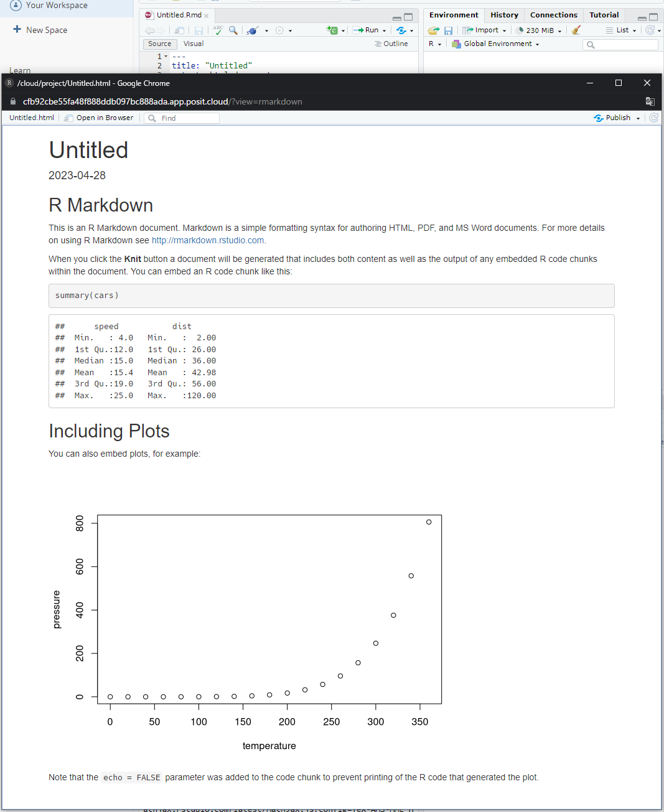

```{r include = FALSE}
knitr::opts_chunk$set(fig.align = 'center', message = F, warning = F)
```


[R Markdown](https://rmarkdown.rstudio.com/docs/)は分析のレポートを書きつつRの実行も行うことができる文書形式で、Rの実行結果（表や図など）を埋め込んだ文書を生成することができる。

（もともとMarkdownという文書を作成するための簡単な言語（マークアップ言語）があり、そこにRの要素を追加したものがR Markdown）


# Rmdファイルの作成

R Studioで新規ファイルを作成する際に「R markdown」を選ぶことで作成できる。

（R Studioから必要なパッケージのインストールが提案された場合は受け入れる）


Rmdファイルは新規作成された段階から下図のようにコードの例が記入されている


毛糸のアイコンをクリックすると文書が作成される





# Rmdの構造

## yamlフロントマター

ページ上部にあるこの部分は**yamlフロントマター**（yaml front matter）と呼ばれ、タイトルや作成日などの文書のメタ情報や出力形式の設定を記述することができる。

```yaml
---
title: "Untitled"
output: html_document
date: "2023-04-28"
---
```

例えば`output`を`pdf_document`に変更した場合、文書はpdfの形で生成されるようになる。wordで出力したい場合は`word_document`にすればよい。


## コードブロック

「\`」で囲った文字は`このように`フォントと背景色が変化する。

2つの「\`\`\`」で囲ったブロックは

```
このようになる
```

コードブロックは1つ目の「\`\`\`」を「\`\`\`{r}」のように書いているプログラミング言語を指定することで文字色が文法に応じて塗り分けられたり、Rの場合は文書作成時に中身が実行される。


```{r}
summary(iris)
```

RStduioでは`Ctrl + Alt + I`でRのコードブロックを挿入することができる。


## その他のMarkdownの文法

### 見出し

見出しは`#`で設定できる

```markdown
# h1見出し
## h2見出し
### h3見出し
```

### 箇条書き

順序なしの箇条書きは`-`あるいは`*`で書くことができる

```markdown
- うに
- いか
```

```markdown
* タコ
* イクラ
```


順序付きの箇条書きは`1., 2., ...`のように書く

```markdown
1. a
2. b
3. c
```

### リンク・画像

リンクを張りたい場合は次のように書く。

```markdown
[タイトル](URL)
```

画像は次のように挿入する。

```markdown

```


## 数式の挿入

TeX記法とよばれる記法を用いて数式を入れることができる。

文中に$y = f(x)$のように入れたい場合は`$y = f(x)$`のように`$`で囲う。

数式の段落を入れたい場合は`$$`で

```markdown
$$
\frac{1}{n} \sum^n_{i=1} x_i
$$
```

のように囲うと

$$
\frac{1}{n} \sum^n_{i=1} x_i
$$

のように出力される。


### （参考）TeX記法の例{-}

| 記号                                                      | TeX記法                                   |
| --------------------------------------------------------- | ----------------------------------------- |
| $\neq$、$\geq$、$\leq$                                    | `\neq`、`\geq`、`\leq`                    |
| $\frac{a}{b}$                                             | `\frac{a}{b}`                             |
| $\sum^n_{i=1}$                                            | `\sum^n_{i=1}`                            |
| よく使われる関数（$\log$、$\ln$、$\exp$など）             | `\log`、`\ln`、`\exp`など                 |
| ギリシャ文字（$\alpha$、$\beta$、$\gamma$、$\delta$など） | `\alpha`、`\beta`、`\gamma`、`\delta`など |


# （参考）DAGの描画

Rmarkdownの話からは離れるが、DAG（directory acyclic graph; 有向非巡回グラフ）の描画の方法についても紹介する。

もともと[Graphviz](https://graphviz.org/)というグラフ描画ツールがあり、DAGを書くために広く使われてきた。
`{DiagrammeR}`パッケージを使うとRからGraphvizを呼び出すことができる。

```{r}
pacman::p_load(DiagrammeR)
```


GraphvizではDOT言語という独自の言語を用いて`X -> Y`のようにグラフを描画する。

## シンプルなグラフの例

```{r}
grViz("digraph dot{
  X -> Y
  U -> {X, Y}
}")
```


## より詳細にオプションを設定したグラフの例

```{r}
grViz("digraph dot{
  graph[rankdir = LR]
  node[shape = circle, fontname = 'Yu Gothic']
  edge[fontname = 'Yu Gothic']
  
  能力A -> 所得Y [label='10']
  学歴X -> 所得Y [label='500']
  能力A -> 学歴X [label='80≧の50%が進学']
  {rank = same; 能力A; 学歴X}
}")
```


- `graph`はグラフ全体の設定をする箇所で、`rankdir = LR`はグラフの描画方向の設定である（左から右にしたいなら`LR`、上から下にしたいなら`TB`）
- `node`はグラフの頂点（node）に関する設定である
- `edge`はグラフの頂点をつなぐ矢印の設定である
- `{rank = same; 能力A; 学歴X}`は位置を揃えたいnodeの設定


# 参考{-}

- [R Markdown Cheatsheet](https://www.rstudio.com/wp-content/uploads/2015/02/rmarkdown-cheatsheet.pdf)

